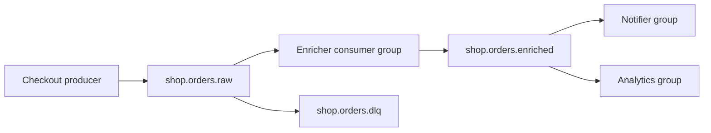

# 19. Final project: mini order platform

## Intro: put basic together into one loop

Separately you can do topic, key, group, retention, JSON, and lag. The **finale** is a connected “shop” scenario: order events go **raw → enriched → notification**, you verify **partition**, **lag**, and **CLI**. No Java/Python — only the [`deploy/kafka`](../../deploy/kafka/README.md) stand and shell.

## What you'll learn (course wrap-up)

- Design **topic names** and **keys**.
- Run an event through the **pipeline** from lesson 13.
- Capture an **operator** checklist and a short report.

## Architecture



| Topic | Partition | Retention | Purpose |
|-------|-----------|-----------|---------|
| `shop.orders.raw` | 3 | 24h (`86400000` ms) | raw events |
| `shop.orders.enriched` | 3 | 24h | enriched |
| `shop.orders.dlq` | 1 | 7d | broken JSON (opt.) |

## Requirements

| # | Requirement | Criterion |
|---|-------------|-----------|
| 1 | Stand | `mock-kafka` healthy, UI :8080 |
| 2 | Topics | three topics per table (dlq opt.) |
| 3 | Events | ≥3 orders with different `orderId`, key = orderId |
| 4 | Sample | at least one event from [`order-created.json`](examples/events/order-created.json) |
| 5 | Enriched | `discountPercent` field by `customerTier` (SILVER=5, GOLD=10) |
| 6 | Groups | `shop-enricher`, `shop-notifier`, `shop-analytics` — independent enriched reads |
| 7 | Lag | intentional lag on `shop-analytics`, then catch up to 0 |
| 8 | CLI | report: describe topic + describe group + get-offsets |
| 9 | Retention | raw topic has `retention.ms=86400000` |
| 10 | Document | `PROJECT.md` in your copy (see below) |

## Runbook — recommended order

### Phase 1: infrastructure

```bash
cd deploy/kafka
docker compose up -d
docker compose ps
bash scripts/smoke.sh
```

### Phase 2: topics

```bash
docker exec mock-kafka /opt/kafka/bin/kafka-topics.sh \
  --bootstrap-server localhost:9092 \
  --create --topic shop.orders.raw \
  --partitions 3 --replication-factor 1 \
  --config retention.ms=86400000

docker exec mock-kafka /opt/kafka/bin/kafka-topics.sh \
  --bootstrap-server localhost:9092 \
  --create --topic shop.orders.enriched \
  --partitions 3 --replication-factor 1 \
  --config retention.ms=86400000

docker exec mock-kafka /opt/kafka/bin/kafka-topics.sh \
  --bootstrap-server localhost:9092 \
  --create --topic shop.orders.dlq \
  --partitions 1 --replication-factor 1
```

Verification:

```bash
docker exec mock-kafka /opt/kafka/bin/kafka-topics.sh \
  --bootstrap-server localhost:9092 --describe --topic shop.orders.raw
```

### Phase 3: produce raw

Example (adapt the JSON):

```bash
printf '%s\n' 'ord-fp-1|{"eventType":"order.created","eventId":"evt-fp-1","customerTier":"SILVER","order":{"orderId":"ord-fp-1","totalCents":1000}}' | \
  docker exec -i mock-kafka /opt/kafka/bin/kafka-console-producer.sh \
  --bootstrap-server localhost:9092 --topic shop.orders.raw \
  --property parse.key=true --property key.separator='|'

printf '%s\n' 'ord-fp-2|{"eventType":"order.created","eventId":"evt-fp-2","customerTier":"GOLD","order":{"orderId":"ord-fp-2","totalCents":5000}}' | \
  docker exec -i mock-kafka /opt/kafka/bin/kafka-console-producer.sh \
  --bootstrap-server localhost:9092 --topic shop.orders.raw \
  --property parse.key=true --property key.separator='|'
```

Third event — from the course file (key manually):

```bash
printf '%s\n' "ord-10042|$(cat courses/kafka-basic/examples/events/order-created.json)" | \
  docker exec -i mock-kafka /opt/kafka/bin/kafka-console-producer.sh \
  --bootstrap-server localhost:9092 --topic shop.orders.raw \
  --property parse.key=true --property key.separator='|'
```

### Phase 4: enricher (manual or script)

1. Consume raw with group `shop-enricher` (`--from-beginning`, note partition for each orderId).
2. For each order produce to `shop.orders.enriched` with the same key and `discountPercent`.

Verification:

```bash
docker exec mock-kafka /opt/kafka/bin/kafka-console-consumer.sh \
  --bootstrap-server localhost:9092 \
  --topic shop.orders.enriched \
  --group shop-notifier --from-beginning --timeout-ms 8000
```

### Phase 5: lag on analytics

1. Produce **20** more raw events (`seq` loop).
2. Read enriched with group `shop-analytics` only **5** messages (`--max-messages 5`).
3. `kafka-consumer-groups.sh --group shop-analytics --describe` — LAG > 0.
4. Catch up until LAG = 0.

### Phase 6: DLQ (optional)

Send an invalid string to raw, copy it to `shop.orders.dlq` (manually) — simulate error handling.

### Phase 7: PROJECT.md report

Create a file locally (not required to commit to the repo):

```markdown
# Kafka basic — final project

## Topics
- shop.orders.raw: partitions=3, retention.ms=86400000
- shop.orders.enriched: ...

## Events
| orderId | tier | partition raw | discountPercent |
|---------|------|---------------|-----------------|
| ord-fp-1 | SILVER | ? | 5 |

## Lag
- shop-analytics max LAG before catch-up: ___
- after catch-up: 0

## Commands (paste output)
- kafka-topics.sh --describe
- kafka-consumer-groups.sh --describe
- kafka-get-offsets.sh
```

## Submission criteria (self-check)

- [ ] All required topics created and describe without errors
- [ ] ≥3 orders, key = orderId, one event from `order-created.json`
- [ ] Enriched has correct `discountPercent`
- [ ] `shop-notifier` and `shop-analytics` both read enriched
- [ ] Lag demonstrated and cleared to 0 on `shop-analytics`
- [ ] `PROJECT.md` filled in

## What's next

- [`kafka-intermediate`](../kafka-intermediate/README.md) — 3-broker cluster, RF, min ISR, Schema Registry.
- [`kafka-advanced`](../kafka-advanced/README.md) — Streams, security, tuning.

## Course summary

You went from **“why a log”** to **operator CLI** and a mini-project. Keep bootstrap **9094** from the host and **9092** in the container handy — and the checklist: **topic → produce → group → lag → retention**.
