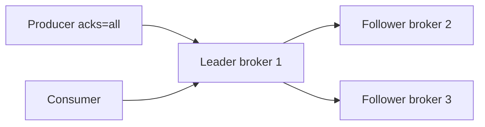

# 01. Replication: RF, ISR, min.insync.replicas

## Intro: "the leader died — the data is gone"

At night a broker holding the only copy of a partition went down. A producer with `acks=1` only managed to write to the leader; the follower had not caught up into the ISR. After failover the new leader opens a **gap** in the log — some messages "disappeared" for the consumer. In a three-broker cluster this is solved by the **replication factor (RF)** and the **in-sync replicas (ISR)** policy plus **`min.insync.replicas`** on the broker.

## What you'll learn

- **Leader / follower**, the role of replicas.
- **ISR** — who is considered "caught up" with the leader.
- **RF**, **`min.insync.replicas`**, the link with **`acks=all`**.
- Unclean leader election (when data is sacrificed for availability).
- How to read `kafka-topics.sh --describe` on the **three-broker** stand.

---

## Replication factor (RF)

**RF** — how many brokers store a copy of each partition (leader + followers).

| RF | Survives failure of 1 broker without losing writes (with correct acks) |
|----|----------------------------------------------------------|
| 1 | no — a single copy |
| 3 | yes, if ISR ≥ 2 and the producer waits for `acks=all` |

On the stand [`deploy/kafka/docker-compose.cluster.yml`](../../deploy/kafka/docker-compose.cluster.yml):

- `KAFKA_DEFAULT_REPLICATION_FACTOR: 3`
- `KAFKA_MIN_INSYNC_REPLICAS: 2`

Create topics with `--replication-factor 3` (auto-create is disabled).

## Leader and follower

For each partition:

- **Leader** — accepts produce and serves fetch to consumers (by default).
- **Follower** — pulls data from the leader (replication), does not serve clients until it becomes leader.



## ISR (in-sync replicas)

**ISR** — replicas that do not lag behind the leader by more than a threshold (`replica.lag.time.max.ms` / bytes). Only replicas from the ISR can become the **new leader** in a "clean" election.

If a follower drops out of the ISR and then catches up again — it returns to the ISR.

**Operator signal:** in `describe` you see `Isr: 1,2,3` — all three are in sync.

## min.insync.replicas

Broker-level (and can be set per topic): the **minimum** number of replicas in the ISR at which the partition is considered available for writes with `acks=all`.

Stand example: **RF=3**, **min.insync.replicas=2**.

| ISR size | acks=all produce |
|--------|------------------|
| 3 | OK |
| 2 | OK |
| 1 | **NotEnoughReplicasException** (protection against writing "to a single copy") |

Meaning: with two live replicas you won't agree to commit until **at least two** (leader + one follower) confirm.

## acks and durability (the link)

| Producer `acks` | Behavior with RF=3, min ISR=2 |
|-----------------|-----------------------------|
| `0` | doesn't wait for the broker — risk of loss |
| `1` | leader wrote it — the follower may lag |
| `all` | waits for confirmation from all ISR; with min ISR=2 — at least 2 replicas |

For **critical** events (payments, orders): **RF=3**, **min.insync.replicas=2**, **acks=all**.

## Unclean leader election

If **all** replicas in the ISR are lost, but "lagging" followers are still alive — an **unclean** election may pick a leader outside the ISR → **loss** of the latest writes, but the cluster accepts writes again.

In production it's often **`unclean.leader.election.enable=false`** — partition unavailability is preferred over data loss.

## Internal topics

On the cluster compose, **RF=3** is already set for:

- `__consumer_offsets`
- transaction log

Otherwise consumer groups and transactions won't survive a broker failure.

## On the stand: describe

```bash
docker exec mock-kafka-1 /opt/kafka/bin/kafka-topics.sh \
  --bootstrap-server kafka-1:9092 \
  --create --topic lab.repl.demo --partitions 3 --replication-factor 3

docker exec mock-kafka-1 /opt/kafka/bin/kafka-topics.sh \
  --bootstrap-server kafka-1:9092 \
  --describe --topic lab.repl.demo
```

Look for lines like:

```text
Topic: lab.repl.demo  Partition: 0  Leader: 2  Replicas: 2,3,1  Isr: 2,3,1
```

The leader can be on any of the three node ids — that's normal.

## Common mistakes

| Mistake | Cause |
|--------|---------|
| `NotEnoughReplicasException` | RF=3, but ISR=1 (2 brokers down) or min ISR not met |
| Topic with RF=1 on the cluster | created manually with RF=1 — no fault tolerance |
| `acks=1` and "we thought RF=3 protects us" | without `all` the follower might not have received the write |
| A single bootstrap | the client must know **all** brokers or a sufficient list for metadata |

## In production

- RF=3 for business topics; RF=1 only for explicitly ephemeral/dev.
- Align **min.insync.replicas** with **acks=all** and the availability SLO.
- Monitor **UnderReplicatedPartitions**, **OfflineReplicas**, ISR size.
- Plan rack awareness (`broker.rack`) — replicas across different AZs.

## Summary

Replication isn't "three copies on disk for the beauty of it", it's a contract: **how many copies are required to confirm a write** before the producer gets a response. ISR and min ISR are the safeguard against writing to a single live copy.

## Checklist

- [ ] You can explain the difference between leader and follower.
- [ ] You know what the ISR is and why `min.insync.replicas` exists.
- [ ] You link `acks=all` with RF and min ISR.
- [ ] You can read `Replicas` and `Isr` in describe.

**Next:** [02. Lab: RF=3 and broker failure](02-lab-replication.md).
