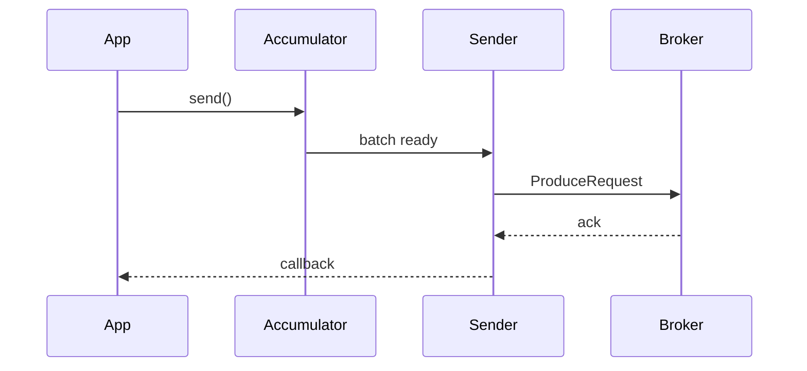

# 03. Producer tuning: batch, linger, compression, buffer

## Intro: "latency doubled after the release"

The team enabled `compression.type=zstd` and increased `batch.size` — throughput went up, but p99 latency for the "create order" API crept upward. The Kafka producer is an **asynchronous pipeline**: records are buffered, compressed, and sent in batches. Tuning is a balance of **latency**, **throughput**, and **durability** (see [01-replication](01-replication.md)).

## What you'll learn

- **`linger.ms`**, **`batch.size`**, **`buffer.memory`**.
- **Compression** and its effect on CPU/network.
- **`max.in.flight.requests.per.connection`** and ordering.
- **`delivery.timeout.ms`**, **`request.timeout.ms`**.
- A reminder: **`enable.idempotence`** (lab 10).

---

## The write path

1. `KafkaProducer.send()` places the record into the **accumulator** (per partition).
2. The sender thread forms a **batch** when `batch.size` is reached or on the `linger.ms` timer.
3. The batch goes to the broker; the response depends on `acks`.



## linger.ms and batch.size

| Parameter | Effect |
|----------|--------|
| `linger.ms` | Wait up to N ms to fill the batch (higher throughput, higher latency) |
| `batch.size` | Upper batch size in bytes per partition |

**Rule:** for interactive APIs — a small `linger.ms` (0–5 ms); for bulk/logs — 10–50 ms and a large batch.

## buffer.memory

The overall producer buffer limit (`32` MB by default). On overflow, `send()` blocks or fails on `max.block.ms`.

Symptom in prod: **`RecordAccumulator is full`** — the consumer can't keep up, or too many partitions are in flight.

## Compression

| Type | CPU | Compression |
|-----|-----|--------|
| `lz4` | low | good |
| `zstd` | higher | better |
| `gzip` | high | good, less common for the hot path |
| `snappy` | low | medium |

`compression.type` is on the producer; the broker may recompress if the topic specifies something different — check `compression.type` on the topic.

## max.in.flight.requests.per.connection

How many unacknowledged produce requests per connection **without** idempotence:

- `>1` + retry → risk of **reordering** within a partition on errors.
- With **`enable.idempotence=true`** Kafka sets a safe value (usually ≤5 with sequence numbers).

For **strict ordering** within a single partition: idempotence + caution with retries.

## Timeouts

| Parameter | Purpose |
|----------|------------|
| `request.timeout.ms` | Waiting for a broker's response to a single request |
| `delivery.timeout.ms` | Upper bound on delivering a record (including retries) |

If `delivery.timeout.ms` is too small with `acks=all` and slow followers — false failures and retries.

## The durability set (reminder)

```properties
acks=all
enable.idempotence=true
retries=2147483647   # effectively "until delivery.timeout"
```

On the cluster with **min.insync.replicas=2** this is a consistent "reliable" profile.

## On the stand

From the host (kcat), if installed:

```bash
kcat -b localhost:9091,localhost:9092,localhost:9093 -t lab.prod.tune -P \
  -X compression.codec=lz4 -X linger.ms=20
```

In Java — the same keys in `Properties` for `KafkaProducer`.

## Common mistakes

| Mistake | Cause |
|--------|---------|
| A huge `linger.ms` on the API path | an artificial delay for every batch |
| `acks=1` + "we have RF=3" | a false sense of security |
| Ignoring `buffer.memory` during a partition spike | producer blocking |
| `max.in.flight=5` without idempotence | duplicates and reorder on failures |

## In production

- Separate **producer profiles** for real-time and for bulk.
- Metrics: `record-send-rate`, `request-latency-avg`, `batch-size-avg`, `NOT_ENOUGH_REPLICAS` errors.
- Load-test after changing compression.

## Summary

Producer tuning isn't "turn everything up to the max", it's picking **batch/linger/compression** to fit the SLO without breaking **durability** and **ordering**.

## Checklist

- [ ] You can explain the role of the accumulator and the batch.
- [ ] You choose compression to fit the load.
- [ ] You know the risk of `max.in.flight` without idempotence.

**Next:** [04. Lab: producer tuning](04-lab-producer-tuning.md).
