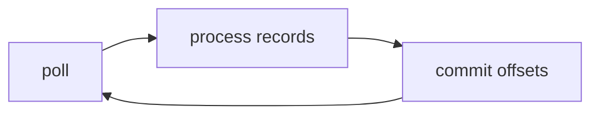

# 05. Consumer tuning: fetch, poll, session

## Intro: "the consumer was kicked out of the group"

A service processes a message for 6 minutes in a single `poll()` thread. The broker receives no heartbeat — **rebalance**, partitions moved to a neighbor, and the same offset was processed **twice**. Consumer tuning is about **how much data to fetch**, **how often to poll**, and **when a consumer is considered alive**.

## What you'll learn

- **`fetch.min.bytes`**, **`fetch.max.wait.ms`**, **`max.partition.fetch.bytes`**.
- **`max.poll.interval.ms`** vs **`session.timeout.ms`** / **`heartbeat.interval.ms`**.
- **`max.poll.records`** — the size of the batch to process.
- **Static membership** (`group.instance.id`) — an overview.
- The link with **lag** (chapter 17).

---

## The consumer loop

1. `poll(Duration)` — a batch of records + heartbeat.
2. Business-logic processing (must fit within **`max.poll.interval.ms`**).
3. `commitSync` / `commitAsync` (if not auto-commit).



## Fetch parameters

| Parameter | Meaning |
|----------|--------|
| `fetch.min.bytes` | Wait for at least N bytes (saving round-trips) |
| `fetch.max.wait.ms` | How long to wait if min bytes aren't reached |
| `max.partition.fetch.bytes` | The byte cap **per partition** per fetch |

Larger fetches → higher throughput, more memory in the consumer, longer processing of a single poll.

## max.poll.records

The maximum number of records returned per `poll`. Reduce it if processing one batch doesn't fit within **`max.poll.interval.ms`**.

## Group timeouts

| Parameter | Purpose |
|----------|------------|
| `session.timeout.ms` | No heartbeat → consumer is **dead** |
| `heartbeat.interval.ms` | How often it sends a heartbeat (usually ≤ session/3) |
| `max.poll.interval.ms` | Maximum between two `poll()` calls while processing |

**A classic incident:** `max.poll.interval.ms` too small for heavy processing → a **rebalance loop**.

## Cooperative vs eager rebalance

- **Eager (range, old round-robin):** **all** partitions are revoked, then re-assigned — stop-the-world.
- **Cooperative (sticky):** only the needed partitions are handed over incrementally — less "double" processing during migration.

`partition.assignment.strategy`: `CooperativeStickyAssignor` (Kafka 2.4+).

## Auto-commit

`enable.auto.commit=true` — commit after poll, **before** successful processing → at-least-once with a risk of **loss** on a crash after commit.

Production: **manual commit** after successful processing.

## Static membership

`group.instance.id` — on restart the consumer is the "same" member, fewer rebalances during a deploy (if the session allows).

## On the stand

```bash
docker exec mock-kafka-1 /opt/kafka/bin/kafka-console-consumer.sh \
  --bootstrap-server kafka-1:9092 \
  --topic lab.consumer.tune \
  --group lab-tune-g1 \
  --consumer-property fetch.min.bytes=1 \
  --consumer-property max.poll.records=100
```

## Common mistakes

| Mistake | Cause |
|--------|---------|
| A long HTTP call inside the poll loop | `max.poll.interval.ms` exceeded |
| Too large `max.poll.records` | OOM or timeout |
| Auto-commit + "processed after commit" | message loss |
| One consumer for 100 partitions | can't keep up with poll/processing |

## In production

- Move heavy work into a **worker pool** with pause/resume of partitions (advanced) or reduce the batch.
- Alert on **time between polls**, **rebalance rate**.
- Separate consumer groups for the fast/slow path.

## Summary

Consumer tuning is fitting the **processing of one batch** between `poll()` calls and not choking the network with fetches that are either too small or too fat.

## Checklist

- [ ] You distinguish `session.timeout.ms` from `max.poll.interval.ms`.
- [ ] You know the role of `max.poll.records`.
- [ ] You understand the risk of auto-commit.

**Next:** [06. Lab: slow consumer](06-lab-slow-consumer.md).
