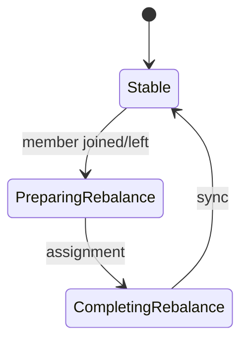

# 07. Rebalance: when and why partitions are redistributed

## Intro: "a deploy — and orders were processed twice"

A rolling deploy of a consumer: the old pod is still committing an offset, the new one already reads the same partition — duplicates in the DB. **Rebalance** is a reassessment of "who reads which partition" within a **consumer group**. Understanding the triggers and strategies is a must-have at the intermediate level.

## What you'll learn

- Rebalance triggers.
- The **group coordinator** and `__consumer_offsets`.
- Strategies: **range**, **round-robin**, **sticky**, **cooperative sticky**.
- The **rebalance listener** (overview).
- How to reduce the rebalance "storm" during a deploy.

---

## When a rebalance happens

- A new consumer **joined** the group.
- A consumer **left** (shutdown, crash, session timeout).
- The number of the topic's **partitions** changed (admin).
- The subscription changed (a different set of topics).
- `max.poll.interval.ms` was exceeded.



## Phases (simplified)

1. The consumer sends **JoinGroup**.
2. The coordinator picks the group's **leader** consumer (not to be confused with the partition leader).
3. The leader applies the **assignor** → partition → member.
4. Everyone receives **SyncGroup** with the assignment.
5. The consumer **resumes** fetch from the committed offset.

During a rebalance it's **stop the world** (eager) — fetch is paused.

## Assignment strategies

| Strategy | Behavior |
|-----------|-----------|
| Range | Partition ranges per topic — imbalance is possible |
| RoundRobin | Round-robin — more even with uniform topics |
| Sticky | Minimizes **movement** of partitions when members change |
| Cooperative Sticky | Sticky + **incremental** revocation of partitions |

Recommendation for new services: **`CooperativeStickyAssignor`**.

## Duplicates and losses during a rebalance

- **Eager:** consumer A is revoked, B reads from the **committed** offset — if A processed but didn't commit → a **duplicate**; if it committed before processing → a **loss**.
- **Cooperative:** fewer partitions "in the air" at once.

**Idempotency** downstream is mandatory with at-least-once.

## group.instance.id (static)

On restart with the same `group.instance.id`, the coordinator may **not** consider the member new immediately — fewer unnecessary rebalances (see the docs for `group.initial.rebalance.delay.ms`).

## Rebalance listener

`ConsumerRebalanceListener`:

- `onPartitionsRevoked` — flush state, commit sync.
- `onPartitionsAssigned` — restore cache, seek.

Critical for **stateful** stream processing.

## On the stand

Observe it in the application logs or Kafka UI → Consumer Groups on:

```bash
docker stop mock-kafka-2   # indirectly — a network blip for the consumer
# better: start/stop a second console-consumer in the same group
```

## Common mistakes

| Mistake | Cause |
|--------|---------|
| Frequent scale up/down | rebalance storm |
| Long processing without pause | max.poll exceeded |
| No idempotency | duplicates after every deploy |
| A different `group.id` for "one service" | double load on the topic |

## In production

- **Cooperative** assignor + a tested deploy playbook.
- A limit on partitions per consumer instance.
- Metrics: `rebalance-latency-avg`, failed rebalance.

## Summary

Rebalance isn't a bug, it's the group's scaling mechanism; the pain is **duplicates** and a **stop** with poor settings and a lack of idempotency.

## Checklist

- [ ] You named ≥3 rebalance triggers.
- [ ] You distinguish eager from cooperative.
- [ ] You know why `onPartitionsRevoked` exists.

**Next:** [08. Lab: rebalance](08-lab-rebalance.md).
