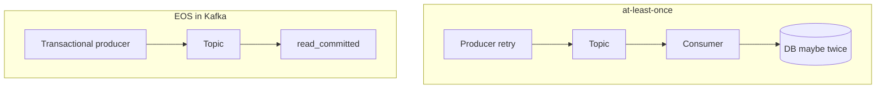

# 09. Delivery semantics: at-most-once, at-least-once, exactly-once

## Intro: "we enabled exactly-once, but the money was charged twice"

Marketing loves the phrase **exactly-once**; in Kafka it means **a contract within the boundaries of Kafka** (producer → topic → consumer with EOS), not a magical "DB + email + Kafka without duplicates". At the intermediate level — break down the three semantics and what is actually configurable.

## What you'll learn

- **At-most-once**, **at-least-once**, **exactly-once** (in Kafka).
- The role of **commit offset** and **retry**.
- The **idempotent producer** (PID + sequence).
- The **transactional producer** (preview → chapter 11).
- Why the consumer must be **idempotent** anyway.

---

## At-most-once

A message can be **lost**, there are no duplicates.

Typically: `acks=0` or committing the offset **before** processing + auto-commit.

| Pro | Con |
|------|-------|
| Simplicity | Losing events is unacceptable for orders |

## At-least-once

A message is **not lost** with correct acks, but **duplicates** are possible (producer retry, rebalance, re-consume).

Typically: `acks=all`, manual commit **after** processing, an idempotent handler (`UPSERT` by `eventId`).

## Exactly-once in Kafka (EOS)

A combination of:

1. **Idempotent producer** — no duplicates in a partition on retry.
2. **Transactions** — an atomic write into several partitions/topics.
3. Consumer **`isolation.level=read_committed`** — doesn't see aborted transactions.

EOS does **not** eliminate duplicates on the side of an **external** DB without idempotency.

## Idempotent producer

`enable.idempotence=true` enables:

- **Producer ID (PID)**
- **Sequence number** per partition

The broker discards duplicates within the producer's session.

Limitations:

- Within a **single** producer instance / epoch.
- Doesn't replace idempotency of **consumer → DB**.
- Requires `acks=all`, a safe `max.in.flight`.

## Commit and processing

| Order | Semantics on failure |
|---------|-------------------|
| commit → process | at-most-once, risk of loss |
| process → commit | at-least-once, duplicates on a crash before commit |
| process + transactional consume (Kafka Streams) | EOS within the application |

## Deduplication in the application

Patterns:

- A **natural key** in the DB (`orderId`, `eventId`) UNIQUE.
- A **processed_events** table.
- **Outbox** + a single writer.

## On the stand

Idempotence is **not** enabled in the console-producer — lab 10 uses **kafka-producer-perf-test** or a description via Java properties; in the lab there's a qualitative demonstration of retry duplicates **without** idempotence.

## Common mistakes

| Mistake | Cause |
|--------|---------|
| "We enabled EOS" only on the producer | the consumer reads uncommitted/aborted data |
| No idempotency in the API | duplicates in the DB with at-least-once |
| Treating the broker's dedup as eternal | a new producer epoch — a new session |

## In production

- An explicit choice of semantics in the service's **ADR**.
- Metrics of duplicates on the consumer side (business KPI).
- EOS only where the complexity is justified (Streams, connect exactly-once sink).

## Summary

**At-least-once + an idempotent consumer** is the most common practical choice; **EOS** is for strict pipelines within the Kafka ecosystem.

## Checklist

- [ ] You can explain the three semantics without confusing them with "EOS everywhere".
- [ ] You know what an idempotent producer gives you.
- [ ] You understand the place of a manual commit.

**Next:** [10. Lab: idempotency](10-lab-idempotency.md).
