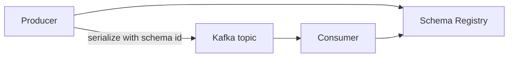

# 13. Schema Registry: contracts and evolution

## Intro: "the consumer crashed on a new field"

The team added `discountCode` to the JSON without coordination — an old consumer with strict deserialization crashes. **Schema Registry** stores **schema versions** (Avro/JSON Schema/Protobuf), checks **compatibility** on registration, and returns a **schema id** in the wire format.

## What you'll learn

- Why a Registry on top of "just JSON in a topic".
- **Subject naming** (`topic-value`, `topic-key`).
- **Compatibility**: BACKWARD, FORWARD, FULL.
- The **schema ID** in the message (Confluent wire format).
- The link with **Kafka Connect** converters.

---

## Architecture



The Registry stores metadata in the compacted topic `_schemas` on Kafka.

## Formats

| Format | Typical use |
|--------|------------------------|
| **Avro** | Kafka + Connect, strict contracts |
| **JSON Schema** | HTTP/API world, JSON validation |
| **Protobuf** | The gRPC ecosystem |

On the stand the Confluent Registry: [http://localhost:8081](http://localhost:8081) with [`docker-compose.extras.yml`](../../deploy/kafka/docker-compose.extras.yml).

## Subject and versions

- Subject `orders-value` — the **value** schema for topic `orders`.
- Versions are monotonic: v1, v2, …
- **Latest** with a compatibility check on `POST /subjects/.../versions`.

## Compatibility

| Mode | Rule (simplified) |
|-------|---------------------|
| **BACKWARD** | new consumers read old data (adding optional fields with a default) |
| **FORWARD** | old consumers read new data |
| **FULL** | both |
| **NONE** | dev only |

By default it's often **BACKWARD** — safe evolutions for a rolling deploy of consumers.

## Wire format (Confluent)

Message prefix: a magic byte + a **4-byte schema id** + payload.

The consumer requests the schema from the Registry by id — there's no need to embed the JSON Schema in every message.

## REST operations (overview)

```bash
curl -s http://localhost:8081/subjects
curl -s http://localhost:8081/subjects/orders-value/versions/latest
```

## Common mistakes

| Mistake | Cause |
|--------|---------|
| A breaking change (removed a field) | compatibility violated |
| Different subjects on prod/dev | version chaos |
| The Registry is unavailable | producer/consumer don't start (fail closed) |
| "A schema in Git is enough" | runtime doesn't validate the payload |

## In production

- CI: schema registration + a **compatibility check** (`mvn schema-registry:validate` / `curl --dry`).
- A separate Registry cluster / HA (not a single container).
- ACL on the Registry (kafka-advanced).

## Summary

The Registry is the **source of truth** for the structure of data in the stream; evolution is deliberate, not "we accidentally broke prod".

## Checklist

- [ ] You can explain a subject and a version.
- [ ] You named BACKWARD and why new fields have a default.
- [ ] You know the role of the schema id in the payload.

**Next:** [14. Lab: Schema Registry](14-lab-schema-registry.md).
