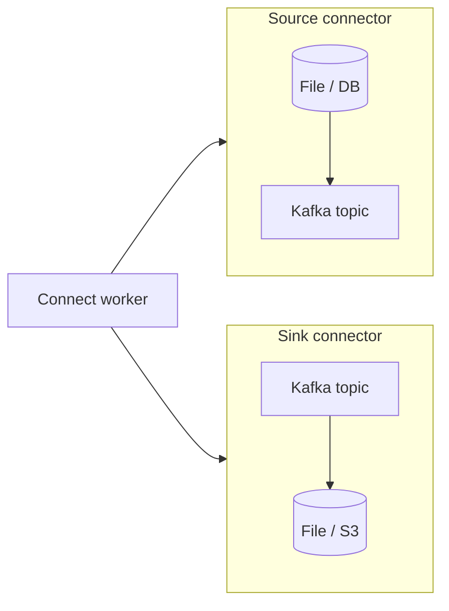

# 15. Kafka Connect: integration without your own consumer

## Intro: "let's write yet another consumer for S3"

Every "Kafka ↔ system X" integration written with your own code duplicates offset management, retry, and scaling. **Kafka Connect** is a framework of **connector** + **tasks**, distributed mode, and a REST API for configuration.

## What you'll learn

- **Source** vs **Sink** connector.
- **Worker**, **connector**, **task**.
- Internal topics: `_connect-configs`, `_connect-offsets`, `_connect-status`.
- **Converters** (JSON, Avro + Schema Registry).
- **SMT** (Single Message Transforms) — overview.
- **Dead Letter Queue** — overview.

---

## The model



- **Source:** external system → Kafka.
- **Sink:** Kafka → external system.

## Worker

On the stand there's one worker in [`docker-compose.extras.yml`](../../deploy/kafka/docker-compose.extras.yml):

- REST: [http://localhost:8083](http://localhost:8083)
- `CONNECT_GROUP_ID=mock-connect`
- Internal topics with RF=1 (sufficient for the lab).

## Connector configuration

POST `/connectors` with JSON:

```json
{
  "name": "file-source-orders",
  "config": {
    "connector.class": "...FileStreamSourceConnector",
    "tasks.max": "1",
    "topic": "connect.orders.raw",
    "file": "/tmp/source.txt"
  }
}
```

Examples: [`examples/connect/file-source.json`](examples/connect/file-source.json), [`file-sink.json`](examples/connect/file-sink.json).

## Converters

| Converter | When |
|-----------|--------|
| `StringConverter` | text, training labs |
| `JsonConverter` | JSON without a Registry |
| `AvroConverter` + `schema.registry.url` | production contracts |

## Scaling

`tasks.max` ≤ the number of partitions (for sink) or the source logic (file — usually 1 task).

Several workers — **distributed mode** (not on the training compose).

## SMT (briefly)

`InsertField`, `ExtractField`, `Filter` — a transformation **before** the write, without a separate microservice.

## Errors and DLQ

`serrors.tolerance=all` + `errors.deadletterqueue.topic.name` — broken messages go to a DLQ topic (production).

## Common mistakes

| Mistake | Cause |
|--------|---------|
| Sink tasks > partitions | extra idle tasks |
| No converter for the Registry | binary garbage in the topic |
| RF=1 internal topics in prod | loss of offsets on failure |
| A file path inside the container | file not found |

## In production

- A Connect **cluster** separate from the brokers.
- Secrets via **config providers**.
- Monitoring connectors in the **FAILED** state in `_connect-status`.

## Summary

Connect is the standard for **bridges** between Kafka ↔ the outside world; your code is only for custom connectors when needed.

## Checklist

- [ ] You distinguish source and sink.
- [ ] You know the REST :8083 and the internal topics.
- [ ] You opened the example JSON configs in `examples/connect/`.

**Next:** [16. Lab: Connect](16-lab-connect.md).
