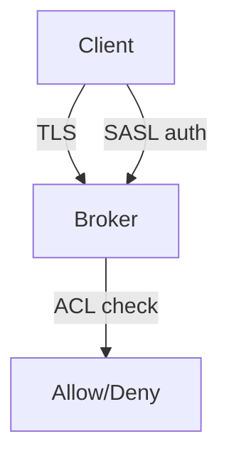

# 19. Kafka security: TLS, SASL, ACL (overview)

## Intro: "anyone on the VPN can write to a production topic"

The training cluster is **PLAINTEXT**, with no authentication. In production an open broker = reading PII and writing garbage into `payments`. At the intermediate level — a map of the mechanisms and the **limitations of PLAINTEXT** for the ACL labs.

## What you'll learn

- **Encryption in transit** (TLS).
- **Authentication**: SASL/SCRAM, mTLS, OAuth (overview).
- **Authorization**: **ACL** (Kafka native).
- The **limitations of PLAINTEXT** on the stand.
- The link with **Schema Registry** and **Connect** security.

---

## Layers of protection



1. **Wire encryption** — TLS between client ↔ broker ↔ broker.
2. **Authentication** — who is connecting.
3. **Authorization** — what is allowed (ACL or RBAC in Confluent).

## TLS

- Brokers: `listeners=SSL://...`, keystore/truststore.
- Clients: `security.protocol=SSL`, truststore CA.
- **Inter-broker** encryption is configured separately.

On the PLAINTEXT stand TLS is **not** enabled — in lab 20 it's only the **concept** of ACL.

## SASL (briefly)

| Mechanism | Scenario |
|----------|----------|
| **SCRAM-SHA-512** | login/password, K8s secrets |
| **GSSAPI (Kerberos)** | enterprise AD |
| **OAuthBearer** | SSO, cloud IAM |

`super.users` — admins who bypass ordinary ACLs (be careful).

## ACL

Resources:

- **Topic**, **Group**, **Cluster**, **TransactionalId**

Operations: `Read`, `Write`, `Create`, `Describe`, `Delete`, …

Principle: **deny by default**, minimal privileges for a service account.

Example (concept):

```text
User:app-orders ALLOW Write DESCRIBE on TOPIC orders
User:app-orders ALLOW Read on GROUP app-orders-
```

## PLAINTEXT: lab limitations

On [`docker-compose.cluster.yml`](../../deploy/kafka/docker-compose.cluster.yml):

- No TLS/SASL — **ACL is not enforced** the way it is in a secured cluster, or the ACL commands work as a "stub" without a real deny for anonymous clients, depending on `authorizer.class.name`.

**Lab 20:** you study the **syntax** of `kafka-acls.sh` and the permission model; for a real deny you need a cluster with `StandardAuthorizer` + SASL (kafka-advanced).

## Schema Registry / Connect

- Registry: `basic.auth`, RBAC, HTTPS.
- Connect: principals for the connector, ACL on topics + internal topics.

## Common mistakes

| Mistake | Cause |
|--------|---------|
| ACL only on the topic, not on the group | the consumer doesn't start |
| `*` Write for the application | lateral movement on a breach |
| PLAINTEXT in prod "inside the VPC" | insider threat, sniffing |
| Forgot the ACL on `__consumer_offsets` | describe group fails |

## In production

- mTLS or SASL everywhere; PLAINTEXT only for dev.
- GitOps for ACLs (Terraform `kafka_acl`).
- SCRAM rotation, an audit log.

## Summary

Kafka security is **three layers**; on the training stand you learn the **ACL model**, in prod you enable the authorizer + auth.

## Checklist

- [ ] You named TLS, SASL, ACL.
- [ ] You understand why a PLAINTEXT lab ≠ prod.
- [ ] You know the Topic and Group resources for ACL.

**Next:** [20. Lab: ACL](20-lab-acl.md).
