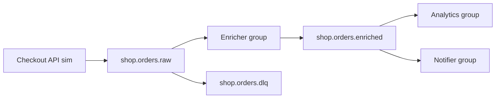

# 27. Final project: an order events platform (cluster)

## Intro: the intermediate level in one setup

You've covered replication, tuning, rebalance, semantics, monitoring, operations. The **finale** is an **order** event platform on a **three-broker** cluster: RF=3, reliable produce, consumer groups, a lag drill, alter topic, an operator's report. Without mandatory Java — CLI, UI, curl (Registry/Connect is an optional bonus).

## What you submit

A repository or a folder `kafka-intermediate-project/` with a **`PROJECT.md`**: the architecture, a table of topics, screenshots/CLI output, a lag incident runbook.

## Architecture



| Topic | Partitions | RF | retention.ms | Purpose |
|-------|------------|-----|--------------|------------|
| `shop.orders.raw` | 6 | 3 | 86400000 (24h) | raw events |
| `shop.orders.enriched` | 6 | 3 | 86400000 | enriched |
| `shop.orders.dlq` | 1 | 3 | 604800000 (7d) | broken JSON (opt.) |

**Keys:** `orderId` on all records.

## Requirements

| # | Requirement | Criterion |
|---|------------|----------|
| 1 | Stand | `docker-compose.cluster.yml` up, UI :8080 |
| 2 | Topics | three topics per the table, RF=3, created explicitly |
| 3 | Config | on `shop.orders.raw`: `min.insync.replicas=2` (topic config) |
| 4 | Produce | ≥5 orders, `acks=all`, different `orderId` |
| 5 | Enricher | group `shop-enricher`: tier → `discountPercent` (SILVER=5, GOLD=10) |
| 6 | Downstream | `shop-notifier` and `shop-analytics` read enriched independently |
| 7 | Lag drill | stop analytics, load raw, LAG>0, then catch up to 0 |
| 8 | Replication | describe shows ISR=3 on a healthy cluster |
| 9 | Alter | increase partitions of `shop.orders.enriched` 6→9, document the effect |
| 10 | Hot key | one order with key `VIP-1` × 100 events — skew in the report |
| 11 | CLI report | describe topics + consumer groups + get-offsets |
| 12 | Incident | the runbook table from [18-lab-lag-drill](18-lab-lag-drill.md) |
| 13 | PROJECT.md | ≤5 pages, a diagram, conclusions |

## Runbook — recommended order

### Phase 1: cluster

```bash
cd deploy/kafka
docker compose -f docker-compose.cluster.yml up -d
docker exec mock-kafka-1 /opt/kafka/bin/kafka-broker-api-versions.sh \
  --bootstrap-server kafka-1:9092
```

Bootstrap from the host: `localhost:9091,localhost:9092,localhost:9093`.

### Phase 2: topics

```bash
for t in shop.orders.raw shop.orders.enriched shop.orders.dlq; do
  docker exec mock-kafka-1 /opt/kafka/bin/kafka-topics.sh \
    --bootstrap-server kafka-1:9092 \
    --create --topic "$t" \
    --partitions 6 --replication-factor 3
done

docker exec mock-kafka-1 /opt/kafka/bin/kafka-topics.sh \
  --bootstrap-server kafka-1:9092 \
  --alter --topic shop.orders.dlq --partitions 1

docker exec mock-kafka-1 /opt/kafka/bin/kafka-configs.sh \
  --bootstrap-server kafka-1:9092 \
  --entity-type topics --entity-name shop.orders.raw \
  --alter --add-config retention.ms=86400000,min.insync.replicas=2
```

### Phase 3: raw events

Example line (key|json):

```text
ord-1001|{"eventId":"evt-1001","eventType":"order.created","orderId":"ord-1001","customerTier":"GOLD","amount":120}
```

Sending:

```bash
# your file events.txt
docker exec -i mock-kafka-1 /opt/kafka/bin/kafka-console-producer.sh \
  --bootstrap-server kafka-1:9092 \
  --topic shop.orders.raw \
  --producer-property acks=all \
  --property parse.key=true --property key.separator='|'
```

### Phase 4: enricher pipeline

Consumer `shop-enricher` from raw → produce enriched (as in [kafka-basic/13-lab-pipeline](../kafka-basic/13-lab-pipeline.md), with RF=3).

### Phase 5: lag drill

1. Stop the `shop-analytics` consumer.
2. Load a burst of ≥2000 messages into raw.
3. `kafka-consumer-groups --describe --group shop-analytics` — LAG.
4. Start 2–3 consumers in the group — LAG→0.

### Phase 6: alter + hot key

- `shop.orders.enriched` partitions 6→9 ([24-lab-alter-topic](24-lab-alter-topic.md)).
- 100× produce key `VIP-1` into raw — skew ([22-lab-hot-partition](22-lab-hot-partition.md)).

### Phase 7 (bonus): Registry + Connect

Bring up [`docker-compose.extras.yml`](../../deploy/kafka/docker-compose.extras.yml), register a JSON Schema for `shop.orders.enriched`, a FileStream source into a staging topic — not required for passing.

## PROJECT.md template

```markdown
# Kafka Intermediate — final project

## Architecture
(mermaid diagram or a link)

## Stand
- compose: cluster
- bootstrap: localhost:9091-9093

## Topics
| topic | partitions | RF | configs |

## Consumer groups
| group | topics | lag max |

## Lag incident (training date)
| T0 lag | action | T1 lag |

## Hot partition
which partition, suggestions for a fix

## Conclusions
3–5 sentences: RF+minISR, idempotency, rebalance
```

## Passing criteria

- [ ] All mandatory items in the **Requirements** table are done.
- [ ] **PROJECT.md** reads like an operator's report, not a copy-paste of the labs.
- [ ] The commands are reproducible on the `deploy/kafka` cluster.

## After the course

- [kafka-advanced](../kafka-advanced/README.md) — tiered storage, MirrorMaker, a secured cluster.
- [kuber-intermediate](../kuber-intermediate/README.md) — Strimzi in practice.

Congratulations on completing **Kafka Intermediate**.
