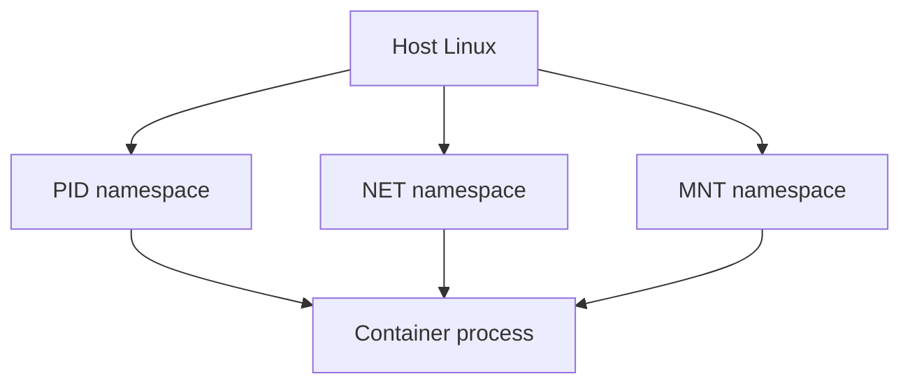

# 01. Linux namespaces

## Intro: "inside the container it's PID 1, on the host it's a different number"

You run `docker exec` into a pod and see `ps`: the nginx process is **PID 1**. On the node, `ps aux | grep nginx` shows the same process, but as **PID 18432**. This is not a bug and not "two nginx instances" — it's a **PID namespace**: inside the container the process tree starts over.

Kubernetes does not run "magic" containers. **kubelet** asks the **container runtime** (containerd) to create a process via **runc**, which sets up the **namespaces** and **cgroups**. Understanding namespaces is the bridge between "Linux admin" and "why kubectl/debug behaves this way".

## What you'll learn

- Which **namespaces** exist (UTS, IPC, PID, NET, MOUNT, USER, cgroup).
- How to inspect namespaces in **`/proc/$pid/ns/`**.
- Why a container has its own **PID 1** and init.
- The link to Docker/Kubernetes and the **unshare** lab.

---

## Namespace types

| Namespace | Isolation | Example in a container |
|-----------|----------|---------------------|
| **pid** | process tree | PID 1 = your entrypoint |
| **net** | interfaces, routing, ports | own `eth0`, own `127.0.0.1` |
| **mnt** | mount points | container `/` ≠ host `/` |
| **uts** | hostname, domainname | `hostname` in the pod |
| **ipc** | SysV IPC, POSIX mq | queue isolation |
| **user** | UID/GID mapping | root in the container ≠ root on the host (user ns) |
| **cgroup** | view of the cgroup hierarchy | cgroup v2 namespace |



---

## Viewing namespaces

Each process is a set of inodes in `/proc`:

```bash
ls -la /proc/self/ns/
readlink /proc/self/ns/pid
readlink /proc/self/ns/net
readlink /proc/self/ns/mnt
```

Same inode for two PIDs → they are in the **same** namespace. Different inodes → isolation.

In Docker:

```bash
# on the host
docker inspect --format '{{.State.Pid}}' CONTAINER_ID
ls -la /proc/THAT_PID/ns/
```

---

## PID namespace — why PID 1 matters

In a new PID ns the first process gets **PID 1**. It must:

- **reap** zombie child processes (`wait`);
- handle signals correctly (a minimal init is often needed: `tini`, `dumb-init`).

If the entrypoint is a shell script with no init, zombies may pile up.

**From the host** the same process has an ordinary PID — you see the "real" picture on the node.

---

## NET namespace — ports and loopback

In its own NET ns:

- `127.0.0.1:8080` in container A does **not** conflict with `127.0.0.1:8080` in container B;
- `ss -tlnp` inside shows only its **own** sockets;
- external access requires a **publish** / **Service** / CNI.

The "port in use" symptom inside a container means another process **in the same** net ns.

---

## MNT and UTS

**mnt** — the root of the container filesystem (overlayfs layers). `chroot` is a simplified model; a container = mnt ns + everything else.

**uts** — the `hostname` in `kubectl exec` ≠ the node hostname.

```bash
hostname
cat /proc/sys/kernel/hostname
```

---

## USER namespace (overview)

UID 0 inside the container can be mapped to UID 100000 on the host — **rootless** containers are safer. Not all runtimes enable user ns by default.

---

## unshare — create a namespace manually

Preview (lab 02):

```bash
sudo unshare --fork --pid --mount --uts /bin/bash
hostname isolated-box
ps aux | head
```

`unshare` is what runc does before `exec`-ing your image.

---

## Link to Kubernetes

| Component | Role |
|-----------|------|
| kubelet | CRI CreateContainer |
| containerd | images, snapshot |
| runc | namespaces + cgroups + exec |
| pause pod | holds the net ns for the pod (shared container network) |

See [kuber-basic: Docker vs containerd](../kuber-basic/02-docker-vs-containerd.md).

---

## Common mistakes

| Mistake | Reality |
|--------|--------|
| "PID 1 in the container = the main process on the server" | only in its own pid ns |
| debug on the node and in the pod show the same picture | different net/pid ns |
| no init in the image | zombies, ignored SIGTERM |

---

## In production

Sidecars, service mesh, `hostNetwork: true` — **break** net ns isolation on purpose. `hostPID: true` — you see host processes (debug only). Understand when a pod has "left" its isolation.

---

## Summary

**Namespaces** are separate "views" of PID, network, mount, hostname. A container = process(es) in a set of namespaces + cgroups. Inspect `/proc/$pid/ns/` and compare inodes.

## Checklist

- [ ] Which namespace isolates ports?
- [ ] Why does a container have its own PID 1?
- [ ] Where in `/proc` are namespaces visible?
- [ ] How is the pause container related to the pod's net ns?

Next lesson: [02. Lab: unshare](02-lab-unshare.md).
