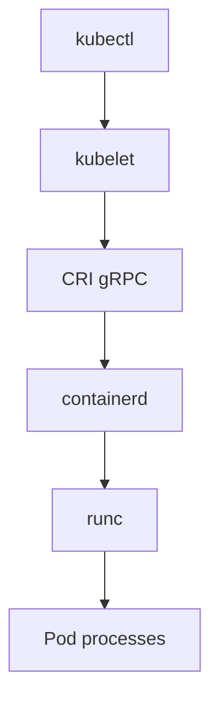

# 05. containerd and CRI

## Intro: "there's no docker on the node, but the pods are running"

Modern Kubernetes on a worker node often runs **without dockerd**. `kubectl get nodes -o wide` shows `containerd://1.7.x`. Images are pulled by **kubelet** via **CRI** (Container Runtime Interface) → **containerd** → **runc** → namespaces + cgroups.

The "I'm used to docker ps" confusion breaks debugging: on the node you use **`crictl`**, not `docker`.

## What you'll learn

- The roles of **containerd**, **runc**, **CRI**.
- The Docker CLI vs Kubernetes chain.
- The **ctr**, **crictl** commands (overview).
- Where images and snapshots live.
- The link to **mockctl** / minikube.

---

## Component roles



| Component | Role |
|-----------|------|
| **containerd** | daemon: image pull, snapshot, container start |
| **runc** | OCI runtime: `run` a process in namespaces/cgroups |
| **CRI** | API kubelet ↔ runtime (containerd or CRI-O) |
| **dockerd** | optional: CLI + build (not required on a K8s node) |

**Docker CLI** → dockerd → containerd → runc (with Docker Desktop / legacy).  
**kubelet** → CRI → containerd → runc (typical K8s).

---

## CLI: ctr vs crictl vs docker

| Command | Where | Purpose |
|---------|-----|------------|
| `docker` | dev machine | developer convenience |
| `ctr` | node, debug | low-level containerd |
| `crictl` | **K8s worker** | wrapper over CRI, "like kubectl for the runtime" |

```bash
ctr version 2>/dev/null
crictl version 2>/dev/null
crictl images
crictl ps
crictl pods
```

crictl config: `/etc/crictl.yaml` → `runtime-endpoint: unix:///run/containerd/containerd.sock`.

---

## Images and snapshots

containerd stores layers in **`/var/lib/containerd`** (not `/var/lib/docker`).

```bash
sudo ctr images pull docker.io/library/nginx:alpine 2>/dev/null
sudo ctr images ls | head
```

The **snapshotter** (overlayfs) is the container's root filesystem.

---

## OCI and runc

**OCI** (Open Container Initiative) is the image spec (`config.json` + layers). **runc** reads the bundle and calls `unshare` + cgroups.

Viewing (if runc is installed):

```bash
runc list 2>/dev/null
```

---

## Link to mockctl

```bash
kubectl get nodes -o jsonpath='{.items[0].status.nodeInfo.containerRuntimeVersion}{"\n"}'
```

[`INSTALL.md`](../../INSTALL.md), [`mockctl`](../../mockctl/README.md) — the local cluster uses containerd (or docker) under the hood.

---

## Common mistakes

| Mistake | Reality |
|--------|--------|
| `docker ps` on the worker is empty | the runtime is containerd |
| image exists in docker, pod ImagePullBackOff | different runtime/socket |
| cleaning disk with `docker system prune` on a K8s node | use `crictl rmi`, kubelet garbage collection |
| mounting docker.sock into a pod | root on the host |

---

## In production

- Version containerd for kubelet compatibility.
- Monitoring: disk `/var/lib/containerd`, image pull errors.
- **Sandbox image** (pause) — a separate image, don't confuse it with the app.

---

## Summary

On the node, Kubernetes talks to **containerd** via **CRI**. **runc** creates the container. To debug the node — use **crictl**, not docker. Images live in `/var/lib/containerd`.

## Checklist

- [ ] How does containerd differ from dockerd?
- [ ] What is CRI?
- [ ] Why crictl on a worker node?
- [ ] Where on disk are containerd's layers?

Next lesson: [06. Lab: ctr](06-lab-ctr.md).
