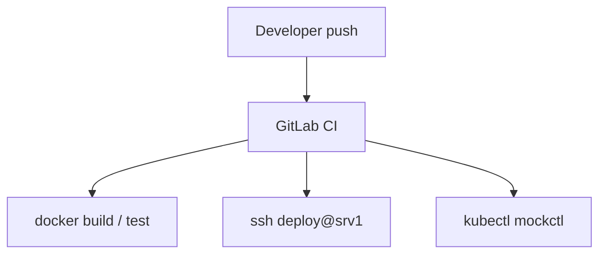

# 27. Integration: Linux + GitLab + mockctl

## Intro: a "Linux only" skill doesn't live in a vacuum

The production path: **GitLab CI** builds an image → **deploy** over SSH to a VM (Linux hardening, nginx, systemd) → **kubectl/Helm** to a **mockctl** cluster. This chapter connects **linux-advanced** with the neighboring courses into a single scenario.

## End-to-end scenario



```text
GitLab CI  --build-->  container image
       |
       +--ssh deploy-->  srv1 (systemctl reload nginx)
       |
       +--kubectl-->  mockctl cluster (Helm / manifests)
```

---

## Linux roles by layer

| Layer | Skill from the course |
|------|----------------|
| CI runner host | user, **docker socket** risks, limits |
| App server srv1 | nginx, systemd, **ufw**, audit, fail2ban |
| K8s worker | swap off, sysctl, **containerd**, verify-node |
| Ops | **runbook**, capacity, HANDOFF |

---

## Course order (recommended)

1. **linux-basic** → **linux-intermediate** → **linux-advanced**
2. **gitlab-basic** → **gitlab-intermediate** (CI deploy)
3. **kuber-basic** → mockctl / **kuber-intermediate**

In parallel: **linux-security** after the advanced baseline.

---

## What's already done on srv1 (capstone preview)

| Component | Lesson |
|-----------|------|
| ufw + SSH hardening | 11–12 |
| auditd sudoers | 09–10 |
| fail2ban | 13–14 |
| deploy + sudo | 26, capstone |
| runbook disk-full | 24 |
| verify-node | 07–08 |

---

## Integration check (checklist)

- [ ] `mockctl up` / cluster Ready
- [ ] `ansible` or `ssh deploy` to srv1
- [ ] curl http://172.28.0.11/ OK
- [ ] GitLab pipeline (if configured) — green deploy stage

---

## Common gaps

| Gap | Symptom |
|--------|---------|
| Linux without K8s prep | NotReady nodes |
| CI root on the VM | audit nightmare |
| K8s without a host fw | strange timeouts |
| no HANDOFF | bus factor |

---

## Summary

Advanced Linux is the foundation for the **VM** and the **node**. CI/CD and K8s are the next layers of the same pipeline.

## Checklist

- [ ] Draw your pipeline from git push to prod.
- [ ] Where is srv1 in it, where is mockctl?

Next lesson: [28. Capstone](28-final-project.md).
