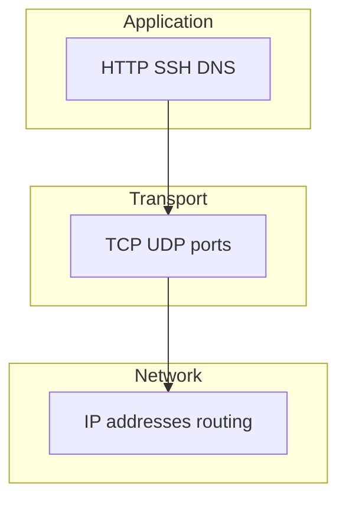

# 01. TCP/IP: model, addresses, routes

## Intro: "curl hangs" is not the same as "the server is down"

You open a terminal, run `curl https://api.internal.company` — and a minute of silence. Panic: "prod is down"? Not necessarily. The request may have gotten stuck at **DNS**, run into a **route**, hit a **firewall**, or reached a host where **nobody is listening on the port** — and each case looks different once you know at which layer to look.

Kubernetes, load balancer, and Security Group are all layers on top of the same **TCP/IP** that you configure on a VM. This chapter is the foundation for the entire "Networking" block in intermediate: without it, DNS and firewall will be a set of commands without meaning.

## What you'll learn

- How the **L2–L7** layers are structured and which tool belongs to which layer.
- How to read the address **172.28.0.10/24** and the routing table.
- How **TCP** differs from **UDP** and when this matters for diagnostics.
- How to tell a **timeout** from a **connection refused** by the error message.
- Which IPs the hosts of the `deploy/linux` lab stand have.

## The layer model — "in plain terms"

Imagine a letter: an envelope with an address (where to deliver), inside — reliable delivery with confirmation or "just dropped in the box", inside the letter — the meaning (HTTP, SSH).

| Layer | Name | Examples | Your tools |
|---------|-----|---------|------------------|
| L2 | Link | Ethernet, MAC, ARP | `ip neigh`, Docker bridge |
| L3 | Network | IP, ICMP | `ip addr`, `ping`, routes |
| L4 | Transport | TCP, UDP, ports | `ss`, `nc` |
| L7 | Application | HTTP, SSH, DNS | `curl`, `dig`, `ssh` |

DevOps most often lives in **L3–L7**. L2 surfaces when "two containers on the same docker network, but weirdness with ARP" — rarely, but it's useful to know it exists.



## IPv4: address, mask, subnet

The notation **172.28.0.10/24** reads like this:

- **172.28.0.10** — the address of **this** interface (host).
- **/24** — the mask 255.255.255.0: the first 24 bits are the network number, the last 8 are hosts (256 addresses in the subnet).
- Hosts with the same prefix (172.28.0.1–172.28.0.254) are, for Linux, the **local subnet**: the packet goes directly, without a router.

In the [`deploy/linux`](../../deploy/linux/README.md) stand:

| Name | IP | Role |
|-----|-----|------|
| lab | 172.28.0.10 | your "workstation" |
| srv1 | 172.28.0.11 | server for labs |
| srv2 | 172.28.0.12 | second server |
| web | 172.28.0.20 | nginx / TLS |
| dns | 172.28.0.53 | BIND, zone lab.local |

Look at **lab**:

```bash
ip -4 -br addr
ip route show
```

`-br` is brief output: interface, IP, up/down. `ip route` — where the kernel will send the packet for each destination.

## Routing: where the packet goes

```bash
ip route get 172.28.0.11
ip route get 8.8.8.8
```

The first command will show: to a neighbor in the same /24 — `dev eth0` (or equivalent), **without** `via` (a gateway). The second — to the "internet" — through the **default gateway** (`via 172.28.0.1` or however Docker configured it).

If `ip route` is empty or there is no default — external addresses are unreachable; the local network 172.28.0.0/24 may still work.

## TCP and UDP

| | TCP | UDP |
|---|-----|-----|
| Connection | yes (handshake) | no |
| Reliability | retransmits, ordering | no guarantees |
| Typical services | HTTP, SSH, Postgres | DNS, DHCP, VoIP |
| Diagnostics | `ss -tlnp` | `ss -ulnp` |

### TCP handshake — three steps (why this is a "connection")

When you `curl http://172.28.0.11/`, roughly this happens:

1. **SYN** — client: "I want a connection on port 80".
2. **SYN-ACK** — server: "agreed".
3. **ACK** — client: "ok, let's start".

Only after this does the HTTP `GET /` go out. If **nobody is listening** on port 80, the server responds with **RST** — in curl this is **Connection refused**.

### Connection refused vs timed out — breaking it down in human terms

These are **two different stories**. Memorize the table — it will save hours of on-call.

| Message | Did the packet reach the host? | Is port 80 listening? | Typical causes |
|-----------|------------------------|---------------------|------------------|
| **Connection refused** | yes | **no** (or REJECT) | nginx not running, listening on another port, only 127.0.0.1 |
| **Connection timed out** | often **no** or DROP | unknown | firewall DROP, wrong IP, host down, route |
| **No route to host** | no route | — | `ip route`, typo in IP |
| **Could not resolve host** | — (not networking yet) | — | DNS, see lesson 03 |

**Practical example on the stand:**

```bash
# 1. Is anyone listening on 80 on srv1?
ssh course@172.28.0.11 'ss -tlnp | grep :80'
# empty → curl gives refused when there is no nginx

# 2. Install nginx
ssh course@172.28.0.11 'sudo apt install -y nginx && sudo systemctl start nginx'

# 3. Again
curl -v http://172.28.0.11/ 2>&1 | head -20
# Connected to ... → HTTP/1.1 200
```

**Refused** — fix the **service** (`systemctl`, `ss`). **Timeout** — fix the **path** (ping, route, ufw, SG).

### UDP — "fire and forget"

DNS query: one UDP packet to port 53, the reply may or may not arrive. There is no "connection" — that's why `nc -u` is harder to debug. For DNS, use **dig** with a timeout.

```bash
dig @172.28.0.53 srv1.lab.local +time=2 +tries=1
```

## ICMP and ping

```bash
ping -c3 172.28.0.11
```

Ping checks **reachability at L3** (ICMP Echo). This is **not** a check of port 443. A firewall can block ICMP while SSH on 22 works — and vice versa.

## Ports and sockets

A service "listens" on **IP:port** — for example `0.0.0.0:80` (all interfaces) or `127.0.0.1:8080` (localhost only).

```bash
ss -tlnp
ss -tlnp | grep ':22'
```

Before "the network is broken", always ask: **is the process listening on the right port?**

## MTU (briefly)

Ethernet MTU is usually **1500** bytes. On a VPN/tunnel, if the MTU is not negotiated — large packets "disappear", small ones work. Symptom: SSH opens, scp of large files hangs. Fix — MSS clamping, reducing the MTU on the tunnel (advanced).

## On the stand: a quick check

From **lab** after `docker compose up -d`:

```bash
ping -c2 172.28.0.11
ip route get 172.28.0.11
ssh course@172.28.0.11 'ss -tlnp | grep -E ":22|:80"'
```

## Common mistakes

| Symptom | Layer | What to check |
|---------|---------|---------------|
| no ping, no SSH | L3 / fw | IP, `ip route`, firewall |
| ping works, curl timeout on 80 | L4 / app | `ss -tlnp`, nginx |
| curl refused | L4 | service not running |
| only FQDN doesn't work | L7 DNS | `dig`, `/etc/resolv.conf` |
| works with localhost, not with IP | bind | listening on 127.0.0.1, not 0.0.0.0 |

## In production

In the cloud, an instance has a **private IP** in the VPC and sometimes a **public IP** / Elastic IP. The Security Group filters before the guest OS. In Kubernetes, **ClusterIP** is yet another virtual network layer. The mental scheme "client → SG → VM → ufw → pod" is the same as lab → srv1.

## Summary

Networking in diagnostics goes **bottom to top**: route and ping (L3), port and TCP (L4), HTTP/DNS (L7). An address with `/24` defines the subnet of neighbors. **Refused** and **timeout** are different stories. The commands `ip`, `ss`, `ping` are the basic set before tcpdump and firewall.

## Checklist

- What does /24 mean for 172.28.0.10?
- When does a packet go through the gateway?
- How does TCP differ from UDP for DNS?
- What will `ss -tlnp` show for "nginx doesn't accept connections"?

Next lesson: [02. Lab: ip and stand neighbors](02-lab-ip.md).
