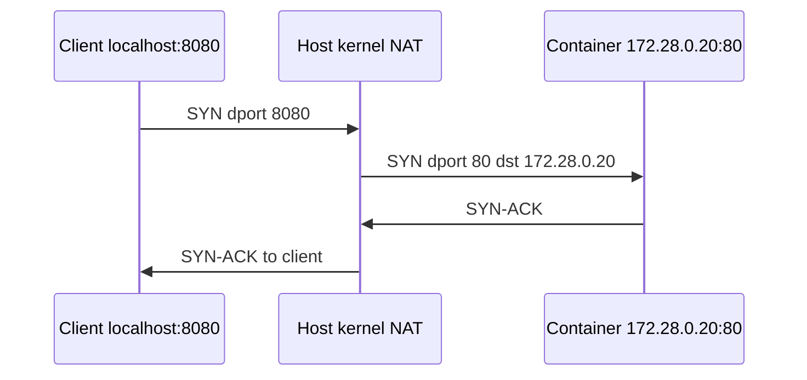

# 05. NAT and IP forwarding

## Intro: why "8080 on the outside", but 80 inside the container

On your laptop you open `http://localhost:8080` and see the page of an nginx that, inside Docker, listens on **port 80**. The packet arrived on the host's **8080** but ended up on the container's **80** with a different IP. The kernel **swapped the destination address** — this is **DNAT** (Destination NAT).

The return path: the container replies from IP `172.28.0.20`, the client expects a reply from `127.0.0.1`. The host **swaps the source** of the reply — **SNAT** / **MASQUERADE**.

Without NAT and forwarding, private networks (Docker, VPC, home Wi-Fi) couldn't "reach the internet" from a single public IP. This breaks when "the port is forwarded, but you can't reach it from another machine" or "no internet from the container".

## What you'll learn

- What **private IPs** (RFC1918) are and why **SNAT** is needed.
- When **ip_forward=1** is required.
- The difference between **DNAT** and **SNAT** using Docker as an example.
- Where to look for rules: **iptables-nft**, **nft**.
- The role of **conntrack** and why the firewall looks at **FORWARD**.

---

## Private addresses — why "172.28.0.10" is not on the internet

| Range | Example |
|----------|--------|
| 10.0.0.0/8 | 10.0.5.12 in a VPC |
| 172.16.0.0/12 | **172.28.0.0/24** in our stand |
| 192.168.0.0/16 | home router |

Routers on the internet **do not route** 172.28.0.10 as a global address. Internet access: a host with a **public IP** swaps the packet's **source** address for its own (**SNAT**). The reply comes to the public IP; using **conntrack** the kernel hands the packet back to 172.28.0.10.

**Analogy:** an office with a single mailbox out on the street — all outgoing letters go with the office address, and inside the office knows who to return the reply to.

---

## IP forwarding — allowing the kernel to be a router

By default Linux often **does not forward** packets between interfaces if they aren't for a local process.

```bash
cat /proc/sys/net/ipv4/ip_forward
# 0 = not a router between interfaces
# 1 = forwarding allowed

sudo sysctl -w net.ipv4.ip_forward=1
echo 'net.ipv4.ip_forward=1' | sudo tee /etc/sysctl.d/99-forward.conf
sudo sysctl -p /etc/sysctl.d/99-forward.conf
```

Without `ip_forward=1`, two interfaces and correct `ip route` entries are **not enough** — packets between docker0 and eth0 are dropped.

---

## DNAT — port forwarding (Docker publish)



| Before DNAT | After DNAT |
|--------|------------|
| dst: 127.0.0.1:8080 | dst: 172.28.0.20:80 |

`docker compose` with `ports: "8080:80"` creates rules in the **nat** table. Check from the host:

```bash
docker compose port web 80
curl -s -o /dev/null -w "%{http_code}\n" http://127.0.0.1:PORT/
```

Inside the compose network, **without** DNAT:

```bash
curl -s -o /dev/null -w "%{http_code}\n" http://172.28.0.20/
```

---

## SNAT / MASQUERADE — reaching "the outside"

A packet from 172.28.0.10 → the internet: the source is swapped for the IP of the host with a route to the outside.

```bash
# Example — substitute your own outbound interface (eth0, ens5)
sudo iptables -t nat -A POSTROUTING -o eth0 -j MASQUERADE
```

**MASQUERADE** — SNAT with the interface's automatic IP (convenient with DHCP on the WAN).

Symptom in lab: `curl https://example.com` from a container **times out**, ping inside 172.28.0.0/24 is **OK** — often there's no SNAT/route on the host, not "DNS is broken in the container" (although DNS is also worth checking).

---

## iptables/nft tables and the FORWARD chain

| Table | Role |
|---------|------|
| **nat** | DNAT, SNAT |
| **filter** | INPUT, FORWARD, OUTPUT — allow/deny |

Traffic **into the container** on a published port often goes through **FORWARD** (host → bridge), not through INPUT. That's why `ufw allow 80` on INPUT **doesn't help** — see [07-firewall](07-firewall.md).

```bash
sudo iptables-nft -t nat -L -n -v 2>/dev/null | head -40
sudo iptables-nft -L FORWARD -n -v 2>/dev/null | head -15
```

Look for **DOCKER**, **DNAT** to the container's IP.

---

## conntrack — why the reply "finds" the client

The kernel remembers the mapping:

`client 127.0.0.1:54321 ↔ 172.28.0.20:80`

The return packet from the container is **translated back** to 127.0.0.1:8080 without manual rules for every packet.

```bash
sudo conntrack -L 2>/dev/null | head -5
```

If conntrack overflows (very high load) — strange NAT drops; rare on a lab stand.

---

## DevOps scenarios

| Scenario | Mechanism |
|----------|----------|
| `docker -p 8080:80` | DNAT on the docker bridge |
| Kubernetes NodePort | kube-proxy + iptables/IPVS |
| AWS private subnet → internet | NAT Gateway (managed SNAT) |
| Site-to-site VPN | forward + MASQUERADE on the hub |

In [`deploy/linux`](../../deploy/linux/README.md), lab is **not** configured as an internet gateway — see the rules in [lab 06](06-lab-nat.md).

---

## Common mistakes

| Symptom | Cause | Action |
|---------|---------|----------|
| localhost:8080 OK, not from a neighbor | bind 127.0.0.1 | `0.0.0.0:8080` |
| Container without internet | no MASQUERADE | POSTROUTING, route |
| forward=1, doesn't work | no route | `ip route get 8.8.8.8` |
| Port forwarded, blackhole | FORWARD DROP | ufw/nft forward |
| Confusing DNAT and SNAT | — | dst vs src swap |

---

## In production

In the cloud, SNAT is on a **managed NAT Gateway**. In K8s — CNI, kube-proxy, security groups. When debugging, ask: is the packet going **to the host** (INPUT) or **through the host to a pod** (FORWARD)?

---

## Summary

**ip_forward** — forwarding between interfaces. **DNAT** — publishing a port. **SNAT/MASQUERADE** — internet access. **conntrack** ties the return path together. Docker edits iptables itself — hence the conflict with ufw.

## Checklist

- [ ] Why is 172.28.0.x not on the internet directly?
- [ ] What does DNAT change in `8080:80`?
- [ ] Why is conntrack needed?
- [ ] Why FORWARD for Docker?

Next lesson: [06. Lab: NAT](06-lab-nat.md).
