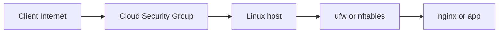

# 07. Firewall: ufw and nftables

## Intro: "we enabled the firewall — SSH is gone"

A typical Friday-evening incident: a colleague "hardened" the server, ran `ufw enable`, and the jump host can no longer log in via SSH. From the outside — **timeout** or **connection refused**, in the cloud console the VM is "green", and you can neither restart the service nor roll back the config. The cause is almost always the same: **incoming TCP 22 is not allowed** in the host firewall rules, or the traffic goes to the wrong chain (INPUT vs FORWARD in Docker).

A firewall on Linux is not "a checkbox in an antivirus". It's a **packet filter** in the kernel: for every incoming frame it decides — **accept**, **drop**, or **reject with a reply**. In DevOps you configure it on every VM, on the bastion, sometimes on Kubernetes nodes — **in addition** to the Security Group in AWS/Azure/GCP. One layer without the other is a hole; both layers without understanding is a self-inflicted wound.

In this lesson — how to think **default deny**, how to safely enable **ufw** on Ubuntu, what's under the hood (**nftables**), and why Docker breaks the intuition of "I opened a port in ufw, so everything works".

## What you'll learn

- How a **host firewall** differs from a **Security Group** in the cloud.
- How to enable **ufw** without losing SSH.
- What **INPUT**, **FORWARD**, **established/related** are in nftables.
- Why a Docker published port can bypass your expectations about ufw.
- How to tell "the port is closed by the firewall" from "the service isn't listening" by the symptoms.

## Two layers of protection

Imagine a user request to an API on a VM in a private subnet:



| Layer | Where it lives | Who edits it |
|------|-----------|------------|
| Security Group / NSG | hypervisor / cloud SDN | Terraform, console |
| ufw / nftables | inside the guest OS | admin, Ansible |

**Both** must allow the needed port. SG open, ufw closed — from outside the cloud it may be silent, and from another VM in the same VPC too. SG closed, ufw open — you still can't get in from the internet.

The policy expected by auditors and common sense: **default deny incoming** — explicitly allow only what's needed (22, 80, 443, sometimes 53 only inside the network).

## Default deny — what it means in practice

Before the firewall is enabled, many services listen on `0.0.0.0` — all interfaces. Within a day a scanner on the internet finds an open Redis, Elasticsearch, Docker API. **Default deny** tells the kernel: "everything not allowed — DROP". A closed port 6379 and `bind`/`protected-mode` for Redis — [redis-advanced/07-security](../redis-advanced/07-security.md).

Outgoing traffic (apt updates, curl, replies to established connections) is usually left as **allow outgoing** — otherwise you'll break apt and DNS until you write dozens of exceptions.

**The golden rule before `ufw enable`:** open a **second SSH session** to the same host. Don't close the first until you've confirmed the second reconnects after enable.

## ufw — the admin interface on Ubuntu

**Uncomplicated Firewall** — a wrapper that generates nftables/iptables rules. You don't have to write low-level chains for routine tasks.

### Check the current state

```bash
sudo ufw status verbose
```

`Status: inactive` — the filter isn't applied to incoming yet (but rules may already be in the config).

### The safe sequence on srv1

On the lab **srv1** (172.28.0.11) from [`deploy/linux`](../../deploy/linux/README.md):

```bash
# 1. Default policies
sudo ufw default deny incoming
sudo ufw default allow outgoing

# 2. SSH — MANDATORY before enable
sudo ufw allow OpenSSH
# or explicitly: sudo ufw allow 22/tcp

# 3. HTTP for the labs (nginx)
sudo ufw allow 80/tcp

# 4. Restrict SSH to the lab network only (educational, good practice)
sudo ufw allow from 172.28.0.0/24 to any port 22 proto tcp

# 5. Review rules with numbers — before enabling
sudo ufw status numbered

# 6. Enable — answer y to the prompt
sudo ufw enable
```

| Command | Why |
|---------|--------|
| `allow OpenSSH` | profile from `/etc/ufw/applications.d/`, port 22 |
| `allow from 172.28.0.0/24` | SSH only from the stand's Docker network |
| `status numbered` | deletion: `sudo ufw delete 3` |
| `reload` | after editing `/etc/ufw/*.rules` |

The configs are in `/etc/ufw/`. After manually editing files — `sudo ufw reload`, and don't forget about the syntax.

### What ufw does under the hood

```bash
sudo ufw status verbose
sudo nft list ruleset | less
# or on older systems:
sudo iptables-nft -L -n -v | head -40
```

You'll see chains like `ufw-user-input` — this is no longer "ufw magic", but ordinary netfilter.

## nftables — how it looks without the wrapper

On modern Debian/Ubuntu, **nftables** is the backend. A minimal educational example — **do not blindly copy to prod** without backing up your access:

```nft
table inet filter {
  chain input {
    type filter hook input priority 0; policy drop;
    ct state established,related accept
    iif "lo" accept
    tcp dport 22 accept
    tcp dport { 80, 443 } accept
  }
}
```

Line-by-line breakdown:

| Element | Meaning |
|---------|--------|
| `policy drop` | everything not allowed — drop |
| `established,related accept` | replies to already-open connections (SSH session, HTTP keep-alive) |
| `iif "lo" accept` | localhost to localhost |
| `tcp dport 22 accept` | incoming SSH |

Persistence: `/etc/nftables.conf`, then `sudo systemctl enable --now nftables`.

ufw and "raw" nft on the same host **can conflict** — on the lab srv1, ufw is enough; look at nft to understand it.

## Docker breaks the intuition: INPUT vs FORWARD

Traffic **into a container** with a published port (`-p 8080:80`) often goes through the **FORWARD** chain, not INPUT. A `ufw allow 8080` rule on the host may not match how Docker inserted the DNAT.

If "curl localhost:8080 from the host works, but from a neighboring VM it doesn't":

```bash
sudo nft list ruleset | less
sudo iptables-nft -L DOCKER -n -v 2>/dev/null
ip route get 172.28.0.10 from 172.28.0.11
```

Check **both the cloud SG** (if the VM is in the cloud), and ufw, and Docker.

## On the deploy/linux stand

| Host | IP | Role in the firewall lab |
|------|-----|----------------------|
| lab | 172.28.0.10 | client: curl, ssh |
| srv1 | 172.28.0.11 | we enable ufw |
| web | 172.28.0.20 | optionally TLS later |

From lab, check after configuring srv1:

```bash
ssh course@172.28.0.11 'sudo ufw status'
curl -s -o /dev/null -w "%{http_code}\n" http://172.28.0.11/
```

## Common mistakes

| Symptom | Likely cause | What to do |
|---------|-------------------|-------------|
| SSH timeout after enable | no rule for 22, or SSH only from a "foreign" network | provider console / `compose restart srv1`, add `allow OpenSSH` |
| Connection refused on 80 | nginx isn't listening, not the firewall | `ss -tlnp \| grep :80`, `systemctl status nginx` |
| HTTP worked, after ufw — no | forgot `allow 80/tcp` | `sudo ufw allow 80/tcp` |
| SSH OK from lab, not from the laptop | `allow from 172.28.0.0/24` — by design | for prod — your own office/VPN CIDR |
| Docker port not from the outside | FORWARD/DNAT | see the Docker section above |

## In production

- Firewall rules — in **IaC** (Ansible `ufw`, Terraform security groups), not by hand "just this once".
- **22/tcp** is often closed off from the internet entirely — access only through VPN or SSM Session Manager.
- Changes — in a change window, with a rollback plan and a second session.
- Logs of dropped packets (rate-limited) are sometimes enabled to investigate scans — not required on the lab stand.

## Summary

A host firewall is a mandatory layer together with the cloud SG. **ufw** on Ubuntu is a convenient way to enable **default deny** and explicitly open SSH and services. Before `enable`, always allow **OpenSSH** and keep a backup session. Under the hood — **nftables** and the `established,related` states. In Docker environments, also look at **FORWARD** and the DOCKER rules. A **timeout** symptom is more often the firewall or a route; **refused** — the port is closed or nobody is listening.

## Checklist

- Why two layers: SG and ufw?
- In what order do you add rules before `ufw enable`?
- What does the `established,related` chain accept?
- How does INPUT differ from FORWARD for a container?
- How do you allow HTTP only from the 172.28.0.0/24 subnet?

Next lesson: [08. Lab: ufw on srv1](08-lab-firewall.md).
