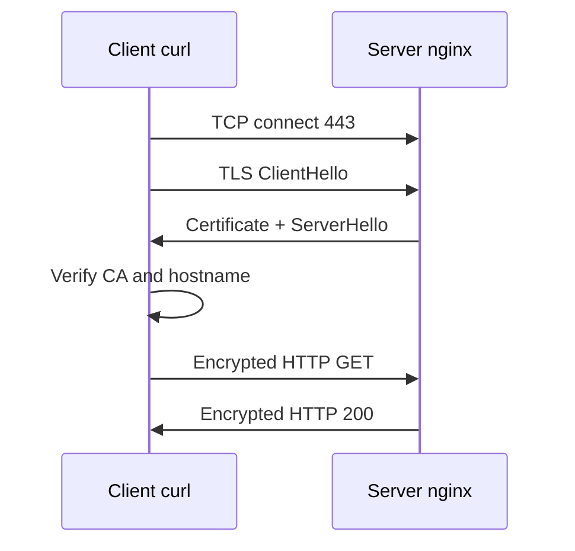

# 09. TLS and OpenSSL

> TLS termination on nginx (practice): [nginx-intermediate/01-tls-termination](../nginx-intermediate/01-tls-termination.md), stand [`deploy/nginx`](../../deploy/nginx/README.md) + `scripts/gen-certs.sh`.

## Intro: "the certificate expired" and "self-signed"

The browser blocks the site with a red padlock. CI fails on `curl https://internal.service`. A Java client complains about a **hostname mismatch**. All of this is not "HTTPS magic", but a verifiable chain: **private key**, **certificate**, **trusted CA**, and a match of the **name in the URL** with the **SAN** in the certificate.

TLS (Transport Layer Security) encrypts traffic on top of TCP and confirms that you're talking to the server whose certificate passed verification. In DevOps you issue a cert (Let's Encrypt, corporate CA) or temporarily install a **self-signed** one in the lab.

## What you'll learn

- What HTTPS consists of: TCP → TLS handshake → HTTP.
- The difference between **private key** / **certificate** / **CA chain**.
- How to inspect a certificate with **openssl** and **curl -v**.
- How to add TLS to **nginx** on the stand.
- Why `-k` in curl is only for the lab.

---

## How HTTPS works



1. TCP to port **443**.
2. **ClientHello** — cipher versions, SNI (the host name).
3. The server returns the **certificate chain**.
4. The client verifies the CA signature and the **hostname** (SAN).
5. Then HTTP inside the encrypted channel.

The client trusts the certificate if it's signed by a **CA from the trust store** of the OS/browser (or you explicitly disabled verification with `-k`).

---

## Certificate and key

| Artifact | Secret? | Where it lives |
|----------|---------|-----------|
| **Private key** (.key) | **yes**, never in git | chmod 600, owner root/nginx |
| **Certificate** (.crt/.pem) | public | nginx, LB |
| **Chain / fullchain** | public | cert + intermediate CA |

The key and certificate are a **pair**: nginx won't start TLS if they don't match (`SSL_CTX_use_PrivateKey_file` failed).

### Self-signed for the lab

```bash
sudo mkdir -p /etc/ssl/lab
sudo openssl req -x509 -nodes -days 365 -newkey rsa:2048 \
  -keyout /etc/ssl/lab/key.pem \
  -out /etc/ssl/lab/cert.pem \
  -subj "/CN=web.lab.local"
sudo chmod 600 /etc/ssl/lab/key.pem
```

| openssl option | Meaning |
|--------------|--------|
| `-x509` | self-signed cert, not a CSR |
| `-nodes` | key without a passphrase (lab; in prod often HSM/KMS) |
| `-days 365` | validity period |
| `-subj "/CN=..."` | Common Name (legacy); browsers care about the **SAN** |

Verification:

```bash
openssl x509 -in /etc/ssl/lab/cert.pem -noout -subject -issuer -dates -ext subjectAltName 2>/dev/null
openssl rsa -in /etc/ssl/lab/key.pem -check -noout
```

For a self-signed cert, the **issuer** = the **subject** (its own CA).

---

## Inspect someone else's certificate

```bash
openssl s_client -connect example.com:443 -servername example.com </dev/null 2>/dev/null \
  | openssl x509 -noout -subject -issuer -dates
curl -vI https://example.com 2>&1 | head -30
```

**SNI** (`-servername`) is required if there are many TLS sites on one IP — without SNI the server will return a "foreign" cert.

Checking the expiry (monitoring):

```bash
echo | openssl s_client -connect example.com:443 -servername example.com 2>/dev/null \
  | openssl x509 -noout -enddate
```

---

## nginx: a server block for 443

```nginx
server {
    listen 443 ssl;
    server_name web.lab.local;

    ssl_certificate     /etc/ssl/lab/cert.pem;
    ssl_certificate_key /etc/ssl/lab/key.pem;

    location / {
        return 200 "tls ok\n";
        add_header Content-Type text/plain;
    }
}
```

```bash
sudo nginx -t
sudo systemctl reload nginx
ss -tlnp | grep 443
curl -k https://172.28.0.20/
curl -v https://172.28.0.20/ 2>&1 | grep -E "subject:|issuer:|SSL certificate"
```

`-k` / `--insecure` — **do not verify** the CA (educational environment only).

---

## Let's Encrypt (concept)

**Certbot** + HTTP-01 (a file on :80) or DNS-01 (a TXT record in DNS). You need a **public DNS name** and internet access (or your DNS provider's API). For `*.lab.local` in Docker — self-signed or an internal CA (mkcert, step-ca).

Auto-renewal: a certbot systemd timer, cert-manager in Kubernetes.

---

## Common mistakes

| Error / message | Cause |
|--------------------|---------|
| certificate has expired | didn't renew the cert |
| hostname mismatch | URL ≠ CN/SAN |
| unable to get local issuer certificate | no intermediate in the chain |
| SSL_CTX_use_PrivateKey_file failed | key ≠ cert |
| permission denied on key | perms aren't 600, nginx can't read it |
| curl without -k on self-signed | expected verify failure |

---

## In production

TLS 1.2+ (1.3 is better), strong ciphers from an ingress template/the mozilla ssl-config-generator. Monitor **expiry** 30 days out. Secrets in Vault/a K8s Secret, not in the repository. HSTS, OCSP stapling — at the edge.

---

## Summary

TLS = encryption + identity via PKI. The key is a secret; the certificate is public. Verify with `openssl x509` and `curl -v`. Self-signed — for the stand; prod — a CA + expiry monitoring.

## Checklist

- [ ] How does the key differ from the certificate?
- [ ] Why SNI in s_client?
- [ ] Why shouldn't you get used to `curl -k`?
- [ ] What to check if `nginx -t` is OK but the browser complains?

Next lesson: [10. Lab: HTTPS](10-lab-tls.md).
