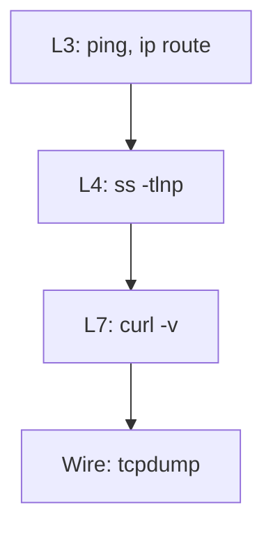

# 11. ss, curl, traceroute, tcpdump

## Intro: the "bottom-up" method

On-call: "the API isn't responding". You can't just restart everything at once — you'll lose evidence and may make things worse (restarting the DB during a network problem). A working habit is **diagnostics by OSI layers**, bottom to top:



1. **L3** — do we reach the host? (`ping`, `ip route get`)
2. **L4** — is the port listening? is the process alive? (`ss`)
3. **L7** — is HTTP/TLS responding? (`curl -v`)
4. **Wire** — did the packets really go out and a reply come back? (`tcpdump`)

This chapter brings the tools together into **one scenario**; you'll practice it in [lab 12](12-lab-tcpdump.md) on the stand `172.28.0.11` (srv1).

## What you'll learn

- When to use `ss` instead of the deprecated `netstat`.
- How to read `curl -v` output line by line.
- Why `traceroute` in a Docker network and in the WAN.
- How to safely run **tcpdump** with filters.
- The "refused vs timeout" table — the key to firewall and bind.

---

## ss — who is listening and who is connected to whom

`ss` reads data from `/proc/net/tcp` — faster and more informative than `netstat`.

```bash
ss -tlnp
ss -tlnp | grep ':80'
ss -tan state established | head
ss -ulnp
```

| Option | Meaning |
|------|--------|
| `-t` | TCP |
| `-u` | UDP |
| `-l` | listening only |
| `-n` | ports as numbers, no DNS |
| `-p` | process (root needed for all PIDs) |
| `-a` | all sockets |

**How to read a LISTEN line:**

```text
LISTEN 0 511 0.0.0.0:80 0.0.0.0:* users:(("nginx",pid=123,fd=6))
```

| bind address | Who can connect |
|------------|-------------------------|
| `0.0.0.0:80` | from any interface |
| `127.0.0.1:8080` | from localhost only |
| `172.28.0.11:22` | only on this IP |

**A typical trap:** nginx listens on `127.0.0.1:80` — from srv2, `curl http://172.28.0.11/` gives **connection refused**, even though `systemctl status nginx` is active.

```bash
# on srv1
ss -tlnp | grep nginx
```

---

## curl — the entire L7 chain

`curl -v` prints the stages: resolve → connect → TLS (if https) → HTTP.

```bash
curl -v http://172.28.0.11/ 2>&1 | head -45
curl -vk https://172.28.0.20/
curl -o /dev/null -s -w 'code=%{http_code} connect=%{time_connect}s total=%{time_total}s\n' http://172.28.0.11/
```

**Breakdown of a successful HTTP fragment:**

```text
*   Trying 172.28.0.11:80...
* Connected to 172.28.0.11 (172.28.0.11) port 80
> GET / HTTP/1.1
< HTTP/1.1 200 OK
```

| curl message | Layer | What to check |
|----------------|------|----------------|
| `Could not resolve host` | DNS | `/etc/resolv.conf`, dig |
| `Connection timed out` | L3/L4 fw | ufw, route, security group, host down |
| `Connection refused` | L4 app | `ss -tlnp`, service stopped |
| `HTTP/1.1 502 Bad Gateway` | L7 proxy | backend, nginx error.log |
| `SSL certificate problem` | TLS | SAN, expiry, `-k` only in the lab |

**Refused vs timed out** — not interchangeable:

- **Refused** — the SYN arrived, the host replied with RST (port closed / not listening).
- **Timeout** — no reply (DROP in the firewall, wrong route, host not on the network).

On the stand:

```bash
# srv1, nginx stopped
sudo systemctl stop nginx
curl -m3 http://172.28.0.11/   # from lab: refused

# ufw DROP 80 (after the firewall lesson)
# curl: timeout
```

---

## traceroute / tracepath

Shows the **hops** to the target (TTL expire → ICMP from the router).

```bash
traceroute -n 172.28.0.20
tracepath -n 172.28.0.11
```

In the `deploy/linux` network there's often a **single hop** — that's normal: lab and srv1 are on the same bridge.

In the WAN you look for where the **latency jumps** or `* * *` appears (ICMP filtering — not always a "break").

```bash
traceroute -n -T -p 443 example.com   # TCP traceroute to 443
```

---

## tcpdump — with filters

Without a filter on a busy host — gigabytes and a secrets leak.

```bash
sudo tcpdump -i any port 80 -nn -c 20
sudo tcpdump -i any host 172.28.0.11 and port 22 -nn -c 15
sudo tcpdump -i eth0 'tcp[tcpflags] & tcp-syn != 0' -nn -c 10
```

| Option | Why |
|------|--------|
| `-i any` | all interfaces (careful on noisy nodes) |
| `-nn` | don't resolve names — faster and cleaner |
| `-c N` | stop after N packets |
| `-w file.pcap` | save for Wireshark |

**Mini-breakdown of SYN/ACK:**

```text
IP 172.28.0.10.xxxxx > 172.28.0.11.80: Flags [S]     # SYN
IP 172.28.0.11.80 > 172.28.0.10.xxxxx: Flags [S.]    # SYN-ACK
```

No SYN-ACK after the SYN — firewall DROP or the host is unreachable.

In prod: sign-off, PII in the payload, limiting with `-c` and time.

---

## The "how I'd fix it" scenario (runbook)

Problem: **http://172.28.0.11/ doesn't open from lab**

| Step | Command | Good result | If bad |
|-----|---------|-------------------|------------|
| 1 | `ping -c2 172.28.0.11` | 0% loss | route, host down, icmp blocked |
| 2 | `ip route get 172.28.0.11` | via dev br0 | no route |
| 3 | `nc -zv 172.28.0.11 80` or `ss` on srv1 | open / LISTEN | refused → nginx; timeout → fw |
| 4 | `curl -v http://172.28.0.11/` | HTTP 200 | 502 → proxy; 403 → app |
| 5 | `sudo tcpdump -i any host 172.28.0.11 and port 80 -nn -c 10` | exchange visible | empty → wrong iface/filter |

Note the **first** command where the behavior "breaks" — that's the layer boundary.

---

## Common mistakes

| Mistake | Don't confuse with | The right step |
|--------|-------------|----------------|
| ping OK, curl fail | "the network is dead" | port, bind, ufw |
| curl refused | timeout | ss on the target host |
| tcpdump empty | "no packets" | interface, filter, VLAN |
| testing only from localhost | "works from the outside" | curl from **another** VM |
| looking at app logs before curl | — | first L3–L4 |

---

## In production

Service mesh, sidecar, eBPF — the picture is more complex, but **ss** and **curl** on the pod/node remain the first step. `kubectl exec` + `curl` to a Service ClusterIP repeats the same logic. Centralized logging doesn't replace a five-minute curl from a client similar to a real user.

---

## Summary

Network diagnostics — **layer by layer**, not by guessing. **ss** — ports and bind. **curl -v** — HTTP/TLS and the error text. **tcpdump** — facts, when the logs lie. Refused and timeout lead to different runbooks.

## Checklist

- [ ] How do you see the PID of a process on port 443?
- [ ] What does refused vs timed out mean, using ufw as an example?
- [ ] Why `-nn` and `-c` in tcpdump?
- [ ] Why is curl from lab more important than curl from localhost on srv1?

Next lesson: [12. Lab: tcpdump](12-lab-tcpdump.md).
