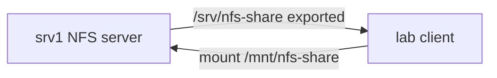

# 17. NFS: server and client

## Intro: a shared folder for several servers

Three app servers need to read the same uploaded files (media, build artifacts). Object storage (S3, MinIO) is the modern answer for new systems; **NFS** (Network File System) still shows up in legacy, virtualization, and some on-prem clusters.

One server **exports** a directory over the network, clients **mount** it as an ordinary file system — the application doesn't know the files are "far away". In Kubernetes, for **ReadWriteMany** volumes, NFS CSI is sometimes used — the export/mount principle is the same.

## What you'll learn

- The **server export** / **client mount** scheme.
- The `/etc/exports` file and the options `rw`, `sync`, `root_squash`.
- **NFSv4** vs v3 (ports, firewall).
- The **fstab** line with `_netdev`.
- Typical mount errors and "stale file handle".

---

## Architecture



| Role | Host in the stand | Action |
|------|---------------|----------|
| Server | srv1 172.28.0.11 | `nfs-kernel-server`, `/etc/exports` |
| Client | lab 172.28.0.10 | `mount -t nfs ...` |

Port **2049/tcp** (and udp) — NFS. **NFSv3** additionally pulls in **rpcbind** (111) — harder in the firewall. In the lab, **NFSv4** is preferable (a single port 2049).

---

## Server: installation and export

```bash
sudo apt install -y nfs-kernel-server
sudo mkdir -p /srv/nfs-share
echo "shared $(date -Is)" | sudo tee /srv/nfs-share/readme.txt

echo '/srv/nfs-share 172.28.0.0/24(rw,sync,no_subtree_check,no_root_squash)' | sudo tee /etc/exports
sudo exportfs -ra
sudo exportfs -v
```

| Option | Meaning |
|-------|--------|
| `172.28.0.0/24` | only this subnet can mount |
| `rw` | read and write |
| `sync` | data to disk before replying to the client (slower, safer) |
| `no_subtree_check` | fewer inode problems on rename (common in the lab) |
| `no_root_squash` | root on the client = root on the export — **dangerous in prod** |
| `root_squash` | root on the client → nobody on the server — **normal in prod** |

After editing exports, always:

```bash
sudo exportfs -ra
```

---

## Client: mount

```bash
sudo apt install -y nfs-common
showmount -e 172.28.0.11
sudo mkdir -p /mnt/nfs-share
sudo mount -t nfs 172.28.0.11:/srv/nfs-share /mnt/nfs-share
df -h /mnt/nfs-share
echo "from client" | sudo tee /mnt/nfs-share/client.txt
```

**fstab** (careful — a mistake can delay boot):

```text
172.28.0.11:/srv/nfs-share  /mnt/nfs-share  nfs  defaults,_netdev  0  0
```

| Field | Why |
|------|--------|
| `_netdev` | mount after the network comes up |
| `0 0` | no dump/fsck by default |

Check fstab without a reboot: `sudo mount -a`.

---

## How NFS looks to the application

The application does ordinary `open/read/write` — the client kernel translates them into NFS RPC. Latency is higher than on a local disk; **file locking** and the **cache** behave differently than on ext4 — with multiple writers there can be races (you need app-level locking or object storage).

---

## Common mistakes

| Symptom | Cause | Action |
|---------|---------|----------|
| access denied by server | IP not in exports, ro | `exportfs -v`, CIDR |
| mount.nfs: Connection timed out | fw, no route | ping, open 2049 |
| stale file handle | server reboot, inode changed | remount |
| Permission denied on write | root_squash, uid map | `ls -ln`, id, squash |
| target is busy on umount | a process in the directory | `lsof +D` |

---

## NFS vs alternatives

| Solution | When |
|---------|--------|
| NFS | legacy RW-many, simple shared dir |
| S3/MinIO | new apps, large volumes |
| iSCSI block | DBs, a single writer |
| Ceph/Gluster | your own storage cluster |

---

## In production

NFS over a **VPN** or a **dedicated storage VLAN**. **Kerberos** (`sec=krb5`) for authentication. Snapshots on the storage/SAN, not just `tar` from the client. Monitoring: latency, RPC errors, space on the export.

---

## Summary

NFS = a network FS: **exports** on the server, **mount** on the client. **no_root_squash** — lab only. Check **showmount**, **2049**, **exports** before "reinstalling NFS".

## Checklist

- [ ] What goes into `/etc/exports`?
- [ ] Why `_netdev` in fstab?
- [ ] Why is NFSv4 simpler for the firewall?
- [ ] Why does root_squash matter in prod?

Next lesson: [18. Lab: NFS](18-lab-nfs.md).
