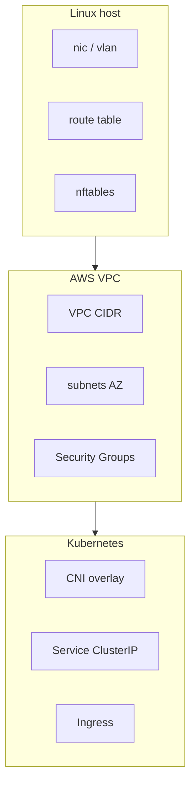

# 01. Why networking-deep: an L2–L7 map and typical failures

## Intro: "the network is broken" is not a diagnosis

An incident: "traffic isn't flowing between services." An hour later it turns out: a security group didn't open a port — not that "AWS networking went down." Another case: `curl` hangs for a minute — an MTU blackhole on the VPN, not that "the app is slow." Without a **common map of layers**, every engineer fixes their favorite layer (only the firewall or only DNS).

This course does **not replace** [`linux-intermediate`](../linux-intermediate/README.md) and [`aws-intermediate`](../aws-intermediate/README.md) — it **stitches them together**: from ARP on the host to a Transit Gateway in the cloud.

---

## What's already in mock-exams

| Topic | Where covered | What we add here |
|------|--------------|---------------------|
| TCP/IP, ping, routes | [linux-intermediate/01](../linux-intermediate/01-tcp-ip.md) | CIDR design, policy routing |
| NAT, iptables | [05–06](../linux-intermediate/05-nat-forwarding.md) | hairpin, cloud mapping |
| Firewall | [07–08](../linux-intermediate/07-firewall.md) | zones, SG vs host firewall |
| ss, curl, tcpdump | [11–12](../linux-intermediate/11-network-debug.md) | runbook, P1 scenarios |
| Custom VPC | [aws-intermediate/01](../aws-intermediate/01-vpc-custom.md) | peering, TGW, endpoints |
| ALB + SG | [03](../aws-intermediate/03-alb-security-groups.md) | L7 path, health checks |
| K8s Service | [kuber-advanced/08](../kuber-advanced/08-network-internals.md) | full CNI/overlay map |

---

## The layer model (review with a deeper dive)

```text
L7  HTTP, gRPC, a DNS query as an application
L4  TCP/UDP, ports, session establishment
L3  IP, routing, ICMP
L2  Ethernet, MAC, VLAN, ARP
L1  Physical (covered separately in bare-metal)
```

**Diagnostic rule:** don't climb up to L7 until you've ruled out L3–L4 on the **same path** as the user (not from a bastion "on the other side").

| Symptom | Common layer | First tool |
|---------|-------------|-------------------|
| `No route to host` | L3 | `ip route get <dst>` |
| `Connection refused` | L4 (port) | `ss -tlnp` on the target |
| `Connection timed out` | L3–L4 (filter/NAT) | `tcpdump`, SG/NACL |
| `Could not resolve host` | L7 (DNS) | `dig +trace` |
| TLS handshake fail | L7 | `openssl s_client` |
| Works from the host, not from a Pod | overlay/NAT | `ip route`, CNI, NetworkPolicy |

---

## The three "worlds" of a single engineer



1. **Host** — interfaces, route tables, conntrack, local firewall.
2. **VPC** — a logical L3 network, IGW/NAT, SG as a stateful firewall on the ENI.
3. **Cluster** — another overlay on top of the VPC (often VXLAN), Service IPs, kube-proxy.

A thinking error: "a Pod has its own IP in the VPC" — **often not**; the VPC sees the **node's** IP or the CNI's secondary ENI, while the Pod lives in the overlay.

---

## Typical architectures

### A three-zone VPC (the aws-intermediate teaching template)

```text
10.0.0.0/16 VPC
├── public-a   10.0.1.0/24   → IGW
├── private-a  10.0.10.0/24  → NAT (outbound internet)
└── private-b  10.0.20.0/24  → RDS, internal ALB
```

### On-prem + cloud (chapter 09)

BGP between the **customer gateway / Direct Connect** and the **cloud router** — routes for "who knows about 10.0.0.0/16."

### K8s on AWS (chapter 12)

A worker in a **private subnet** → NAT for images → an ALB in **public** → the Pod overlay inside the node.

---

## In mock-exams

| Practice | Resource |
|----------|--------|
| Host, routes, tcpdump | [`deploy/linux`](../../deploy/linux/README.md) |
| VPC Terraform | [aws-intermediate/02-lab](../aws-intermediate/02-lab-vpc-custom.md) |
| Calico / NetworkPolicy | [kuber-advanced/09](../kuber-advanced/09-lab-cni-calico.md) |

---

## Interview notes

- **Timeout vs refused** — the key to firewall vs "nothing is listening."
- **Stateful** (SG, conntrack) vs **stateless** (NACL, raw ACL) — a different rule ordering.
- **Overlay** doesn't cancel L3 — it adds encapsulation on top of the underlay.
- **BGP** — a protocol for **routing between autonomous systems**, not "configuring nginx."

---

## Summary

Networking-deep teaches you to **switch the level of abstraction**: the same incident reads differently on srv1, in the VPC, and in a Pod. Next up — the details of L2–L3.

---

## Self-check checklist

- [ ] Name the three layers where "the API doesn't work" most often gets stuck.
- [ ] Explain why a bastion with open SSH doesn't prove the service is reachable for the client.
- [ ] Where in your infrastructure does "the Linux network" end and "the AWS network" begin?

**Next:** [02. L2–L3: ARP, VLAN, CIDR](02-l2-l3.md).
