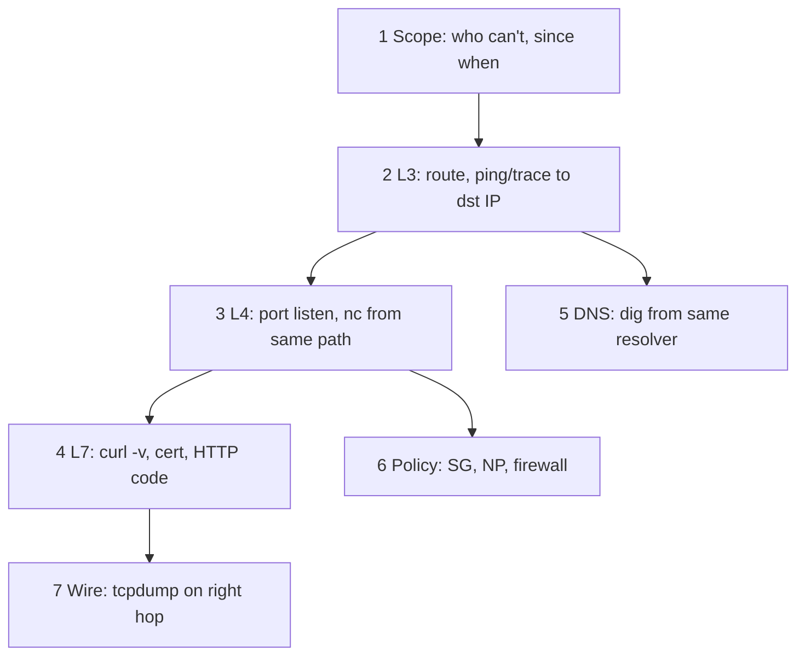

# 13. Troubleshooting methodology and runbook

## Intro

Without a method, on-call **restarts** things and **wastes time**. This chapter formalizes [linux-intermediate/11](../linux-intermediate/11-network-debug.md) for **any** environment: VM, VPC, K8s.

---

## The algorithm (bottom-up)



### 1. Scope

- **Who** is affected: all users / one region / one Pod?
- **From which** source IP is the check run (the same path)?
- **What changed**: deploy, SG, route, cert expiry?

### 2. L3

```bash
ip route get <dst>
ping -c3 <dst>          # if ICMP is allowed
traceroute -n <dst>     # where it breaks
```

### 3. L4

```bash
ss -tlnp | grep <port>     # on the server
nc -zv <dst> <port>        # from a client on the same path
```

### 4. L7

```bash
curl -v --connect-timeout 5 https://host/path
openssl s_client -connect host:443 -servername host
```

### 5. DNS

```bash
dig +short host
dig +trace host
```

### 6. Policy

- AWS: SG, NACL, route table
- Linux: `nft list ruleset`
- K8s: `kubectl get networkpolicy`

### 7. Wire

```bash
tcpdump -i any -nn host <dst> and port 443 -c 20
```

| What you see on the wire | Conclusion |
|----------------|-------|
| SYN, no SYN-ACK | filter or host down |
| SYN-ACK, RST | port closed |
| TLS ClientHello, no ServerHello | middlebox / wrong backend |
| Packets in one direction only | asymmetric routing |

---

## Symptom table

| Symptom | Likely layers | First steps |
|---------|----------------|-------------|
| timeout | SG, NACL, route, NP | tcpdump, `ip route get` |
| connection refused | app not listening, wrong IP bind | `ss -tlnp` |
| 502/503 from LB | no healthy targets, app crash | target health, app logs |
| SSL certificate problem | wrong cert, expired, SNI | `openssl s_client` |
| works in browser, not in Pod | DNS, NP, different resolver | `dig` from Pod |
| intermittent | MTU, conntrack full, flaky backend | MTU probe, metrics |

---

## Runbook template (one page)

```markdown
# Service: checkout-api

## Symptom
Users cannot complete payment (HTTP 5xx / timeout).

## Blast radius
Region eu-central-1, all AZ.

## Dashboards
- Grafana: checkout RED
- AWS: ALB 5xx, target health

## Quick checks (5 min)
1. ALB target health
2. curl -v https://checkout.internal/health from bastion AND from test Pod
3. dig checkout.internal
4. Recent deploy / SG change

## Escalation
#platform-network if SG/VPC; #app if 500 from app

## Safe mitigations
- rollback deployment
- scale replicas (if capacity)
```

---

## Anti-patterns

- Testing **only** from the engineer's laptop (a different VPN path).
- `telnet` instead of understanding refused vs timeout.
- Opening `0.0.0.0/0` "temporarily" without a ticket and rollback.
- Restarting without saving an `ss` / `tcpdump` snapshot.

---

## In mock-exams

- Practice: [15-lab-troubleshooting](15-lab-troubleshooting.md)
- Runbooks: [observability-advanced](../observability-advanced/README.md)

---

## Summary

Troubleshooting is **hypotheses by layer**, with evidence from the **same path** as the user. A runbook saves cognitive load at 3:00 AM.

---

## Checklist

- [ ] Describe the L3→L4→L7 order for "API timeout."
- [ ] When is tcpdump mandatory?
- [ ] What do you record in the incident timeline in the first 10 minutes?

**Next:** [14. Security zones](14-security-zones.md).
