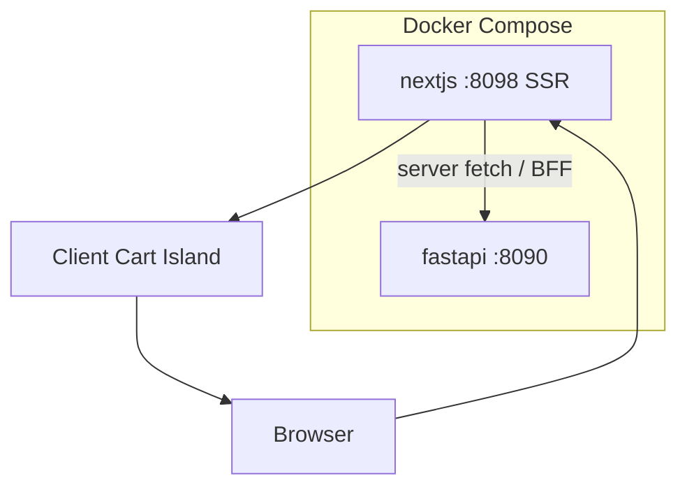

# 39. Capstone: Shop Catalog fullstack (8–10 hours)

## Intro: why a capstone

Up to this chapter you learned **fragments** of the Next.js App Router: RSC ([09-server-components.md](09-server-components.md)), server fetch ([14-server-fetch.md](14-server-fetch.md)), Route Handlers ([19-route-handlers.md](19-route-handlers.md)), Server Actions ([21-server-actions.md](21-server-actions.md)), metadata ([31-metadata-seo.md](31-metadata-seo.md)), Docker ([35-docker-deploy.md](35-docker-deploy.md)). The capstone assembles a **production-like shop** — an SSR catalog talking to FastAPI [`deploy/fastapi`](../../deploy/fastapi/README.md) on **:8090**, with Next.js in Docker on **:8098**.

The analog in the JS track is [react-basic/38-capstone](../react-basic/38-capstone.md) (SPA shop); here it's a **fullstack SSR + BFF**. The backend capstone — [fastapi/42-capstone](../fastapi/42-capstone.md).

**Time estimate:** **8–10 hours** (4–5 sessions of ~2 hours).

If you get stuck — go back to the lessons in the "When to review" table; don't copy ready-made boilerplate without understanding it.

---

## The task

**Shop Catalog Next.js** — a fullstack product-catalog application:

- **SSR** list and details from FastAPI
- **Route Handlers** as the BFF layer
- **Server Action** contact form
- **Client island** cart
- **Metadata / SEO** per product
- **Docker deploy** `:8098` + FastAPI `:8090`

The domain is the same as in the Python/React courses: **items** (`id`, `title`, `description`, optionally `price`).

---

## Functional requirements

### Routes (App Router)

| Path | Type | Description |
|------|-----|----------|
| `/` | redirect | → `/catalog` |
| `/catalog` | Server SSR | Product list from FastAPI |
| `/items/[id]` | Server SSR dynamic | Detail + add to cart (client) |
| `/cart` | Client island | Cart, noindex metadata |
| `/contact` | Server Action form | Feedback |
| `not-found` | `not-found.tsx` | 404 UI |

Layout: a shared **Header** (nav, cart badge client), **Footer**, `<main>{children}</main>`.

### API (FastAPI :8090)

| Method | Endpoint | Usage |
|-------|----------|---------------|
| GET | `/health` | smoke / optional footer |
| GET | `/api/v1/items` | Catalog SSR + sitemap |
| GET | `/api/v1/items/{id}` | Item SSR + metadata |

```bash
cd deploy/fastapi
docker compose up -d --build
curl http://localhost:8090/api/v1/items
```

### BFF Route Handlers (Next.js)

| Method | Route | Purpose |
|--------|-------|------------|
| GET | `/api/items` | Proxy list (optional if direct server fetch) |
| GET | `/api/items/[id]` | Proxy detail |
| GET | `/api/health` | Docker healthcheck |
| POST | `/api/contact` | Optional proxy; or Server Action only |

Server Components can fetch `FASTAPI_URL` **directly** or through an internal Route Handler — **one style** per project, document it in the README.

**Env:**

```env
FASTAPI_URL=http://localhost:8090          # dev host
# Docker: http://fastapi:8090
NEXT_PUBLIC_SITE_URL=http://localhost:8098
PORT=8098
```

### CatalogPage (`/catalog`)

- Server Component: `fetch` items with `{ next: { revalidate: 60 } }` or `no-store` (justify it in the README)
- **loading.tsx** — skeleton
- **error.tsx** — message + retry (`reset`)
- Empty state if `items.length === 0`
- Grid of **ProductCard** (Server, or a Client wrapper with a client AddButton)
- Search: server searchParams `?q=` **or** a client filter island — at least one option

### ItemDetailPage (`/items/[id]`)

- Shared **`getItem(id)`** for the page + **`generateMetadata`**
- `notFound()` if the API returns 404
- OG title/description ([32-lab-metadata.md](32-lab-metadata.md))
- Add to cart — client button

### CartPage (`/cart`)

- **`"use client"`** page **or** client children in a server page
- Context / `useState` + localStorage (extension)
- qty +/-, remove, clear, empty state
- Badge count in the Header
- **`cart/layout.tsx`** → `robots: { index: false }`

### ContactPage (`/contact`)

- **Server Action** `"use server"` ([22-lab-server-actions.md](22-lab-server-actions.md))
- Fields: name, email, message — server-side validation
- `useFormStatus` / pending UI on the client form wrapper
- Success/error messages (log + mock save without a real email is fine)

### Metadata / SEO

- Root `metadataBase`, `title.template`
- **`app/sitemap.ts`** — item URLs
- **`app/robots.ts`** — disallow `/cart`, `/api/`
- Per-item **`generateMetadata`**

---

## Non-functional requirements

| Requirement | Why |
|------------|-------|
| TypeScript strict | production habit |
| Clear server/client boundaries | perf, interview topic |
| `output: 'standalone'` | Docker |
| Multi-stage Dockerfile | [35-docker-deploy.md](35-docker-deploy.md) |
| Compose :8098 + :8090 | mock-exams stack |
| Healthcheck `/api/health` | [37-lab-docker.md](37-lab-docker.md) |
| CSS Modules or Tailwind ([29-styling.md](29-styling.md)) | consistent UI |
| `next/image` for placeholder ([30-images-fonts.md](30-images-fonts.md)) | optional |
| README with dev + docker commands | reviewer onboarding |
| `npm run build` without errors | CI gate |

---

## Target structure

```text
courses/nextjs-basic/examples/   # or examples/capstone/
├── README.md
├── .env.example
├── Dockerfile                   # or deploy/nextjs/
├── next.config.ts               # standalone + rewrites
├── package.json
├── app/
│   ├── layout.tsx
│   ├── globals.css
│   ├── page.tsx                 # redirect catalog
│   ├── not-found.tsx
│   ├── robots.ts
│   ├── sitemap.ts
│   ├── catalog/
│   │   ├── page.tsx
│   │   ├── loading.tsx
│   │   └── error.tsx
│   ├── items/[id]/
│   │   └── page.tsx             # + generateMetadata
│   ├── cart/
│   │   ├── layout.tsx           # noindex metadata
│   │   └── page.tsx
│   ├── contact/
│   │   ├── page.tsx
│   │   └── actions.ts           # Server Actions
│   └── api/
│       ├── health/route.ts
│       └── items/               # optional BFF
├── components/
│   ├── layout/Header.tsx
│   ├── layout/Footer.tsx
│   └── catalog/ProductCard.tsx
├── features/
│   └── cart/
│       ├── CartProvider.tsx     # "use client"
│       └── AddToCartButton.tsx
├── lib/
│   ├── api/items.ts             # getItems, getItem
│   └── validations/contact.ts
└── types/
    └── item.ts
```



---

## Step-by-step plan (recommended)

### Session 1 (~2 h): scaffold + SSR catalog

1. Scaffold or evolve [`examples/`](examples/package.json).
2. `lib/api/items.ts` — `getItems()`, typed `Item`.
3. `/catalog` Server Component + loading/error.
4. Header/Footer layout, redirect `/` → `/catalog`.
5. **Criterion:** the catalog SSR HTML contains titles from `:8090`.

**Lessons:** [14-server-fetch.md](14-server-fetch.md), [15-lab-server-fetch.md](15-lab-server-fetch.md), [18-error-not-found.md](18-error-not-found.md).

### Session 2 (~2 h): dynamic item + metadata + cart

1. `/items/[id]` + shared `getItem`.
2. **`generateMetadata`** + canonical.
3. Client **CartProvider** + AddToCartButton.
4. `/cart` page + badge.
5. **Criterion:** add on detail → visible on `/cart`; View Source title = item name.

**Lessons:** [05-dynamic-routes.md](05-dynamic-routes.md), [32-lab-metadata.md](32-lab-metadata.md), [25-lab-client-state.md](25-lab-client-state.md).

### Session 3 (~2 h): BFF + contact + SEO files

1. Route Handler `/api/health` + optional items proxy ([20-lab-route-handlers.md](20-lab-route-handlers.md)).
2. Contact **Server Action** + validation ([22-lab-server-actions.md](22-lab-server-actions.md)).
3. `robots.ts`, `sitemap.ts`, cart noindex.
4. **Criterion:** an invalid form is blocked server-side; the sitemap lists items.

**Lessons:** [19-route-handlers.md](19-route-handlers.md), [21-server-actions.md](21-server-actions.md), [31-metadata-seo.md](31-metadata-seo.md).

### Session 4 (~2 h): styling + polish

1. CSS Modules or Tailwind for the catalog grid ([29-styling.md](29-styling.md)).
2. `next/image` placeholder ([30-images-fonts.md](30-images-fonts.md)).
3. Search `?q=` or filter.
4. `npm run build`, fix TS/errors.
5. **Criterion:** the production build is OK.

### Session 5 (~1–2 h): Docker + README

1. `output: 'standalone'`, Dockerfile, compose :8098/:8090 ([37-lab-docker.md](37-lab-docker.md)).
2. Smoke: health, catalog, docker logs.
3. README: architecture diagram, env table, screenshots.
4. Self-check the acceptance criteria below.

---

## Implementation hints

### Shared getItem (dedupe)

```tsx
// lib/api/items.ts
const base = () => process.env.FASTAPI_URL ?? "http://localhost:8090";

export async function getItem(id: string): Promise<Item | null> {
  const res = await fetch(`${base()}/api/v1/items/${id}`, {
    next: { revalidate: 60, tags: [`item-${id}`] },
  });
  if (res.status === 404) return null;
  if (!res.ok) throw new Error(`Item ${id} fetch failed`);
  return res.json();
}
```

### generateMetadata

```tsx
export async function generateMetadata({ params }: Props): Promise<Metadata> {
  const { id } = await params;
  const item = await getItem(id);
  if (!item) return { title: "Item not found" };
  return {
    title: item.title,
    description: item.description.slice(0, 160),
    openGraph: { title: item.title, url: `/items/${id}` },
  };
}
```

### Server Action sketch

```tsx
// app/contact/actions.ts
"use server";

import { z } from "zod";

const schema = z.object({
  name: z.string().min(2).max(100),
  email: z.string().email(),
  message: z.string().min(10).max(1000),
});

export type ContactState = { ok: boolean; errors?: Record<string, string[]> };

export async function submitContact(
  _prev: ContactState,
  formData: FormData
): Promise<ContactState> {
  const parsed = schema.safeParse({
    name: formData.get("name"),
    email: formData.get("email"),
    message: formData.get("message"),
  });
  if (!parsed.success) {
    return { ok: false, errors: parsed.error.flatten().fieldErrors };
  }
  // log / mock persist
  console.info("contact", parsed.data);
  return { ok: true };
}
```

### Cart functional update

```tsx
setLines((prev) => {
  const i = prev.findIndex((l) => l.id === item.id);
  if (i >= 0) {
    return prev.map((l, idx) =>
      idx === i ? { ...l, qty: l.qty + 1 } : l
    );
  }
  return [...prev, { id: item.id, title: item.title, qty: 1 }];
});
```

---

## Extensions (optional)

| Level | Task | Hours |
|---------|--------|------|
| A | TanStack Query client + dehydrate SSR | +1.5 |
| B | Middleware auth stub `/admin` | +1 |
| C | `[locale]` ru/en ([33-i18n-overview.md](33-i18n-overview.md)) | +2 |
| D | OG image `opengraph-image.tsx` per item | +1 |
| E | Playwright e2e smoke catalog | +2 |
| F | nginx reverse proxy in front of :8098 | +1 |

---

## Acceptance criteria (self-check)

- [ ] `docker compose up` → `:8098/catalog` SSR items from `:8090`
- [ ] `/items/1` title + OG; `/items/99999` → not-found
- [ ] Cart: add, qty, remove, empty, badge
- [ ] Contact: server validation, pending state, success UI
- [ ] `sitemap.xml` + `robots.txt` correct
- [ ] `/cart` noindex
- [ ] `curl :8098/api/health` OK; compose healthy
- [ ] `npm run build` + Docker build success
- [ ] README complete
- [ ] Server/client split explainable in an interview
- [ ] [interview-cheatsheet.md](interview-cheatsheet.md) passed without peeking
- [ ] [38-interview-qa.md](38-interview-qa.md) — ≥ 30/35 confidently

---

## Common mistakes

1. **`FASTAPI_URL=localhost` inside Docker** — use the service name `fastapi`.

2. **Metadata in the client cart page** — use `cart/layout.tsx`.

3. **Forgetting to COPY `.next/static` in Docker** — broken CSS.

4. **The entire app `"use client"`** — defeats the value of Next.js.

5. **Duplicate fetch** in page vs metadata — share `getItem`.

6. **Static export enabled** — breaks SSR/API ([36-static-export.md](36-static-export.md)).

7. **Client hitting `:8090` directly without CORS** — use server fetch or the BFF.

8. **No loading/error** — poor UX, an interview red flag.

9. **Hardcoded URLs** — use env for staging/prod.

10. **Healthcheck on a heavy SSR route** — use `/api/health`.

---

## When to review lessons

| Problem | Lesson |
|---------|------|
| Server fetch / cache | 14, 16, 17 |
| Dynamic route / 404 | 05, 18 |
| Client cart | 10, 25 |
| Route Handlers BFF | 19, 20 |
| Server Actions form | 21, 22 |
| Metadata / sitemap | 31, 32 |
| Docker / standalone | 34, 35, 37 |
| Styling | 29, 30 |
| Export vs SSR confusion | 36 |

---

## After the capstone

1. Go through [interview-cheatsheet.md](interview-cheatsheet.md) and [38-interview-qa.md](38-interview-qa.md) once more.
2. Check off in [javascript-path.md](../javascript-path.md): **react-intermediate**, **javascript-testing**, **nodejs-basic**.
3. Portfolio: screenshots + Docker compose commands + a link to the `capstone-nextjs-shop` branch.
4. Optional: integrate the Django admin `:8092` for item content.

Congratulations — **nextjs-basic** is complete.

---

[← 38-interview-qa](38-interview-qa.md) · [interview-cheatsheet](interview-cheatsheet.md) · [README](README.md)
