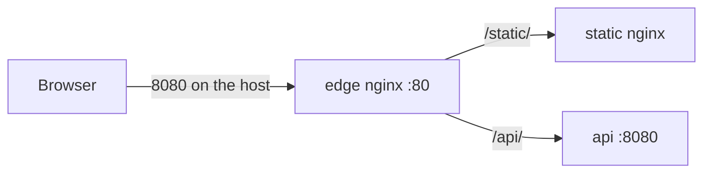

# 01. Why nginx: edge vs app server

## Intro: one entry point instead of ten ports

In production a team often has three layers: **browser** → **edge** (nginx, Ingress, ALB) → **application** (Flask, Node, Java). The user sees `https://shop.example.com/api/orders`, while inside the network the request lands on `http://api:8080/orders` — without publishing every microservice on its own external port.

If you completed [containers-basic: multi-service Compose](../containers-basic/10-compose-multi-service.md), you have already seen this pattern: the **web** container with nginx listens on **8088** on the host and proxies `/api/*` to **api**. The **nginx-basic** course goes deeper into exactly the **edge role**: routing, headers, logs, upstream — on the [`deploy/nginx`](../../deploy/nginx/README.md) stand with ports **8080** (HTTP) and **8443** (HTTPS).

An overview of nginx on "bare" Linux is in [linux-intermediate/13-nginx](../linux-intermediate/13-nginx.md); here it is the same logic, but in Docker and with explicit container names.

## What you'll learn

- How a **reverse proxy / edge** differs from an **app server**.
- When nginx serves **files** and when it **proxies**.
- Why DevOps keeps nginx in Compose and in Kubernetes.
- How this course connects to containers and Ingress.

## Edge vs app server

| Role | Typical tasks | Examples on the stand |
|------|-----------------|-------------------|
| **Edge** | TLS termination, routing by path/Host, rate limit, compression, unified logs | `mock-nginx-edge` :8080 |
| **App server** | Business logic, JSON, sessions, DB | `mock-nginx-api` (Python :8080) |
| **Static backend** | HTML/CSS without logic | `mock-nginx-static` |

The **edge** does not replace the application: it **terminates HTTP(S)** on the outside and **rewrites** the request to the internal service. The app server **must not** be reachable from the internet directly — only from the compose `internal` network.



Compare with [`deploy/containers/stack/web/nginx.conf`](../../deploy/containers/stack/web/nginx.conf): there nginx is **both** the edge **and** serves `index.html` — for a learning stack that is fine. In `deploy/nginx` the roles are **split**: the edge only routes, static only serves files.

## Why nginx, and not "just one more container with Flask"

- **Stability under load** — an event-driven model, little memory per connection.
- **One config** for dozens of `location` blocks and vhosts.
- **Graceful reload** — `nginx -t` and `reload` without dropping all clients (unlike a full restart of the application).
- **Ecosystem** — Ingress Controller (ingress-nginx), API gateway, CDN origin.

Edge alternatives: Traefik, Envoy, HAProxy, a cloud ALB. The concepts of **proxy_pass**, **upstream**, and **X-Forwarded-*** carry over between them.

## A typical DevOps scenario

1. A developer brings up an api on `:8080` inside the cluster/compose.
2. You add `location /api/` → `proxy_pass` + headers to the edge.
3. You attach the TLS certificate to the edge (intermediate labs / [linux-intermediate/09-tls](../linux-intermediate/09-tls-openssl.md)).
4. Monitoring watches **5xx on the edge** and **upstream latency** in the access.log.

The check before a reload is always the same:

```bash
cd deploy/nginx
docker compose exec mock-nginx-edge nginx -t
docker compose exec mock-nginx-edge nginx -s reload
```

## Connection to containers-basic

In [lab 11 compose](../containers-basic/11-lab-compose-stack.md) you brought up **web + api + redis**. nginx in the web image is a **simplified edge** in a single container. The nginx-basic course teaches you to **split the edge** into a separate service — as in production and as in Kubernetes (Ingress → Service → Pod).

| Stand | Host port | Edge |
|-------|---------------|------|
| deploy/containers | 8088 | web (nginx + static) |
| deploy/nginx | 8080 / 8443 | edge (proxy only) |

### What to look at in the web image

The file [`deploy/containers/stack/web/nginx.conf`](../../deploy/containers/stack/web/nginx.conf) has two `location` blocks: `/` serves `index.html` from disk, `/api/` proxies to `http://api:8080/`. The Dockerfile copies the config into `/etc/nginx/conf.d/default.conf` — the same `include` mechanism as `conf.d` on the nginx-basic stand.

A useful exercise before the lab 03: bring up `deploy/containers`, open the web config, and say out loud which request goes to Flask and which stays in nginx.

```bash
cd deploy/containers
docker compose up -d --build
curl -s http://localhost:8088/ | head -3
curl -s http://localhost:8088/api/health
```

You already did this in [chapter 10 of containers-basic](../containers-basic/10-compose-multi-service.md); here we repeat the focus on the **role of nginx**, not on compose.

## When nginx is not needed as a separate edge

- **Serverless** (Lambda + API Gateway) — the cloud does the routing.
- **Service mesh** with an ingress gateway (Envoy) — nginx may be absent.
- **A single service in dev** — sometimes `ports` on the app is enough (not for prod).

Even then, understanding **proxy_pass** and **X-Forwarded-*** is needed when debugging and when reading Ingress annotations.

## Common mistakes

| Mistake | Consequence |
|--------|-------------|
| Publishing the api to the host with `ports: 8080:8080` | bypasses the edge, extra surface |
| Confusing "nginx in the app image" and "a separate edge" | hard to change TLS and routes |
| Reload without `nginx -t` | the edge won't start, 502 on everything |
| Expecting business logic from nginx | you need an app server |

## In production

- The edge is **stateless**, config from Git, deployed via CI/Ansible.
- The app scales horizontally behind **upstream** or a K8s Service.
- WAF / DDoS — in front of or on the edge.
- Edge logs are the source of truth about **external** traffic.

## Summary

**nginx on the edge** is the single HTTP(S) door: static content, API, TLS, limits. The **app server** handles the request after the proxy. The course stand splits **edge / static / api**; the config check is `docker compose exec mock-nginx-edge nginx -t`. Next up — the architecture of files and processes.

## Checklist

- How does the edge differ from an app server?
- Where is nginx in the deploy/containers stack?
- Why not expose the api on the host?
- Which command checks the syntax on the stand?

Next lesson: [02. Stand architecture](02-architecture.md).
