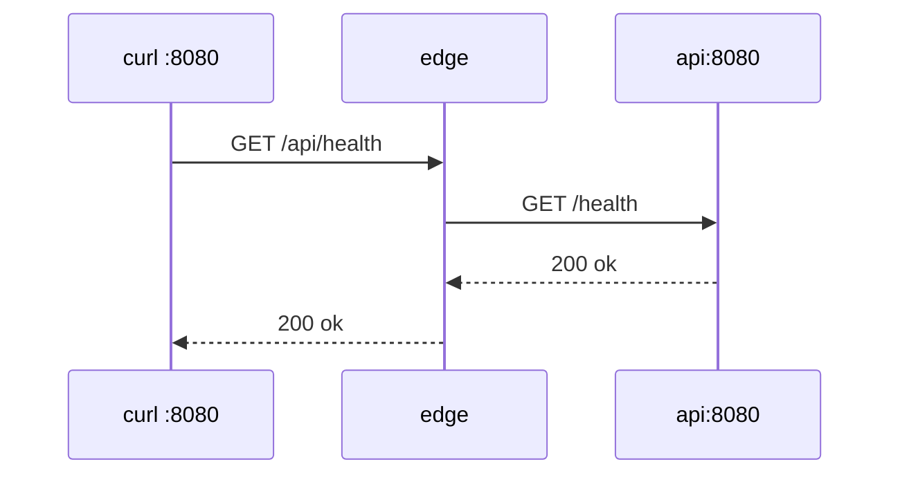

# 04. Reverse proxy: proxy_pass, the slash, X-Forwarded-*

## Intro: the client sees /api/health, the backend — /health

The edge receives `GET http://localhost:8080/api/health`. The **api** container listens for `GET /health` on :8080. Between them are the **`proxy_pass`** directive and the URI rewrite rule based on the **trailing slash** in the upstream URL.

This chapter is the theory that you have already seen in condensed form in [linux-intermediate/13-nginx](../linux-intermediate/13-nginx.md) and in [containers-basic web nginx](../../deploy/containers/stack/web/nginx.conf). On the stand the reference is [`00-default.conf`](../../deploy/nginx/config/conf.d/00-default.conf). The practice is [lab 05](05-lab-proxy-pass.md).

## What you'll learn

- Configuring `location` + `proxy_pass`.
- The **client URI → backend URI** table.
- The set of **X-Forwarded-\*** headers.
- The `proxy_connect_timeout` / `proxy_read_timeout` timeouts.

## Request diagram



The config on the stand:

```nginx
location /api/ {
    proxy_pass http://api:8080/;
    proxy_http_version 1.1;
    proxy_set_header Host $host;
    proxy_set_header X-Real-IP $remote_addr;
    proxy_set_header X-Forwarded-For $proxy_add_x_forwarded_for;
    proxy_set_header X-Forwarded-Proto $scheme;
}
```

A snippet to copy: [`examples/proxy-pass-snippet.conf`](examples/proxy-pass-snippet.conf).

## The trailing slash trap

nginx matches the **prefix** `location /api/` against the URI. If the `proxy_pass` specifies a URI with a **slash** (`http://api:8080/`), the location prefix is **stripped** and the tail is substituted in.

| Client request | proxy_pass | Backend request |
|----------------|------------|-------------------|
| `/api/health` | `http://api:8080/` | `/health` |
| `/api/health` | `http://api:8080` | `/api/health` |
| `/api/v1/x` | `http://api:8080/v1/` | `/v1/x` |

**Rule:** a slash **after** host:port in `proxy_pass` enables rewriting (with a prefix location that ends in a slash).

Before deploying, ask: "which path will my Flask/Go handler see?" The "404 on the API with a live backend" error is this table in 80% of cases.

## The X-Forwarded-* headers

| Header | Variable | Why the backend needs it |
|-----------|------------|---------------|
| `Host` | `$host` | virtual host, cookies domain |
| `X-Real-IP` | `$remote_addr` | client IP in the app logs |
| `X-Forwarded-For` | `$proxy_add_x_forwarded_for` | the chain of proxies |
| `X-Forwarded-Proto` | `$scheme` | http vs https behind TLS on the edge |

Without **`X-Forwarded-Proto`** an application behind HTTPS on :8443 may generate `http://` links. On the stand, after `gen-certs.sh`, the HTTPS location in `10-tls.conf` sets `https`.

The backend should **trust** these headers only from a known edge (in production — a firewall, don't publish the app directly).

## proxy_http_version 1.1

HTTP/1.0, the default in old configs, does not keep keepalive to the upstream. **`proxy_http_version 1.1;`** is the baseline practice for an API. The lab on upstream with keepalive is [chapter 08](08-upstream.md).

## Timeouts

```nginx
proxy_connect_timeout 5s;
proxy_read_timeout    30s;
```

| Symptom in error.log | Directive |
|---------------------|-----------|
| `upstream timed out` | `proxy_read_timeout` |
| `connect() failed` | backend down or wrong host |

## The difference between root and proxy_pass

| Task | Directive | Example |
|--------|-----------|--------|
| Files from **this** nginx's disk | `root` + `try_files` | static container |
| A request to **another** service | `proxy_pass` | `/api/` → api |

On the edge **proxy_pass** to a separate static is used for `/static/` — consistency with the API (in production static may be S3 or a CDN).

## TLS on the edge

HTTP — :8080. HTTPS — :8443 after:

```bash
bash scripts/gen-certs.sh
docker compose exec mock-nginx-edge nginx -t
docker compose exec mock-nginx-edge nginx -s reload
curl -sk https://localhost:8443/api/health
```

Certificate theory: [linux-intermediate/09-tls](../linux-intermediate/09-tls-openssl.md).

## Common mistakes

| Symptom | Cause |
|---------|---------|
| 404 on the API | wrong slash in proxy_pass |
| 502 | api not listening / not in the network |
| Redirects to http | no X-Forwarded-Proto |
| Double prefix /api/api | extra path in proxy_pass |

## In production

- One edge per ingress class / ALB.
- `proxy_set_header` moved into an Ansible/Helm **snippet**.
- For WebSocket — separate `Upgrade`, `Connection` directives (out of scope for basic).

## Summary

**proxy_pass** with **`http://api:8080/`** strips `/api/` and gives the backend a clean path. **X-Forwarded-\*** tell the application the real client and scheme. Always **`nginx -t`** before a reload.

## Checklist

- Where does `/api/hits` land with the stand's config?
- How does `proxy_pass` with a slash differ from without one?
- Why is `X-Forwarded-Proto` needed with TLS on 8443?

Next lesson: [05. Lab: proxy_pass](05-lab-proxy-pass.md).
