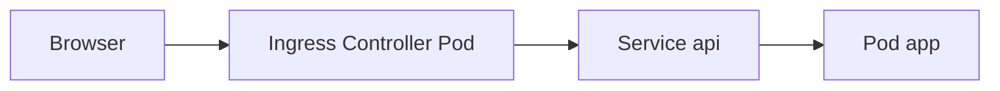

# 10. Ingress: theory and the connection to the nginx edge

## Intro: the same reverse proxy, a different way to configure it

Everything you configured in `deploy/nginx` — **listen 80**, `server_name`, `location /api/`, `proxy_pass`, TLS on :443 — is done in Kubernetes by an **Ingress Controller**. Most often it is **ingress-nginx**: inside the Pod is the same nginx, and the config is generated from **Ingress** resources rather than from files in `conf.d/`.

This chapter is a **theory bridge** without a mandatory cluster. The Ingress practice is [kuber-basic/20-ingress](../kuber-basic/20-ingress.md) and [lab 21](../kuber-basic/21-lab-ingress.md).

## What you'll learn

- The difference between an **Ingress** (object) and an **Ingress Controller** (process).
- The correspondence between nginx directives and Ingress fields.
- Why **ingressClassName** and the rewrite annotations exist.
- How the `deploy/nginx` stand prepares you for the Kubernetes course.

## The problem without Ingress

Each **Service** of type **LoadBalancer** or **NodePort** is a separate external port or LB. Ten microservices means ten load balancers — expensive and inconvenient for TLS by hostname.

**Ingress** is a declaration of rules: "host `app.local`, path `/api` → Service `api:8080`". The **Controller** reads all the Ingresses in the cluster and writes `nginx.conf` (or an equivalent).



## Correspondence table

| deploy/nginx (edge) | Kubernetes |
|---------------------|------------|
| `server_name localhost` | `rules[].host` |
| `location /api/` | `paths[].path` + `pathType: Prefix` |
| `proxy_pass http://api:8080/` | `backend.service.name` + `port` |
| `upstream api_backends` | a Service with several Endpoints |
| `ssl_certificate` in the server :443 | `spec.tls` + a Secret |
| `X-Forwarded-*` | set by the controller automatically |

An example Ingress from kuber-basic:

```yaml
spec:
  ingressClassName: nginx
  rules:
    - host: app.local
      http:
        paths:
          - path: /
            pathType: Prefix
            backend:
              service:
                name: web
                port:
                  number: 80
```

**ingressClassName: nginx** — "only process this with a controller of class nginx" (like choosing the right edge).

## Rewrite and the slash — again

An annotation (ingress-nginx):

```yaml
nginx.ingress.kubernetes.io/rewrite-target: /$2
```

This is the same meaning as **`proxy_pass` with a slash**: external `/api/v1/users` → internal `/users`. **404** errors in the cluster are often due to a wrong rewrite — as in [lab 05](05-lab-proxy-pass.md).

## TLS

On the stand: `gen-certs.sh` → `10-tls.conf` → :8443.

In the cluster: **cert-manager** + `tls.secretName` in the Ingress, or a cloud managed certificate. The browser trusts the CA, not a self-signed cert.

TLS theory: [linux-intermediate/09](../linux-intermediate/09-tls-openssl.md).

## Controller vs CNI vs Service

| Component | Level |
|-----------|---------|
| **CNI** (Calico, Flannel) | Pod↔Pod network |
| **Service** (ClusterIP) | a stable VIP over a set of Pods |
| **Ingress** | HTTP routing by host/path |
| **Ingress Controller** | the implementation (nginx, Traefik) |

Your **mock-nginx-edge** ≈ one Ingress Controller Pod. **mock-nginx-api** ≈ the Pods behind the Service `api`.

## Several Ingresses and one Controller

Like `include conf.d/*.conf` on the edge, the controller **merges** the rules from all Ingress objects. A host/path conflict is an error or an unpredictable priority; in a Git review the host and path matter.

## Difference from a Service Mesh

**Ingress** is the entry **into the cluster** (north-south). A **Mesh** (Istio, Linkerd) is also east-west between services. nginx-basic covers north-south; a mesh is a separate course.

## What you can already do after nginx-basic

- Read a **location / path** and understand the backend path.
- Diagnose a **502** from the upstream error.log.
- Configure **X-Forwarded-Proto** behind TLS.
- Use **upstream** as an analog of a Service with several Pods.

## Common mistakes in Ingress

| Symptom | Cause |
|---------|---------|
| Ingress exists, no traffic | Controller not installed / not running |
| 404 | rewrite-target, pathType |
| 502 | Pod not Ready, wrong port in the Service |
| TLS not working | the Secret is not in the Ingress namespace |

## In production

- One **ingress class** per environment.
- GitOps: the Ingress in the application repository.
- WAF in front of the controller (Cloudflare, AWS WAF).
- Body limits and timeout — annotations or the controller ConfigMap.

## Summary

**Ingress** is a declarative "nginx.conf" for the cluster; **ingress-nginx** is the same reverse proxy as the edge on :8080. Mastering `proxy_pass`, logs, and upstream on Docker directly speeds up [kuber-basic](../kuber-basic/README.md).

## Checklist

- How does an Ingress differ from a Service?
- Which object is useless without a Controller?
- What in nginx corresponds to `rules[].host`?
- Where is the Ingress practice in the repository?

Next lesson: [11. Final project](11-final-project.md).
