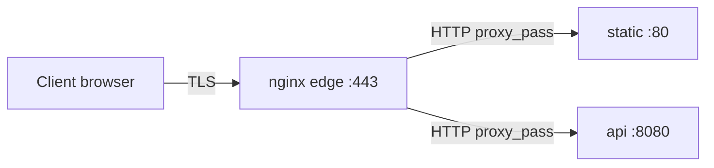

# 01. TLS termination on the edge

## Intro: where HTTPS ends

In production it's rare to encrypt traffic **from the edge to every Pod**. More often the scheme is like this:

```text
[client] --TLS--> [nginx / ALB / Ingress] --HTTP or TLS--> [backend]
```

**TLS termination** — nginx (or an Ingress Controller) accepts HTTPS on :443, decrypts the request, and can then:

- proxy to the backend over **plain HTTP** on the internal network (Docker network, VPC);
- or re-enable TLS to the backend (**re-encrypt**) — a separate topic for zero-trust.

On the stand [`deploy/nginx`](../../deploy/nginx/README.md) the **edge** container plays the perimeter role; the certificates live in `certs/`, the config is `config/conf.d/10-tls.conf`.

PKI theory, key vs certificate, SAN — see [`linux-intermediate/09-tls-openssl`](../linux-intermediate/09-tls-openssl.md). Here we cover **how it plugs into nginx**.

## What you'll learn

- Why the edge terminates TLS instead of every backend.
- The `ssl_certificate`, `ssl_certificate_key`, `ssl_protocols` directives.
- How `gen-certs.sh` prepares self-signed certs for `localhost` and `lab.local`.
- The `X-Forwarded-Proto` header for a backend that builds redirects to `https://`.
- The link to [Ingress](../kuber-basic/20-ingress.md): the same pattern at the cluster level.

---

## Roles in the architecture



| Node | Port outside | TLS |
|------|----------------|-----|
| edge | 8080 HTTP, 8443 HTTPS (host mapping) | yes, on 443 inside the container |
| static, api | internal network only | no |

Advantages of termination on the edge:

- One cert per site name, instead of N certificates for N services.
- Centralized cipher suites, HSTS, WAF (in the cloud — on the LB).
- The backend stays simple (a Python API without OpenSSL).

Risk: traffic **between** the edge and the backend over an open network must be isolated (VPC, NetworkPolicy). In Docker Compose the `internal` network is a learning-grade isolation.

---

## Certificates on the stand

The script [`deploy/nginx/scripts/gen-certs.sh`](../../deploy/nginx/scripts/gen-certs.sh):

```bash
cd deploy/nginx
bash scripts/gen-certs.sh
```

Creates `certs/server.crt` and `certs/server.key` with a **SAN**: `DNS:localhost`, `DNS:lab.local`, `IP:127.0.0.1`. Without a SAN, modern clients complain about a hostname mismatch even with `-k` in some scenarios.

Checking the key/cert pair:

```bash
openssl x509 -in deploy/nginx/certs/server.crt -noout -subject -dates
openssl rsa -in deploy/nginx/certs/server.key -check -noout
```

In the edge container the volume is mounted as `/etc/nginx/certs/`.

---

## The server block for HTTPS

The reference — [examples/ssl-server-block.conf](examples/ssl-server-block.conf) and `deploy/nginx/config/conf.d/10-tls.conf`:

```nginx
server {
    listen 443 ssl;
    server_name localhost lab.local;

    ssl_certificate     /etc/nginx/certs/server.crt;
    ssl_certificate_key /etc/nginx/certs/server.key;
    ssl_protocols       TLSv1.2 TLSv1.3;

    location /api/ {
        proxy_pass http://api:8080/;
        proxy_set_header Host $host;
        proxy_set_header X-Forwarded-Proto https;
    }
}
```

| Directive | Purpose |
|-----------|------------|
| `listen 443 ssl` | enable TLS on port 443 |
| `ssl_certificate` | public cert (PEM) |
| `ssl_certificate_key` | private key (secret) |
| `ssl_protocols` | allowed TLS versions |

After a change, **always**:

```bash
docker compose exec edge nginx -t
docker compose exec edge nginx -s reload
```

`reload` is graceful: the master re-reads the config, and workers finish their old connections.

---

## HTTP → HTTPS (concept)

In production a redirect from :80 is common:

```nginx
server {
    listen 80;
    server_name app.example.com;
    return 301 https://$host$request_uri;
}
```

On the stand, HTTP :8080 is left for labs without TLS. In the final project you can add a redirect in a separate `server`.

---

## X-Forwarded-Proto

The backend doesn't see that the client arrived over HTTPS unless you pass the context:

```nginx
proxy_set_header X-Forwarded-Proto $scheme;   # http on :80
proxy_set_header X-Forwarded-Proto https;     # explicitly on the TLS server
```

Applications use this to build absolute URLs in JSON, `Secure` cookies, and redirects. In Kubernetes the Ingress Controller sets the same headers automatically.

---

## Verification from the client

```bash
curl -sk https://localhost:8443/
curl -vk https://localhost:8443/api/health 2>&1 | grep -E "SSL|subject:|issuer:"
echo | openssl s_client -connect localhost:8443 -servername localhost 2>/dev/null \
  | openssl x509 -noout -subject -dates
```

| Flag | When |
|------|--------|
| `-k` / `--insecure` | self-signed in the lab |
| `-v` | debugging the handshake and cert |
| SNI `-servername` | required when several certs share one IP |

---

## Let's Encrypt vs lab

In production: **cert-manager** + Ingress, or **certbot** on a VM. You need public DNS and internet access (HTTP-01) or DNS API (DNS-01).

On `localhost` LE won't issue a cert — use `gen-certs.sh`, **mkcert**, or a corporate CA.

---

## Link to Kubernetes Ingress

[Ingress](../kuber-basic/20-ingress.md) describes the rules; **ingress-nginx** is the same nginx with:

- TLS in `spec.tls` (a Secret with cert/key);
- annotations for rewrite, rate limit, cors.

The skill of "reading `server {}` on the edge" transfers to reading the controller's **ConfigMap** and Ingress annotations.

---

## Common mistakes

| Symptom | Cause |
|---------|---------|
| `nginx: [emerg] cannot load certificate` | no files in `certs/` — run `gen-certs.sh` |
| `SSL_CTX_use_PrivateKey_file() failed` | key doesn't match the cert |
| Browser: NET::ERR_CERT_AUTHORITY_INVALID | self-signed — expected |
| hostname mismatch | URL isn't in the cert's SAN |
| 502 only on HTTPS | typo in `proxy_pass`, backend unreachable |
| Backend redirects to `http://` | `X-Forwarded-Proto` wasn't passed |

---

## Summary

TLS termination on nginx is the standard perimeter pattern: one cert, decryption on the edge, HTTP (or re-encrypt) to the services. On the stand the cert is generated by `gen-certs.sh`, the config is `10-tls.conf`, and verification is `curl -vk` and `openssl s_client`.

## Checklist

- [ ] Where does TLS end in your scheme?
- [ ] Why a SAN in a self-signed cert for localhost?
- [ ] How does `reload` differ from `restart`?
- [ ] How does Ingress replicate the edge nginx role?

Next lesson: [02. Lab: HTTPS](02-lab-https.md).
