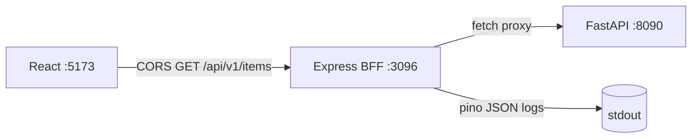

# 39. Capstone: Shop BFF (6–8 hours)

## Intro: why a capstone

Lessons 00–38 gave you **pieces**: event loop, streams, Express middleware, pino, proxy to FastAPI. The capstone combines them into **one deployable service** — the “Shop Proxy” BFF that React (`:5173`) uses to reach the shop API on [`deploy/fastapi`](../../deploy/fastapi/README.md) `:8090`.

Backend-track analogue — [fastapi/42-capstone](../fastapi/42-capstone.md); in the JS track — [javascript-basic/39-capstone](../javascript-basic/39-capstone.md) (CLI tasks). Here — an **HTTP BFF**, as in the prod mock-exams stack.

**Time estimate:** 6–8 hours of focused work (3–4 sessions of 2 hours).

---

## Task

Implement an **Express BFF** on port **3096** that:

1. Proxies shop endpoints to FastAPI **8090**.
2. Serves **health** / **readiness** for the orchestrator.
3. Logs requests with **pino** (JSON, request id).
4. Reads config from **env** (dotenv locally).
5. Allows **CORS** for the Vite React dev server **5173**.

Starter skeleton: [`examples/`](examples/package.json). FastAPI: `cd deploy/fastapi && docker compose up -d --build`.

---

## Functional requirements

### API proxy

| BFF endpoint | Upstream | Method |
|--------------|----------|-------|
| `/api/v1/items` | `{FASTAPI_URL}/api/v1/items` | GET |
| `/api/v1/items/{id}` | `{FASTAPI_URL}/api/v1/items/{id}` | GET |

- Forward upstream **HTTP status** (200, 404, 5xx).
- Forward JSON **Content-Type**.
- When upstream is down — **503** with `{ "error": "upstream_unavailable" }`.
- Upstream timeout: **10 s** (`AbortSignal.timeout`).

**Extension B (optional):** `POST /api/v1/items` with a JSON body — if you add the route to the FastAPI stand.

### Health

| Endpoint | Behavior |
|----------|-----------|
| `GET /health` | 200 `{ "status": "ok", "service": "shop-bff" }` — always if the process is alive |
| `GET /health/ready` | 200 if `GET {FASTAPI_URL}/health` OK within 3 s; otherwise 503 |

### CORS

- `origin`: `http://localhost:5173`, `http://127.0.0.1:5173`
- `credentials: true` (for future cookie auth in react-intermediate)
- Don't use `origin: *` with credentials

### Logging

- **pino-http** on all requests: method, url, status, duration, `req.id`
- Accept incoming **`X-Request-Id`** or generate a UUID
- 5xx errors — `level: error` with field `err` (stack in log, not in response)

### Configuration

| Variable | Default | Description |
|------------|---------|----------|
| `PORT` | 3096 | BFF port |
| `FASTAPI_URL` | — | **required**, no trailing slash |
| `LOG_LEVEL` | info | pino level |
| `NODE_ENV` | development | in production — no stack in JSON |

Template: [`.env.example`](examples/.env.example).

---

## Non-functional requirements

| Requirement | Why |
|------------|-------|
| ES modules, `"type": "module"` | lesson 09 |
| Split: `index`, `app`, `config`, `routes`, `services` | lesson 35 |
| Centralized error handler | lessons 24, 36 |
| `helmet()` | lesson 36 |
| Basic rate limit on `/api/` (100 req/min per IP) | lesson 36, `express-rate-limit` |
| README in `examples/` with curl examples | for the reviewer |
| Don't commit `.env` | lesson 28 |

---

## Target structure

```text
examples/
├── .env.example
├── package.json
├── README.md
├── lab/                          # starter files already there
└── src/
    ├── index.js                  # listen
    ├── app.js                    # createApp(), middleware chain
    ├── config.js                 # env validation
    ├── routes/
    │   ├── health.js
    │   └── proxy.js              # /api/v1/*
    ├── services/
    │   └── fastapiClient.js      # fetch wrapper, timeout, headers
    └── middleware/
        └── errorHandler.js
```



---

## Step-by-step plan

### Phase 1 — Skeleton and health (~1.5 h)

1. `npm install` in `examples/`; copy `.env.example` → `.env`.
2. Start FastAPI `:8090`; verify `curl http://localhost:8090/health`.
3. Finish [`src/app.js`](examples/src/app.js): move health into `routes/health.js`.
4. Implement `/health/ready` with an upstream ping.
5. **Criterion:** `curl http://localhost:3096/health/ready` → 200 with FastAPI alive.

**Lessons:** [28-env-config.md](28-env-config.md), [21-express-routing.md](21-express-routing.md).

### Phase 2 — FastAPI client and proxy (~2 h)

1. `services/fastapiClient.js`: `get(path, { requestId })`, base URL from config, timeout 10 s.
2. `routes/proxy.js`: mount `GET /api/v1/items`, `GET /api/v1/items/:id`.
3. Forward status/body; on `fetch` failure — 503.
4. **Criterion:**

```bash
curl -s http://localhost:3096/api/v1/items | jq .
# same items[] as curl :8090
```

**Lessons:** [20-fastapi-client.md](20-fastapi-client.md), [33-proxy-aggregation.md](33-proxy-aggregation.md), [34-lab-bff.md](34-lab-bff.md).

### Phase 3 — Logs, CORS, errors (~1.5 h)

1. Ensure pino-http is the first middleware after helmet.
2. Forward `X-Request-Id` in the upstream fetch.
3. Error handler: prod without stack; optional detail in dev.
4. Check CORS from the browser or:

```bash
curl -H "Origin: http://localhost:5173" -I http://localhost:3096/api/v1/items
```

5. **Criterion:** logs show one JSON line per request with `req.id`.

**Lessons:** [30-logging-pino.md](30-logging-pino.md), [25-express-body-cors.md](25-express-body-cors.md), [24-express-errors.md](24-express-errors.md).

### Phase 4 — Security hardening (~1 h)

1. `npm install helmet express-rate-limit`.
2. `app.use(helmet())` — verify with `curl -I`.
3. Rate limit 100/min on `/api/`.
4. `express.json({ limit: "100kb" })` for future POST.
5. **Criterion:** 101st quick request → 429.

**Lessons:** [36-security-basics.md](36-security-basics.md).

### Phase 5 — Docs and smoke (~1 h)

1. `examples/README.md`: install, env, curl, endpoints table.
2. Smoke script (bash or PowerShell):

```bash
curl -sf http://localhost:3096/health
curl -sf http://localhost:3096/health/ready
curl -sf http://localhost:3096/api/v1/items | grep -q items
```

3. Stop FastAPI — `/health/ready` should be 503, `/health` — 200.

**Lessons:** [35-project-structure.md](35-project-structure.md).

### Phase 6 — React integration (optional, +1–2 h)

1. In [`react-basic`](../react-basic/README.md) set proxy or `VITE_API_URL=http://localhost:3096`.
2. TanStack Query `useQuery` on `/api/v1/items`.
3. **Criterion:** product list in the UI with no CORS error in Console.

---

## Implementation hints

### fastapiClient.js

```javascript
export async function fastapiGet(path, { requestId, signal } = {}) {
  const url = `${config.fastapiUrl}${path}`;
  const headers = { Accept: "application/json" };
  if (requestId) headers["X-Request-Id"] = requestId;

  const res = await fetch(url, {
    headers,
    signal: signal ?? AbortSignal.timeout(10_000),
  });

  const body = await res.text();
  return { status: res.status, body, contentType: res.headers.get("content-type") };
}
```

### Proxy handler

```javascript
router.get("/items", async (req, res, next) => {
  try {
    const { status, body, contentType } = await fastapiGet("/api/v1/items", {
      requestId: req.id,
    });
    res.status(status).type(contentType ?? "json").send(body);
  } catch (err) {
    if (err.name === "TimeoutError" || err.cause?.code === "ECONNREFUSED") {
      return res.status(503).json({ error: "upstream_unavailable" });
    }
    next(err);
  }
});
```

### Readiness

```javascript
router.get("/health/ready", async (_req, res) => {
  try {
    const r = await fetch(`${config.fastapiUrl}/health`, {
      signal: AbortSignal.timeout(3000),
    });
    if (!r.ok) return res.status(503).json({ status: "not_ready", upstream: r.status });
    return res.json({ status: "ready" });
  } catch {
    return res.status(503).json({ status: "not_ready", upstream: "unreachable" });
  }
});
```

---

## Extensions (optional)

| Level | Task | Hours |
|---------|--------|------|
| B | Aggregation: BFF endpoint `/api/v1/shop/summary` = items + health meta | +1 |
| C | Multi-stage Dockerfile, non-root | +1.5 |
| D | `deploy/nodejs` compose next to fastapi | +1 |
| E | Vitest + supertest on `/health` and mock upstream | +1.5 |

---

## Success criteria (self-check)

- [ ] `npm run dev` starts the BFF on `:3096` with `.env`
- [ ] `GET /api/v1/items` returns FastAPI data when `:8090` is up
- [ ] FastAPI down → `/health/ready` 503, `/api/v1/items` 503
- [ ] Logs — JSON, has `req.id`; error stacks **not** in the response body
- [ ] CORS: Origin `5173` — `Access-Control-Allow-Origin` headers correct
- [ ] `helmet` + rate limit on `/api/`
- [ ] Code split across `routes/`, `services/`, not a 500+ line monolith
- [ ] `examples/README.md` with verification commands

---

## Common mistakes

1. **`FASTAPI_URL` with a slash** — double `//api` → 404. Normalize in `config.js`.
2. **Forgot `await`** in an async route — empty response, 200 with no body.
3. **CORS only on GET** — preflight OPTIONS not handled (cors package fixes this).
4. **Parse JSON and re-emit** — breaks exact upstream body; for GET, forwarding `text` or deliberate parse/stringify is fine.
5. **Logging the entire upstream body** — noise and PII; status + duration is enough.
6. **Rate limit after routes** — never fires; mount before routers.

---

## When to revisit lessons

| Problem | Lesson |
|---------|------|
| ECONNREFUSED | 20, deploy/fastapi README |
| middleware order | 22 |
| async 500 with no log | 24 |
| CORS in browser | 25 |
| env missing | 28 |
| no req.id | 30–31 |
| proxy timeout | 33 |
| stack in response | 36 |
| attach debugger | 37 |

---

## After the capstone

1. Work through [interview-cheatsheet.md](interview-cheatsheet.md) one last time.
2. Next course: [**nodejs-intermediate**](../javascript-path.md) (Prisma, JWT) or [**react-basic**](../react-basic/README.md) (UI for your BFF).
3. Optional: move the BFF into `deploy/nodejs` and add CI smoke from `deploy/fastapi/scripts/`.

Congratulations — **nodejs-basic** is complete.
