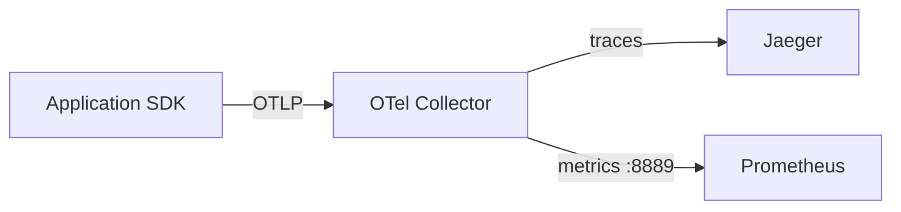

# 01. OpenTelemetry and distributed tracing

## Intro: "the metrics are green, the users are furious"

Grafana shows `up=1`, error rate 0.1%, p99 latency normal — but **one customer** sees 30 s timeouts. Aggregates average out the tail; without a **trace** you won't see that the request hung on `payment-service` → `legacy-db` after a successful cache hit in Redis.

At the advanced level you build an **end-to-end picture**: the metric says "what broke," the log says "where to look," the trace says "which path the request took and where the time was lost."

## The three pillars of observability

| Pillar | Question | Example tool |
|-------|--------|-------------------|
| **Metrics** | How much? How fast? | Prometheus, CloudWatch |
| **Logs** | What happened at a point? | Loki, CloudWatch Logs |
| **Traces** | How did the request move across services? | Jaeger, Tempo, X-Ray |

They **complement** each other. Metrics are cheap for alerting; traces are more expensive — they need **sampling**.

## The trace model

- **Trace** — a single request end-to-end (shared `trace_id`).
- **Span** — a single unit of work (HTTP handler, SQL, Redis `GET`).
- **Parent/child** — the call tree.
- **Attributes** — keys (`http.status_code`, `db.statement` — be careful with PII).
- **Events** — point-in-time markers inside a span.

Example JSON (OTLP): [`examples/otel-span.json`](examples/otel-span.json).

## OpenTelemetry (OTel)

**OTel** is a vendor-neutral SDK + the **OTLP** protocol (gRPC `4317`, HTTP `4318`).

The typical path in our stack:

Collector config: [`deploy/observability/config/otel-collector.yml`](../../deploy/observability/config/otel-collector.yml).

| Component | Role |
|-----------|------|
| **SDK** (auto-instrumentation) | Creates spans in the code |
| **Collector** | Ingest, batch, routing, sampling |
| **Backend** | Jaeger UI, Tempo, Honeycomb, X-Ray |

## Propagation (W3C Trace Context)

Service A must pass `traceparent` (and optionally `tracestate`) over HTTP/gRPC to service B — otherwise the trace is **broken**.

| Header | Purpose |
|-----------|------------|
| `traceparent` | `version-trace_id-parent_span_id-flags` |
| `tracestate` | Vendor-specific hints |

**At the interview:** "You forgot propagation in an async queue — in Jaeger you get two unrelated traces."

## Sampling

| Strategy | When |
|----------|-------|
| **Head-based** (1%) | Cheap, uniform |
| **Tail-based** (in the collector) | Keep all errors and slow requests |
| **Parent-based** | Child spans follow the root's decision |

Rule: **100% traces in prod** at high RPS will blow up storage. Alert on **metrics**; use traces for investigation.

## OTel vs "just Jaeger"

Jaeger is a **backend + UI**. OTel is the **collection standard**. In AWS the traces equivalent is [X-Ray](../aws-intermediate/19-cloudwatch.md) (`tracing_config` on Lambda).

## Relation to Redis monitoring

A slow API is often not HTTP but **Redis**. In the trace, add a child span `redis.GET` with `db.system=redis`. Check the metrics in [`redis-intermediate/15-monitoring`](../redis-intermediate/15-monitoring.md): `SLOWLOG`, `commandstats`, latency doctor — that's a **narrow datastore slice**, while the trace shows the **share** of Redis in the overall request.

## Common mistakes

| Mistake | Consequence |
|--------|-------------|
| `user_id` in span name | Cardinality in the backend |
| Spans without `service.name` | "unknown" in Jaeger |
| No correlation trace_id ↔ log | Jumping between UIs |
| Sync export from the app | Backpressure, latency |

## At the interview

1. **How does a trace differ from a log?** A log is an event within a single process; a trace is a linked tree spanning services.
2. **Why a Collector instead of going straight to Jaeger?** Sampling, PII scrubbing, fan-out (metrics + traces), a single configuration point.
3. **How do you debug 0.01% of errors?** Tail sampling + the `http_errors` metric + exemplars (Prometheus 2.x) or trace_id in the logs.

## Summary

- Traces answer **"where the time went and who is at fault in the chain."**
- OTel + OTLP is the standard; Jaeger is the UI in [`deploy/observability`](../../deploy/observability/README.md) on port **16686**.
- Sampling is mandatory in production; propagation is mandatory between services.

Next lesson: [02-lab-jaeger.md](02-lab-jaeger.md).
