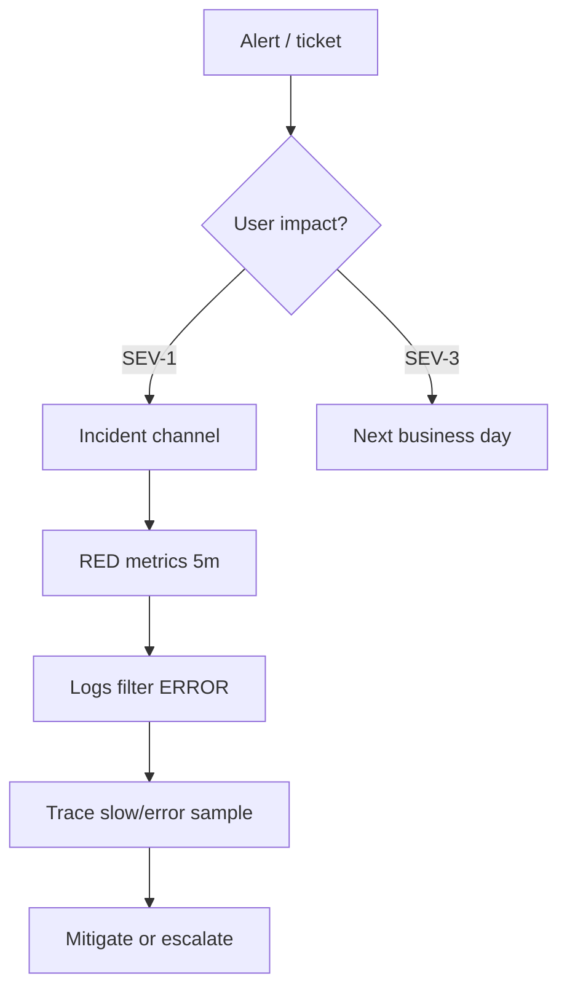

# 07. Troubleshooting and runbooks

## Intro: on-call without a runbook = heroics

At 03:00 the page reads **Checkout down**. A new engineer restarts pods "for luck." A senior opens the runbook: **symptom → metrics → logs → traces → mitigation** — and rolls back the deploy in 12 minutes. A runbook is part of **observability**, not a PDF in Confluence.

Template: [`examples/runbook-template.md`](examples/runbook-template.md).

## Framework: the first 10 minutes



| Step | Tool | Question |
|-----|------------|--------|
| 1 | Alertmanager / PagerDuty | What's on fire? |
| 2 | Grafana RED | Rate, Errors, Duration |
| 3 | Loki / CloudWatch Logs | New ERROR pattern? |
| 4 | Jaeger / X-Ray | Which span is slow? |
| 5 | `kubectl` / runbook | Mitigation |

## RED and USE

| Method | For what | Example |
|-------|----------|--------|
| **RED** | Microservices | Rate, Errors, Duration |
| **USE** | Infra (CPU, disk, net) | Utilization, Saturation, Errors |

```promql
# Error ratio
sum(rate(demo_http_requests_total{status=~"5.."}[5m]))
/ sum(rate(demo_http_requests_total[5m]))

# p99 latency
histogram_quantile(0.99,
  sum(rate(demo_http_request_duration_seconds_bucket[5m])) by (le, path))
```

## Correlating signals

| Pairing | How |
|--------|-----|
| trace_id in logs | JSON field `trace_id` from OTel |
| Exemplars | Prometheus → jump to trace (if configured) |
| Time | A single timezone UTC; note deploy time |

## Scenarios (cheatsheet)

### 1. Latency spike, errors low

- Check **dependency** spans (DB, Redis).
- Redis: `SLOWLOG`, `INFO commandstats` — [redis-advanced/09](../redis-advanced/09-troubleshooting.md).
- Node saturation: `container_cpu_usage_seconds_total`, throttling.

### 2. Error rate 5xx

- Deploy correlation (`kube_deployment_status_replicas_updated`).
- Recent config / feature flag.
- Downstream 503 in a trace.

### 3. "No data" in Grafana

- Target `up==0`?
- Scrape interval vs alert `for:`?
- CloudWatch: wrong region/namespace — [19-cloudwatch](../aws-intermediate/19-cloudwatch.md).

### 4. Alert storm

- Alertmanager **inhibition**: node down → suppress app alerts.
- Fix the root cause, not 50 silences forever.

## Runbook quality bar

A good runbook has:

- **Copy-paste PromQL** and log queries
- **Expected values** ("normal < 0.01")
- **Escalation** with timers
- A link to the **dashboard** and **previous incidents**

A bad one: "check the monitoring."

## Parallel with Redis runbooks

[`redis-advanced/09`](../redis-advanced/09-troubleshooting.md) — the first 5 minutes: `PING`, `INFO`, `SLOWLOG`. An observability runbook **includes** the datastore steps as a branch, it doesn't replace them.

## AWS hybrid

Lambda errors: metric filter + alarm → SNS ([20-lab-cloudwatch](../aws-intermediate/20-lab-cloudwatch.md)). EKS workloads — Prometheus + an optional **CloudWatch agent** for control plane logs.

## At the interview

1. **How do you tell infra from app?** Node USE vs RED on the service; the trace shows the layer.
2. **When do you escalate?** SLO burn, no mitigation in 15–30 min, data loss risk.
3. **Blameless postmortem** — action items: alert, runbook, cardinality fix.

## Summary

- A runbook = a reproducible path from symptom to action.
- RED + logs + traces; Redis/AWS are specialized branches.
- Template in `examples/runbook-template.md`.

Next lesson: [08-lab-oncall-drill.md](08-lab-oncall-drill.md).
