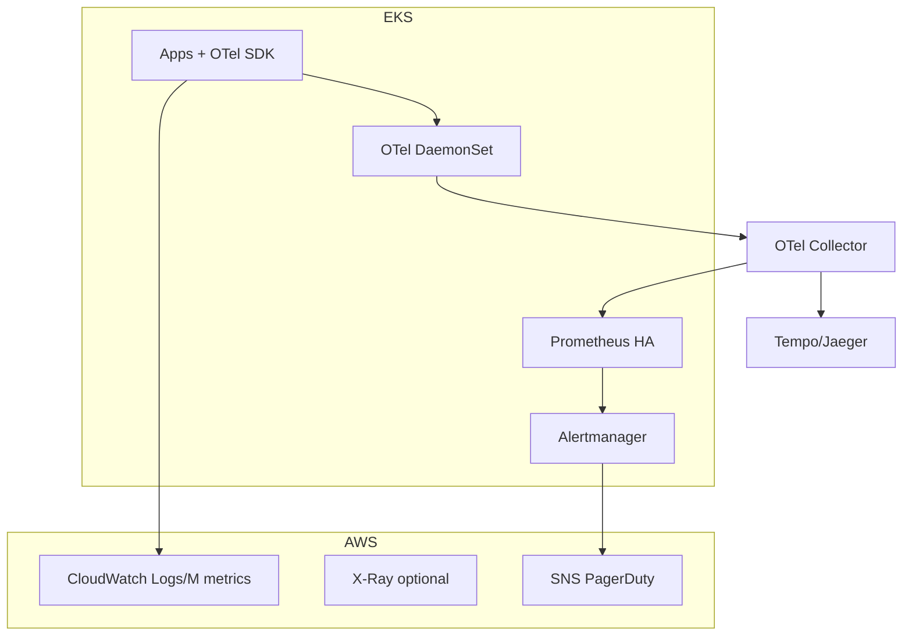

# 11. System design: observability platform

## Intro

A staff/senior task: **"Design observability for 200 microservices on AWS + EKS, limited budget, on-call 24/7."** They assess **standards**, **cost**, and **on-call ergonomics**, not "we'll set up Prometheus."

## Answer framework (45 min)

1. **Requirements** (5 min) — SLO, compliance, regions, teams.
2. **Estimates** (5 min) — RPS, samples/sec, retention.
3. **Architecture** (15 min) — diagram of ingest/storage/query.
4. **Deep dives** (15 min) — cardinality, security, multi-tenancy.
5. **Risks** (5 min) — blind spots, vendor lock, "monitoring down."

---

## Clarifying questions

- **SLO:** availability/latency per critical path?
- **Regulatory:** PII in logs/traces? retention EU-only?
- **Teams:** 20 squads — shared platform or federated?
- **Existing:** CloudWatch only or greenfield?
- **Budget:** managed (AMP/Grafana Cloud) vs self-hosted?

---

## Back-of-envelope

| Parameter | Example |
|----------|--------|
| Services | 200 |
| Avg 500 req/s each (not all peak) | 100k RPS order of magnitude |
| Metrics series per svc (controlled) | ~500 → 100k series |
| Scrape interval 30s | ~3k samples/s metrics (rough) |
| Trace sampling 1% @ 100k RPS | 1k traces/s peak |

**Rule:** cardinality guardrails matter more than the exact RPS on the board.

---

## Reference architecture (hybrid AWS)

| Signal | EKS | AWS managed |
|--------|-----|-------------|
| Infra + k8s | kube-prometheus-stack [03](03-kube-prometheus.md) | — |
| App metrics | Prometheus + ServiceMonitor | Custom CW if must |
| Logs | Loki / Fluent Bit → S3 | CloudWatch Logs [19](../aws-intermediate/19-cloudwatch.md) |
| Traces | OTel → Tempo/Jaeger | X-Ray for Lambda |

---

## Standards (platform team)

| Standard | Content |
|----------|------------|
| **OTel** | Mandatory SDK, `service.name`, resource attrs |
| **Logs** | JSON: `timestamp`, `level`, `trace_id`, `service` |
| **Metrics** | Naming: `http_server_duration_seconds` histogram |
| **Labels** | Denylist: `user_id`, `email`, full URL |
| **Dashboards** | Golden signals per service template |

---

## Alerting philosophy

- **SLO-based** alerts > static thresholds
- **Burn rate** 2-window (Google SRE book)
- **Runbooks** linked in the `runbook_url` annotation
- **Inhibition** node/network before pod noise

Example CloudWatch path for Lambda: [20-lab-cloudwatch](../aws-intermediate/20-lab-cloudwatch.md).

---

## Datastore: Redis layer

The cache isn't in a vacuum:

| Signal | Tool |
|--------|------|
| Latency / hot key | Trace span + `INFO commandstats` |
| Memory | `used_memory`, alerts on `maxmemory` |
| Slow commands | SLOWLOG — [redis-intermediate/15](../redis-intermediate/15-monitoring.md) |

Don't export every key to Prometheus.

---

## Cost controls

| Knob | Effect |
|------|--------|
| Trace sampling | Largest trace bill |
| Metrics retention 15d hot | TSDB size |
| Recording rules | Cheaper dashboards |
| Log index labels only | Loki/CW cost |
| Drop labels at collector | Protect cardinality |

[05-cardinality-cost](05-cardinality-cost.md).

---

## Security

- PII scrubbing in the Collector processor
- RBAC Grafana folders per team
- mTLS ingest OTLP
- No secrets in span attributes

---

## Failure modes

| Risk | Mitigation |
|------|------------|
| Monitoring outage | External synthetics, multi-replica |
| Cardinality explosion | CI lint + relabel |
| Trace gap | Propagation tests in CI |
| Alert storm | Inhibition + SEV definitions |

---

## At the interview — anti-patterns

- "One Prometheus without HA for 200 services"
- "100% traces forever"
- "Every team its own Jaeger without standards"
- "Only CloudWatch without app RED metrics"

## Summary

- Platform: **standards + shared backends + guardrails**.
- Hybrid AWS: EKS Prometheus + CloudWatch for the control plane/Lambda.
- Cost and cardinality are part of the design, not an afterthought.

Next lesson: [12-lab-system-design.md](12-lab-system-design.md).
