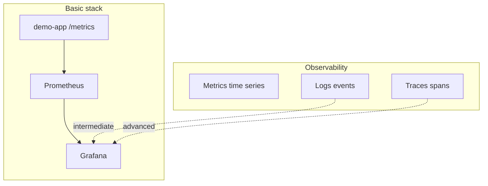

# 01. Why observability: metrics, logs, traces

## Intro: "everything is green, users are screaming"

The release went out: the `/health` healthcheck returns 200, the deploy is green. An hour later, support: **checkout is failing on 30% of requests**. The logs have millions of lines, and APM says "everything is fine" based on average latency. It turns out **5% of requests** to the payment API take 40 s, while the rest take 50 ms; the average **hides the tail**. An SRE opens **Grafana**: p99 latency is up 10x, and the **error rate** for `status=5xx` is 8%. Within 15 minutes they find a **connection pool leak** — not "production magic", but **observability**.

This chapter is a **mental map**: what observability is, how it differs from "just monitoring", and where to start on a Prometheus + Grafana stack.

## What you'll learn

- The three pillars: **metrics**, **logs**, **traces** — their roles and order in an incident.
- The difference between **monitoring** and **observability** (known vs unknown failures).
- Why **Prometheus + Grafana** is the de-facto standard in cloud-native.
- The boundaries of basic: metrics and alerts; logs — [11. Logs](11-logs-preview.md), k8s — [kuber-advanced/14](../kuber-advanced/14-observability.md).

## The three pillars

| Pillar | Question | Example on the stack |
|-------|--------|------------------|
| **Metrics** | How many? How fast? What % of errors? | `demo_http_requests_total`, histogram latency |
| **Logs** | What happened in this request? | container stdout → Loki (intermediate) |
| **Traces** | Where did 200 ms get lost between services? | Jaeger / OTel (advanced) |



**Metrics** are numbers over time with labels (low cardinality, cheap alerts). **Logs** are text events (high detail, more expensive to store). **Traces** are the call tree of a single request id.

## Monitoring vs observability

| | Monitoring | Observability |
|---|------------|---------------|
| Goal | know in advance "what broke" | **understand why** during a new failure |
| Dashboards | a fixed set of KPIs | **ad-hoc** queries (PromQL, Explore) |
| Data | pre-exported metrics | metrics + logs + traces, correlation |

Observability doesn't replace **SLOs and alerts** — it gives you the **investigation tools** for when an alert fires for the first time.

## A typical incident path

1. **Alert** in Alertmanager: `DemoHighErrorRate` firing.
2. **Grafana**: error rate, RPS, p95 latency panels — [10. Golden signals](10-golden-signals.md).
3. **Prometheus → Graph**: `sum by (status)(rate(...))` — which code?
4. **Logs** (if Loki is present): filter by `trace_id` or `pod` — [11. Logs](11-logs-preview.md).
5. **Trace** (advanced): a bottleneck in a downstream DB.

At the basic level you nail down steps **1–3** on [`deploy/observability`](../../deploy/observability/README.md).

## Why Prometheus, not "just Datadog right away"

| | Prometheus (pull) | SaaS APM |
|---|-------------------|----------|
| Model | scrape `/metrics`, TSDB | agent / SDK push |
| Cost | self-hosted, predictable | per host / per span |
| Ecosystem | CNCF, kube-prometheus, exporters | rich UI out of the box |
| Barrier to entry | PromQL, labels | quick start |

In production it's often **both**: Prometheus for infrastructure and SLOs, SaaS for business traces. Comparison — [12. vs CloudWatch/Datadog](12-vs-cloudwatch-datadog.md).

## On the stack: first contact

```bash
cd deploy/observability
docker compose up -d --build
docker compose ps
bash scripts/smoke.sh
```

| URL | Purpose |
|-----|------------|
| [localhost:9090](http://localhost:9090) | Prometheus UI |
| [localhost:3000](http://localhost:3000) | Grafana (`admin` / `admin`) |
| [localhost:8000/metrics](http://localhost:8000/metrics) | demo-app text metrics |

Generate some load:

```bash
bash scripts/traffic.sh
```

In Prometheus → **Graph** run `up` — all targets should be `1`.

## Common mistakes

| Mistake | Why it's bad | The right way |
|--------|--------------|---------------|
| "We only look at averages" | hides p99 and tails | percentiles from a histogram, RED |
| "Logs = monitoring" | no aggregation, expensive to alert on | metrics for alerts, logs for details |
| "1000 labels on user_id" | cardinality explosion, TSDB OOM | labels: `service`, `status`, `route` |
| "An alert for every hiccup" | alert fatigue | `for:`, severity, SLO-based |
| "A dashboard without a runbook" | panic when it's firing | annotation + link to the playbook |

## In production

- **SLO**: error budget, burn rate alerts (advanced).
- **Retention**: 15d–90d for Prometheus; long-term — Thanos/Mimir.
- **HA**: two Prometheus instances + federation or remote write (intermediate/advanced).
- **Kubernetes**: the same stack via **kube-prometheus-stack** — see [kuber-advanced/14-observability](../kuber-advanced/14-observability.md) (ServiceMonitor, kube-state-metrics).
- **Security**: don't expose `/metrics` to the internet without auth; a separate scrape network.

## Interview notes

- **Observability** — the ability to answer a **new** question about the system without redeploying code.
- **Pull vs push**: Prometheus pulls metrics over HTTP; the pushgateway is an exception for batch jobs.
- **Cardinality** — the number of unique time series = metric × label combinations.
- **RED**: Rate, Errors, Duration — for services; **USE**: Utilization, Saturation, Errors — for resources.

## Summary

Observability is not a single tool, but a **culture and a stack**: metrics for **trends and alerts**, logs for **context**, traces for **distributed latencies**. The basic course builds a foundation on **Prometheus + Grafana** locally; next up — Loki, OTel, Kubernetes.

## Checklist

- Name the three pillars and one question for each.
- Why is p99 latency more important than the average?
- Why labels in Prometheus, and why is `user_id` dangerous?
- What is the demo-app metrics URL on the stack?

Next lesson: [02. The Prometheus model](02-prometheus-model.md).
