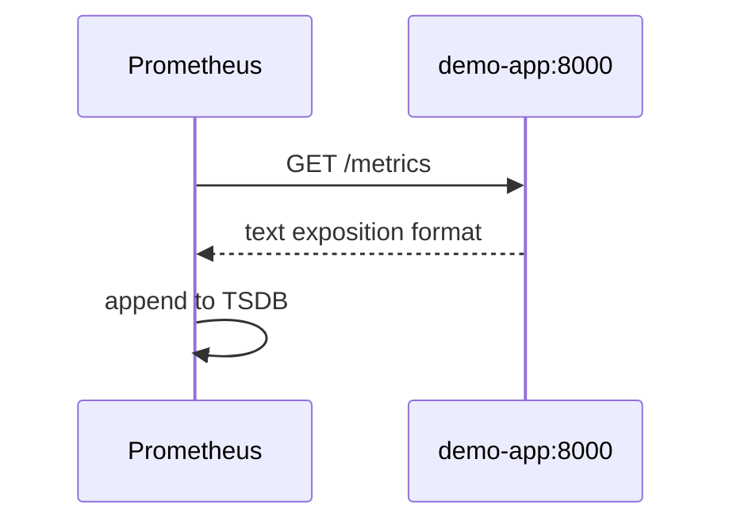

# 02. The Prometheus model: metrics, labels, TSDB

## Intro: "one metric — a thousand series"

A developer added a `request_id` label to a counter "for convenience". Within a day Prometheus **ate 32 GB of RAM** and crashed — every request created a **new time series**. In interviews they don't ask "how to install it", but **how metric types and labels work**. This chapter is the Prometheus data model illustrated with the **demo-app** stack.

## What you'll learn

- Types: **Counter**, **Gauge**, **Histogram**, **Summary**.
- Names, **labels**, **job** / **instance** from scrape.
- How Prometheus **stores** samples (TSDB, scrape interval).
- The connection between exporting in the application and the `/metrics` text.

## The pull model



Every `scrape_interval` (on the stack **15s**, see `config/prometheus.yml`) Prometheus polls the targets from `scrape_configs`. A target is "alive" — the metric **`up{job="demo-app"} == 1`**.

## Metric types

| Type | Monotonicity | demo-app example | PromQL |
|-----|--------------|-----------------|--------|
| **Counter** | only grows (resets on restart) | `demo_http_requests_total` | `rate()`, `increase()` |
| **Gauge** | up/down | `demo_http_in_progress` | instantaneous value |
| **Histogram** | distribution + buckets | `demo_http_request_duration_seconds` | `histogram_quantile()` |
| **Summary** | quantiles on the client | rarer in basic | `quantile` label |

A **Counter** never decreases — it's for "how many requests total". A **Gauge** is "how many are in flight right now". A **Histogram** is for **latency SLIs**: the client records observations into buckets `_bucket`, `_sum`, `_count`.

An exposition fragment (see [localhost:8000/metrics](http://localhost:8000/metrics)):

```text
demo_http_requests_total{method="GET",path="/",status="200"} 42
demo_http_request_duration_seconds_bucket{path="/",le="0.05"} 38
demo_http_in_progress 0
```

## Labels and cardinality

A metric = a name + a set of labels:

```text
demo_http_requests_total{job="demo-app", instance="demo-app:8000", method="GET", path="/", status="200"}
```

| Label | Who sets it | Why |
|-------|------------|-------|
| `job` | `scrape_configs.job_name` | logical group |
| `instance` | target host:port | a specific pod/container |
| `method`, `path`, `status` | the application | HTTP breakdown |

**Rule:** labels should be **low cardinality** (`status`, `path` without ids). Don't put in UUIDs, emails, or `request_id`.

Estimate: 3 statuses × 5 paths × 2 methods ≈ 30 series per counter — OK.  
1M users as a label — a **disaster**.

## Naming

- The `_total` suffix for counters (Prometheus convention).
- `_seconds` for durations in **seconds** (not milliseconds).
- `_bytes` for memory.
- One business meaning — one metric name; breakdowns are labels.

## TSDB and retention

Prometheus stores **blocks** of samples on disk (in a Docker volume on the stack). Parameters:

- **scrape_interval** — how often we take a point.
- **evaluation_interval** — how often we re-evaluate rules.
- **retention** — how long we keep it (15d by default; on the learning stack there's little data).

Queries **always** look at the past: `rate(metric[5m])` — the average rate over a **5-minute** window (not "the last point").

## Jobs on the stack

From [`deploy/observability/config/prometheus.yml`](../../deploy/observability/config/prometheus.yml):

| job | target | Metrics |
|-----|--------|---------|
| `prometheus` | self | `prometheus_*` |
| `demo-app` | `:8000` | `demo_http_*` |
| `node-exporter` | `:9100` | `node_*` |
| `cadvisor` | `:8080` | `container_*` |

More on scrape — [06. Exporters](06-exporters-scrape.md).

## PromQL — the mental model (preview)

| Task | Idea | Example |
|--------|------|--------|
| RPS | derivative of a counter | `rate(demo_http_requests_total[5m])` |
| % 404 | ratio of rates | see [`examples/promql-queries.txt`](examples/promql-queries.txt) |
| p95 latency | quantile over buckets | `histogram_quantile(0.95, sum by (le)(rate(..._bucket[5m])))` |
| Is the target alive | built-in | `up{job="demo-app"}` |

Practice — [03. Lab PromQL](03-lab-promql.md).

## Common mistakes

| Mistake | Symptom | Fix |
|--------|---------|-------------|
| `rate()` on a Gauge | meaningless spikes | Gauge without rate, or `deriv()` deliberately |
| Forgot `[5m]` | syntax error | always a range for `rate/increase` |
| `histogram_quantile` without `sum by (le)` | wrong quantile | aggregate buckets before quantile |
| Duplicate labels on a join | extra series | `on()`, `group_left` — intermediate |
| Reading a counter as "RPS" | overestimation | only `rate` / `increase` |

## In production

- **Recording rules** — precomputed heavy queries for dashboards.
- **Federation** / **remote write** — multiple clusters (advanced).
- **Service discovery** — Kubernetes SD instead of static_configs ([kuber-advanced/14](../kuber-advanced/14-observability.md)).
- Exporting from the application: official clients (`prometheus_client` in demo-app), not hand-written text without tests.

## Interview notes

- **Counter** + `rate` = events per second.
- **Histogram** vs **Summary**: a histogram is aggregated server-side in PromQL; a summary computes quantiles on the client, worse to merge across replicas.
- **`up`** — a synthetic scrape health metric.
- **High cardinality** — the main enemy of Prometheus stability.

## Summary

Prometheus is a **time series DB** with **pull-scrape** and a rich language, **PromQL**. You design metrics as **a type + moderate labels**; counters and histograms cover RED for HTTP. The next step is hands-on in the Graph UI.

## Checklist

- How does a Counter differ from a Gauge, using demo-app as an example?
- Why does a histogram have the suffixes `_bucket`, `_sum`, `_count`?
- What does `up==0` mean?
- Why is `user_id` in labels an anti-pattern?

Next lesson: [03. Lab: PromQL](03-lab-promql.md).
