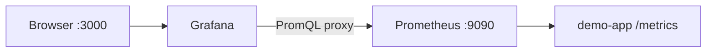

# 04. Grafana: datasource, panels, variables

## Intro: "Prometheus can do graphs, so why Grafana?"

The Prometheus Graph is good for **debugging a query**. But for on-call you need **dashboards with rows of panels**, `environment=prod|staging` variables, a single entry point for **logs and metrics**, and access rights for the team. **Grafana** is the visualization (and, later, correlation) layer; Prometheus remains the **source of truth for metrics**.

On the stack, Grafana is already wired up with a Prometheus datasource — see the provisioning in `deploy/observability/config/grafana/`.

## What you'll learn

- **Organization**, **dashboard**, **panel**, **datasource**.
- Panel types: **Time series**, **Stat**, **Gauge**, **Table**.
- **Explore** vs dashboard.
- Dashboard variables and annotations.

## Architecture on the stack



Default login: **`admin` / `admin`** (change it in production). URL: [http://localhost:3000](http://localhost:3000).

## Datasource

**Configuration → Data sources → Prometheus** (provisioning has already created it):

- URL inside compose: `http://prometheus:9090`
- Access: **Server** (the Grafana backend talks to Prometheus, the browser only talks to Grafana)

Check: **Save & test** → "Successfully queried". If you get **No data** on the panels — see troubleshooting in [`deploy/observability/README.md`](../../deploy/observability/README.md).

## Dashboards and panels

| Element | Purpose |
|---------|------------|
| **Dashboard** | a page for a service/cluster |
| **Row** | grouping of panels |
| **Panel** | a single graph or stat |
| **Query** | PromQL (or LogQL later) |
| **Legend** | series captions from labels |

A recommended row for HTTP (RED) — [10. Golden signals](10-golden-signals.md):

1. **RPS** — `sum(rate(demo_http_requests_total[5m]))`
2. **Error %** — share of non-2xx or 5xx
3. **p95 latency** — `histogram_quantile(...)`

Panel **Unit**: requests/sec, percent (0–1 or 0–100 — configure it), seconds (s).

## Visualization types

| Type | When |
|-----|-------|
| **Time series** | trends over time |
| **Stat** | a single "right now" number (RPS, up) |
| **Gauge** | utilization with color thresholds |
| **Table** | top N by label (`sum by (path)(...)`) |

**Min step** / **Resolution**: don't break the interval smaller than scrape_interval (15s on the stack).

## Explore

**Explore** (the compass icon) — a PromQL sandbox without saving a dashboard. Handy during an incident: build a query → **Add to dashboard**.

Hotkeys: Run query — `Shift+Enter`.

## Variables

A **query** variable from Prometheus:

- Name: `job`
- Query: `label_values(up, job)`
- Multi-select, Include All

In a panel:

```promql
sum(rate(demo_http_requests_total{job="$job"}[5m]))
```

On the stack the jobs are: `demo-app`, `node-exporter`, `cadvisor`, `prometheus`.

## Annotations and thresholds

- **Thresholds** on Stat/Gauge: green / yellow / red by SLO.
- **Annotations** — vertical deploy lines (manual or from CI) — they link "what was rolled out" with a latency spike.

## Provisioning vs UI

In the repository:

- `config/grafana/provisioning/datasources/` — datasource
- `config/grafana/provisioning/dashboards/` — JSON dashboards (the `json/` folder)

In basic you create a dashboard **in the UI** ([05. Lab](05-lab-dashboard.md)); in CI/CD, dashboards are versioned as JSON (intermediate).

## Common mistakes

| Mistake | Symptom | Fix |
|--------|---------|-------------|
| Datasource URL `localhost:9090` inside the Grafana container | connection refused | `http://prometheus:9090` |
| Percent 0–100, but the query is 0–1 | misleading colors | unit Percent (0.0–1.0) |
| Too many series on one graph | unreadable | `topk`, `sum by` aggregation |
| Instant query on a time series panel | empty/a dot | Range query + `$__rate_interval` |
| No traffic | flat zero | `scripts/traffic.sh` |

## In production

- **SSO** (OAuth), RBAC: viewer / editor / admin.
- Dashboard folders per team; **tags** `service=treasury`.
- Version JSON in Git; forbid edits in the prod UI (optional).
- **Grafana OnCall** / integration with Alertmanager — advanced.
- On Kubernetes, dashboards from **kube-prometheus-stack** — overview [kuber-advanced/14](../kuber-advanced/14-observability.md).

## Interview notes

- Grafana **doesn't store** metrics long-term — it queries the backend.
- **`$__rate_interval`** — an auto window for `rate` depending on zoom.
- **Dashboard as code** — reduces drift between environments.

## Summary

Grafana turns PromQL into an **operational picture**: RED panels, variables, thresholds. The datasource on the stack is already configured — your task is to **assemble a meaningful dashboard** for demo-app.

## Checklist

- Where do you check that the Prometheus datasource is alive?
- Which three panels would you add for a checkout API?
- How does Explore differ from a dashboard?
- Why isn't the Prometheus URL `localhost` in Docker Compose?

Next lesson: [05. Lab: dashboard](05-lab-dashboard.md).
