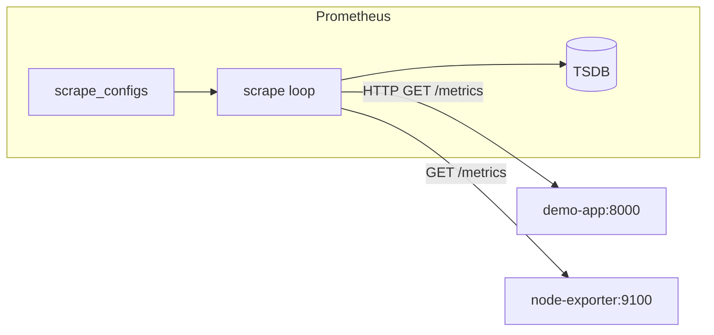

# 06. Exporters and scrape: jobs, targets, `up`

## Intro: "the app isn't in Prometheus, but it 'works'"

A team exposed `/metrics` only inside the pod — from the outside Prometheus **couldn't reach it**, the target was **DOWN**, and there were no alerts because the rule wasn't written. Another team put **node-exporter** on every VM — and finally saw a **full disk a day before the crash**. This chapter is about how Prometheus **learns** about the world: scrape config, exporters, and the **`up`** label.

## What you'll learn

- **`scrape_configs`**: `job_name`, `static_configs`, intervals.
- **Exporters**: node-exporter, cAdvisor, application `/metrics`.
- The **`up`** and **`scrape_duration_seconds`** metrics.
- Relabeling — at the level of ideas (details — intermediate).

## The scrape lifecycle



Each successful scrape adds `up{job,instance}=1`. A network or HTTP error → the sample may be missing, **`up=0`**.

Global intervals in [`config/prometheus.yml`](../../deploy/observability/config/prometheus.yml):

```yaml
global:
  scrape_interval: 15s
  evaluation_interval: 15s
```

## Job and target

| Concept | Example on the stack |
|---------|------------------|
| **job** | `demo-app` — a logical role |
| **target** | `demo-app:8000` — host:port |
| **instance** label | `demo-app:8000` (defaults to the target) |

Several targets in one job — one configuration, different instances:

```yaml
- job_name: demo-app
  static_configs:
    - targets: ["demo-app:8000"]
```

## Types of metric sources

| Source | How it exposes metrics | When |
|----------|-------------------|-------|
| **Application** | a built-in `/metrics` (client library) | your service |
| **Exporter** | a separate process that translates stats into Prom format | Postgres, Redis, hardware |
| **Infrastructure** | cAdvisor, kubelet | containers, k8s |

On the stack:

- **demo-app** — the application ([`demo/app.py`](../../deploy/observability/demo/app.py))
- **node-exporter** — host CPU, RAM, disk
- **cadvisor** — per-container CPU/memory ([localhost:8082](http://localhost:8082) UI)
- **prometheus** — self-monitoring

## Exposition format

The OpenMetrics/Prometheus text format:

```text
# HELP demo_http_requests_total HTTP requests
# TYPE demo_http_requests_total counter
demo_http_requests_total{method="GET",path="/",status="200"} 100
```

Prometheus parses **lines**; `#` marks HELP/TYPE comments.

Check from the host:

```bash
curl -s http://localhost:8000/metrics | head -20
```

## `up` and health

| Query | Meaning |
|--------|-------|
| `up` | 1 = the last scrape succeeded |
| `up{job="demo-app"}==0` | the app is unreachable for Prometheus |
| `scrape_duration_seconds` | the poll duration — growth = a slow endpoint |

**Important:** `up` is availability **for monitoring**, not a replacement for a load balancer healthcheck. An application can answer `/health` to users but be unreachable from the Prometheus network.

## Service discovery (overview)

In Docker Compose — **static_configs**. In Kubernetes the Prometheus Operator wires pods in via **kubernetes_sd_configs** or the **ServiceMonitor** CRD — see [kuber-advanced/14-observability](../kuber-advanced/14-observability.md):

```yaml
endpoints:
  - port: metrics
    interval: 30s
```

There, **kube-state-metrics** also gives `kube_pod_status_phase` — metrics for API objects, not cgroups.

## Relabeling (the idea)

Before writing, Prometheus can **change labels** (`relabel_configs`):

- drop unneeded targets
- add `environment="lab"`
- replace a port

Without relabeling it's easy to accidentally scrape **all** sidecar endpoints — duplicating series.

## Common mistakes

| Mistake | Symptom | Fix |
|--------|---------|-------------|
| Wrong DNS in compose | `up=0` | the service name from `docker-compose.yml` |
| Metrics on a different path | DOWN | `metrics_path: /actuator/prometheus` |
| TLS without `scheme: https` | scrape fail | certs or insecure_skip_verify (carefully) |
| Two scrapes of one process | duplicate series | one job per application |
| A huge `/metrics` | slow scrape | reduce cardinality |

## In production

- **Network policies**: only Prometheus → :9100 / :8080.
- **A separate internal LB** for scrape in multi-AZ.
- **Blackbox exporter** — synthetics from the outside (HTTP probe).
- **Recording** `instance:up` isn't needed — `up` already exists.
- Keep **scrape_timeout** < interval.

## Interview notes

- Prometheus **pull** — discovering "who's alive" via targets, not a push from an agent.
- An **exporter** — a sidecar/process, not a replacement for instrumenting business metrics in the app.
- **cAdvisor** vs **node-exporter**: container vs host.
- **ServiceMonitor** — declarative scrape in k8s (operator).

## Summary

Scrape is the heart of Prometheus: a **job** groups targets, and **`up`** is a quick availability signal. Exporters extend coverage to the OS and containers; the application must expose **meaningful** business metrics on `/metrics`.

## Checklist

- What does `static_configs` consist of on the stack?
- How does an app being unreachable for a user differ from `up==0`?
- Why node-exporter on every node?
- Where do you describe an application's scrape in k8s?

Next lesson: [07. Lab: targets](07-lab-targets.md).
