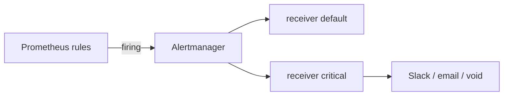

# 08. Alerting: rules, Alertmanager, routing

## Intro: "the dashboard is red, the phone is silent"

On-call looks at Grafana at 3 a.m. — **nobody called**, because the "red threshold" existed only on the panel, without an **alert rule**. And vice versa: **50 alerts an hour** for CPU > 50% — everyone ignores them. A mature stack: **Prometheus rules** → **Alertmanager** (grouping, routing) → PagerDuty/Slack. On the stack, Alertmanager is already wired into `prometheus.yml`.

## What you'll learn

- **Alerting rule** vs **recording rule**.
- The fields: `expr`, `for`, `labels`, `annotations`.
- **Alertmanager**: route, receiver, inhibit.
- The connection with RED and the runbook.

## The alert chain



1. Every `evaluation_interval`, Prometheus evaluates `expr`.
2. The condition is true → the alert is **Pending**; after `for` — **Firing**.
3. Firing is sent to Alertmanager.
4. Alertmanager **groups**, **suppresses duplicates**, and routes.

## Alerting rule

An example from the stack [`config/rules/demo-alerts.yml`](../../deploy/observability/config/rules/demo-alerts.yml):

```yaml
- alert: DemoTargetDown
  expr: up{job="demo-app"} == 0
  for: 1m
  labels:
    severity: critical
  annotations:
    summary: "demo-app scrape target is down"
```

| Field | Purpose |
|------|------------|
| `alert` | the alert name (cardinality by labels) |
| `expr` | PromQL → boolean / vector |
| `for` | how long it holds before firing |
| `labels` | `severity`, `team` — for routing |
| `annotations` | text for a human, links to the runbook |

A **recording rule** (doesn't send to AM):

```yaml
- record: job:demo_rps:5m
  expr: sum(rate(demo_http_requests_total[5m]))
```

It speeds up dashboards; in basic it's enough to know it exists.

## Good expressions

| Bad | Better |
|-------|-------|
| `demo_http_requests_total > 1000` | `rate(...[5m]) > N` on a counter |
| an alert without `for` | `for: 2m` — cut off flapping |
| only `avg(cpu)<20` | USE + saturation, SLO-based |
| 404 in dev as critical | severity by environment |

A sample error-share rule — [`examples/alert-rule.yml`](examples/alert-rule.yml).

## Alertmanager

[`config/alertmanager.yml`](../../deploy/observability/config/alertmanager.yml):

- **route.tree** — match `severity: critical` → receiver `critical`
- **group_by** — one email per `alertname` group
- **group_wait** / **repeat_interval** — don't spam
- **inhibit_rules** — critical suppresses a warning with the same `alertname`

On the learning stack the receivers are **empty** (alerts are visible in the AM UI, they don't go to Slack). UI: [http://localhost:9093](http://localhost:9093).

## Severity and runbook

| severity | Example | Action |
|----------|--------|----------|
| `warning` | rising 404s, disk 80% | investigate during working hours |
| `critical` | `up==0`, error rate > SLO | immediate on-call |

In `annotations`, add:

```yaml
runbook_url: "https://wiki.example/demo-app-down"
```

## The connection with RED

| Signal | Example expr |
|--------|-------------|
| Rate drop | `sum(rate(...[5m])) < 0.1` |
| Errors | share of 5xx > 5% (demo rule `DemoHighErrorRate`) |
| Duration | `histogram_quantile(0.95, ...) > 0.5` |

Practice — [09. Lab Alertmanager](09-lab-alertmanager.md).

## Common mistakes

| Mistake | Consequence |
|--------|-------------|
| An alert per pod without aggregation | N identical pages |
| No `for` on noisy metrics | alert fatigue |
| Different thresholds in Grafana and rules | distrust of the dashboard |
| Forgot `alertmanagers` in prometheus.yml | firing only in the Prometheus UI |
| High cardinality in `alert` labels | an explosion of notifications |

## In production

- **On-call rotation**, escalation, **silence** with a TTL for planned maintenance.
- **Alertmanager HA** — a pair of instances (intermediate).
- **Unit tests** for rules: `promtool test rules`.
- In k8s the same rules via the PrometheusRule CRD — [kuber-advanced/14](../kuber-advanced/14-observability.md).

## Interview notes

- **Pending vs Firing** — the role of `for`.
- **Alertmanager** doesn't evaluate PromQL — only routing.
- **Inhibition** — a "master" alert mutes dependent ones.
- **Watchdog** / **Dead man's switch** — an alert for "monitoring itself is alive" (advanced).

## Summary

An alert is a **contract with on-call**: meaningful PromQL, `for`, severity, an annotation with a runbook. Alertmanager delivers it **grouped** and **routed**.

## Checklist

- How does an alerting rule differ from a recording rule?
- Why `for: 2m`?
- Where on the stack do you see firing alerts besides Prometheus?
- Which alert on the stack fires when demo-app is stopped?

Next lesson: [09. Lab: Alertmanager](09-lab-alertmanager.md).
