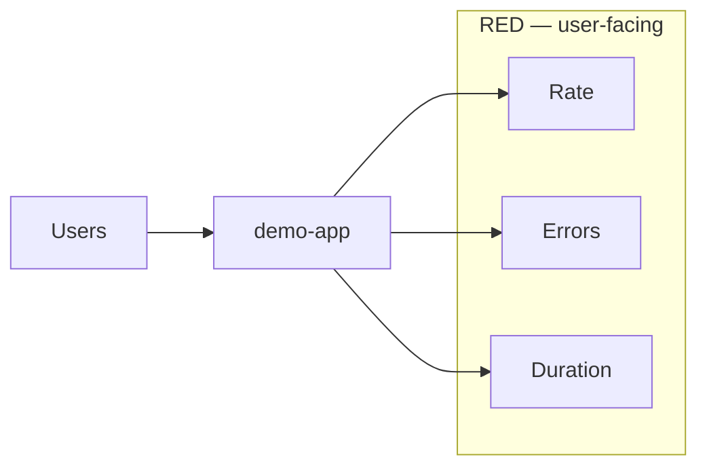
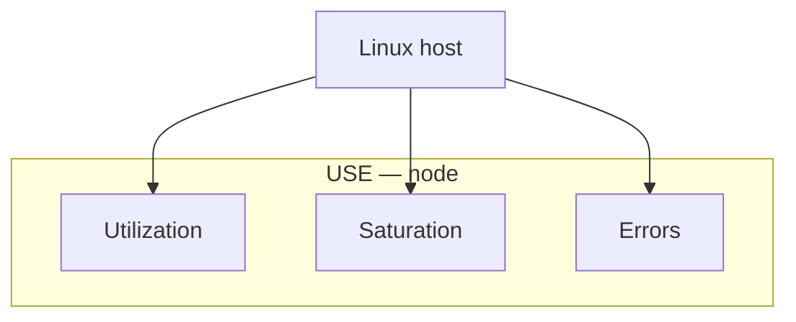

# 10. Golden signals: RED and USE

## Intro: "CPU 30%, but clients wait a minute"

The infrastructure dashboard is green: CPU is low, RAM is free. But the **request queue** in the application is jammed — saturation. Another incident: CPU is 95%, but there are no errors — it's just a **batch job**. The **RED** (services) and **USE** (resources) methodologies help you not conflate "hardware" and "user experience".

## What you'll learn

- **RED**: Rate, Errors, Duration — for request-driven services.
- **USE**: Utilization, Saturation, Errors — for CPU, disk, network.
- Mapping onto **demo-app** and **node-exporter** metrics.
- How to choose SLIs and alert thresholds.

## RED — for services

| Letter | Question | demo-app | PromQL (idea) |
|-------|--------|----------|---------------|
| **R** Rate | how many requests/s? | throughput | `sum(rate(demo_http_requests_total[5m]))` |
| **E** Errors | what % of failures? | non-2xx, 5xx | `rate(...{status!~"2.."}) / rate(...)` |
| **D** Duration | how slow? | latency SLI | `histogram_quantile(0.95, ...)` |

**Duration:** for an SLO it's almost always a **percentile** (p95/p99), not the average. The histogram in demo-app is the right type.

**Errors:** agree on what counts as an error:

- only **5xx** (the server is at fault);
- **4xx** separately (client / routing);
- a timeout as 5xx or a separate metric.

## USE — for resources

| Letter | Question | node-exporter |
|-------|--------|---------------|
| **U** Utilization | is the resource busy? | CPU non-idle %, disk space used |
| **S** Saturation | is there a queue? | load average, disk IO wait, network drops |
| **E** Errors | device failures? | `node_network_receive_errs_total` |

**Utilization** of 80% CPU isn't always bad; **saturation** is "how much work is **waiting**" (run queue, disk queue depth).

## When RED, when USE

| Layer | Method | Example alert |
|------|-------|---------------|
| HTTP API | RED | p95 > 500ms 5m |
| VM / k8s node | USE | disk < 10% free |
| DB | USE + custom | replication lag (Gauge) |
| Queue (Kafka) | lag, rate | consumer lag (intermediate kafka) |

On one dashboard: **RED of the service on top**, **USE of the nodes below** where it runs — the link between "slow" ↔ "disk filled up".

## Google's four golden signals (briefly)

Latency, Traffic, Errors, Saturation — close to RED+USE. In cloud-native people more often say **RED/USE** explicitly.

## Thresholds and SLO (intro)

| Approach | Example |
|--------|--------|
| Static | p95 < 0.5s |
| Error budget | 99.9% monthly → burn rate alert (advanced) |
| Relative | RPS dropped by 50% from the weekly median |

On the stack: a warning when 404 > 10%, critical when `up==0` — different **severity**.

## cAdvisor and containers

Between the node's USE and the service's RED there is a **container** layer:

- `container_cpu_usage_seconds_total` — cgroup utilization
- throttling, memory limit — saturation in k8s ([kuber-advanced/14](../kuber-advanced/14-observability.md): `container_memory_working_set_bytes`)

## Common mistakes

| Mistake | Why it's bad |
|--------|--------------|
| Only a CPU alert | we miss latency and errors |
| Average latency | hides the tail |
| RED on a batch job | no steady RPS — its own metrics (lag, duration) |
| One threshold for dev/prod | noise or blindness |
| Ignoring saturation | "CPU is low", but disk IO wait is 40% |

## In production

- **SLI dashboard** — one per service; USE — a separate infra board.
- **Multi-window burn alerts** for SLOs (Google SRE book).
- **Synthetic probes** complement RED (blackbox from the outside).
- A service mesh adds RED per-route — mind the cardinality.

## Interview notes

- **RED** — a microservice with HTTP/gRPC.
- **USE** — a DB, disk, CPU, network.
- **Saturation** ≠ **Utilization**.
- A **Histogram** is needed for correct latency quantiles.

## Summary

RED answers "how does the **client** feel". USE — "how does the **infrastructure** feel". Together they cover a typical incident: RED first, and if RED is fine — USE and dependencies.

## Checklist

- Spell out RED and give PromQL for demo-app.
- How does utilization differ from saturation on a disk?
- Why is p99 more important than the mean for checkout?
- Which three RED panels did you already build in lab 05?

Next lesson: [11. Logs — preview](11-logs-preview.md).
