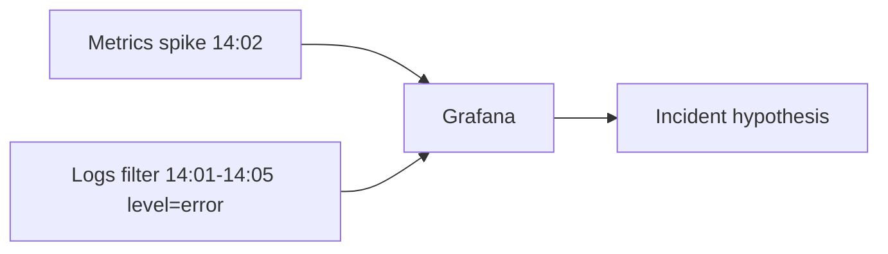

# 11. Logs: why, the format, and pairing them with metrics

## Intro: "the metric said 'errors', the log said why"

Prometheus showed a spike in **5xx rate** at 14:02. PromQL won't explain **which** `order_id` and **which** stack trace. The log line `ERROR payment timeout upstream=bank-api` is the bridge to a fix. Metrics **aggregate**, logs **give detail**; without metrics you drown in grep. This chapter is the theory of logs in observability; hands-on Loki is in **observability-intermediate**.

## What you'll learn

- Logging levels and **structured logs**.
- Correlation via **timestamp**, **labels in Loki**, **trace_id**.
- When logs don't replace metrics.
- How to bring up Loki on the same stack (preview).

## Metrics vs logs

| | Metrics | Logs |
|---|---------|------|
| Cardinality | low, moderate labels | high (every event) |
| Storage cost | relatively cheap | more expensive at volume |
| Alerts | native PromQL | log-based metrics / Loki ruler |
| Question | "how many / how often" | "what exactly happened" |



A typical workflow: an alert on **rate(5xx)** → Grafana **Explore Loki** over the same interval → filter `service="demo-app"`.

## Structured logging

Text:

```text
2026-05-18T14:02:11Z ERROR payment failed user=42
```

JSON (preferred):

```json
{"ts":"2026-05-18T14:02:11Z","level":"error","service":"checkout","msg":"payment failed","user_id":"42","trace_id":"abc"}
```

The fields are **stable** — Loki indexes by them (`| json | level="error"`). Don't log PANs, passwords, or full card details.

## Levels

| Level | When |
|-------|-------|
| DEBUG | dev, temporarily in prod during an incident |
| INFO | routine events (start, config) |
| WARN | degradation, retry |
| ERROR | a request failed, action needed |
| FATAL | the process is terminating |

**Rule:** an ERROR in the log should be reflected in a **metric** (an `errors_total` counter or HTTP status).

## Correlation

| Key | Connection |
|------|-------|
| `trace_id` | metric → Jaeger span → logs (advanced OTel) |
| `request_id` | one request across microservices |
| `pod` / `instance` | `up{instance}` → LogQL `{pod="demo-xyz"}` |
| timestamp | the same range in Prometheus and Loki |

On the stack, demo-app **suppresses** the access log (`log_message` is a no-op) — the metrics are for learning; in intermediate they add stdout + Promtail.

## Loki on the stack (preview)

In [`deploy/observability/README.md`](../../deploy/observability/README.md):

```bash
docker compose -f docker-compose.yml -f docker-compose.logs.yml up -d
```

| Component | Role |
|-----------|------|
| **Loki** | storing log streams |
| **Promtail** | shipping from Docker/json logs |
| **Grafana** | Loki datasource (provisioning) |

An example of LogQL (intermediate):

```logql
{container="observability-demo-app-1"} |= "error"
```

Course: [`observability-intermediate`](../observability-intermediate/README.md) — full Loki/Promtail labs.

## Log volume and cost

- **Sampling** debug in prod.
- **Retention** 7–30d hot, an archive in S3 (advanced).
- **Cardinality** in Loki labels — like in Prometheus: don't use `user_id` as a stream label.

## Common mistakes

| Mistake | Consequence |
|--------|-------------|
| Alerting only by grep in logs | slow, unreliable |
| No structure | LogQL is impossible |
| Logging the request body with PII | compliance risk |
| Metrics without logs | no root cause |
| Logs without metrics | no early warning |

## In production

- **Centralized** collection (Promtail, Fluent Bit, Vector).
- **Unified** `service`, `environment`, `version` labels.
- **RBAC** in Grafana for log datasources.
- **Kubernetes**: pod logs + **events** (`kubectl get events`) + kube-state metrics — [kuber-advanced/14](../kuber-advanced/14-observability.md).

## Interview notes

- **Loki** indexes **labels**, not full text like Elasticsearch (with caveats by version).
- **Promtail** — an agent; analogs are Fluent Bit, Vector.
- **Exemplars** — the link between a histogram sample and a trace_id (advanced).

## Summary

Logs are the second pillar of observability. Basic gives you **metrics and alerts**; the next step is **Loki** on the same compose and correlation in Grafana Explore.

## Checklist

- Name a question that logs answer better than metrics.
- Why JSON logs?
- Which command brings up the Loki overlay on the stack?
- Where does the course on logs continue?

Next lesson: [12. vs CloudWatch/Datadog](12-vs-cloudwatch-datadog.md).
