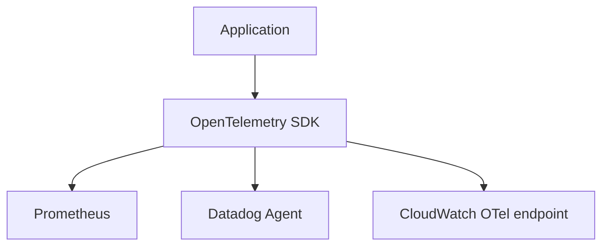

# 12. Prometheus/Grafana vs CloudWatch vs Datadog

## Intro: "AWS already has monitoring — why Prom?"

A startup on **EC2** looks only at CloudWatch. A year later — **EKS**, custom metrics, dashboards in Grafana OSS, and the CloudWatch **Custom metrics** bill surprises the CFO. Another team pays for **Datadog** per host and per span — a great UX, but a $200k/year contract. This chapter is **not a tool war**, but a decision map for an architect and an SRE.

## What you'll learn

- The positioning of **Prometheus + Grafana** (OSS, CNCF).
- **Amazon CloudWatch**: metrics, logs, alarms in AWS.
- **Datadog**: SaaS APM/logs/infra, unified.
- Hybrids and migration patterns.

## Comparison table

| Criterion | Prometheus + Grafana | CloudWatch | Datadog |
|----------|---------------------|------------|---------|
| Model | pull scrape, PromQL | push/agent, Metrics API | agent + SaaS backend |
| Hosting | self-managed / managed (AMP, Mimir) | managed AWS | SaaS |
| Strength | k8s, OSS, predictability | native AWS integration | fast time-to-value, APM UI |
| Weakness | ops burden, PromQL learning | vendor lock-in to AWS, cost of custom metrics | cost, cardinality billing |
| Logs | Loki / ELK separately | CloudWatch Logs | built-in |
| Traces | Jaeger/Tempo/OTel | X-Ray | APM traces |
| Alerts | Alertmanager | CloudWatch Alarms | Monitors |

## Prometheus + Grafana

**When it's chosen:**

- Kubernetes (**kube-prometheus-stack** — [kuber-advanced/14](../kuber-advanced/14-observability.md))
- Multi-cloud, bare metal, on-prem
- The team is ready to maintain the TSDB, rules, AM
- You need a **single** stack for dev/stage/prod without per-seat SaaS

**Managed options:** Amazon Managed Prometheus, Grafana Cloud, Mimir, Thanos — they take away the ops while keeping PromQL.

The learning stack [`deploy/observability`](../../deploy/observability/README.md) is the same mental model as in prod k8s.

## Amazon CloudWatch

**When it's chosen:**

- Predominantly **AWS**, with minimal monitoring infrastructure of your own
- Metrics for AWS services (ALB, RDS, Lambda) **out of the box**
- Compliance: data doesn't leave the region

| Pro | Con |
|------|-------|
| IAM, no separate scrape network | PromQL thinking doesn't transfer 1:1 |
| Logs + metrics + alarms in one bill | Expensive custom metrics / high resolution |
| EventBridge integrations | Dashboards weaker than OSS Grafana for ad-hoc |

**Hybrid:** Prometheus **remote_write** into AMP; a Grafana datasource for CloudWatch + Prometheus.

## Datadog

**When it's chosen:**

- You need a **full** observability suite quickly (infra + APM + logs + RUM)
- A small platform team, no desire to administer Prometheus
- A budget for SaaS, where a **correlation** UI matters (trace ↔ log ↔ metric)

| Pro | Con |
|------|-------|
| Agent autodiscovery, rich integrations | cost grows with hosts/spans/custom metrics |
| Anomaly detection, SLO UI | risk of vendor lock-in |
| An on-call product | requires tag discipline (otherwise bill shock) |

## The data model

| | Prometheus labels | CloudWatch dimensions | Datadog tags |
|---|-------------------|----------------------|--------------|
| Example | `status="500"` | `StatusCode=500` | `http.status_code:500` |
| Risk | cardinality | custom metric cost | indexed spans cost |

**Low-cardinality** practices are the same everywhere.

## OpenTelemetry as a bridge

**OTel** — neutral instrumentation: one SDK → export to Prometheus, Datadog, X-Ray, Jaeger. On the stack, the `docker-compose.otel.yml` overlay — [observability-advanced](../observability-advanced/README.md). Basic lays the **metrics** foundation; OTel unifies the three pillars later.

## Common mistakes

| Mistake | Consequence |
|--------|-------------|
| Two full stacks with no owner | duplication, divergent numbers |
| A CloudWatch custom metric per user | an AWS bill |
| "Datadog will replace runbooks" | alert fatigue remains |
| Ignoring OSS skills in an AWS-only shop | pain when moving to EKS |
| No strategy for long-term metrics | loss of history > 15d |

## In production

- **A single source of truth for SLOs** — one backend (often the Prometheus family).
- **FinOps**: review custom metrics and indexed spans quarterly.
- **Grafana** as the UI even on top of CloudWatch/Datadog datasources.
- **Runbooks** aren't tied to a vendor — the diagnosis steps are the same (RED/USE).

## Interview notes

- **Pull vs push** — not "better/worse", but an operational trade-off.
- **AMP / Grafana Mimir** — managed, Prometheus-compatible.
- **CNCF** landscape: Prometheus, OpenTelemetry, Grafana — different projects, often together.
- **Cardinality** — the common enemy of CloudWatch and Datadog billing.

## Summary

Prometheus+Grafana — the **cloud-native standard** with control and PromQL. CloudWatch — **native AWS**. Datadog — **the speed and completeness of SaaS**. The choice depends on team, budget, and environment; OTel reduces the cost of switching vendors.

## Checklist

- Name two scenarios where "just CloudWatch is enough".
- How does Managed Prometheus differ from self-hosted?
- Why is it dangerous to duplicate Prometheus and Datadog on the same metrics?
- Which k8s-stack component from kuber-advanced/14 is the analog of node-exporter?

Next lesson: [13. Final project](13-final-project.md).
