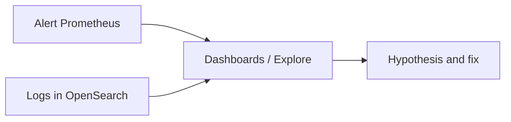

# 01. Why OpenSearch: log search, Loki, and databases

## Intro: “grep over 200 GB won’t save you”

Incident at 03:00: support asks for **all checkout errors in the last hour** with field `upstream=bank-api` and status **not** 200. `kubectl logs` across a hundred pods is slow; **grep over an NFS archive** takes hours. Prometheus metrics already showed a 5xx spike, but the **error text** and specific **order_id** values are in the logs. The team opens **OpenSearch Dashboards**: filter `level:error` + `service:checkout` + time range — answer in seconds. This is not a “PostgreSQL replacement” and not “another Prometheus” — it is a **search engine** over documents (often logs).

This chapter is a **mental map**: why OpenSearch belongs in an observability stack, and how it differs from **Loki** and from a **relational DB**.

## What you'll learn

- Three ways to work with logs: **files/grep**, **log stream (Loki)**, **inverted index (OpenSearch/Elasticsearch)**.
- Questions answered by **full-text search** vs **LogQL** vs **SQL**.
- Why the stand uses **`DISABLE_SECURITY_PLUGIN`** and when that is unacceptable in production.
- Link to the Loki course: [observability-intermediate/03-loki](../observability-intermediate/03-loki-logql.md).

## Three pillars of observability and where logs fit

| Pillar | Question | Typical tool |
|-------|--------|---------------------|
| **Metrics** | How much? How fast? | Prometheus |
| **Logs** | What happened in the event? | Loki, OpenSearch, CloudWatch Logs |
| **Traces** | Where was time lost? | Jaeger, Tempo |

Metrics **aggregate** (low cardinality). Logs **detail** (high volume). OpenSearch does not replace a **rate(5xx) alert** — it helps you **investigate** after the alert.



More on metrics + logs — [observability-basic/11](../observability-basic/11-logs-preview.md).

## OpenSearch in one paragraph

**OpenSearch** is a distributed **search and analytics** engine (Elasticsearch fork). Data is **JSON documents** in **indexes**; search uses an **inverted index** (term → list of documents). Queries use **Query DSL** (JSON) or the Dashboards UI. For logs a typical flow is: **Bulk API** → `logs-*` index → search, aggregations, dashboards.

On the lab stand: [`deploy/opensearch`](../../deploy/opensearch/README.md) — API [localhost:9200](http://localhost:9200), UI [localhost:5601](http://localhost:5601).

## Loki vs OpenSearch: not “better/worse”

| Criterion | Loki | OpenSearch |
|----------|------|------------|
| Index | primarily **labels** (like Prometheus) | **mapping fields** + full text |
| Strength | cheap volume, unified stack with Grafana | complex search, aggregations, Kibana/Dashboards |
| Weakness | broad full-text without a narrow selector | RAM/disk cost, cluster ops |
| Queries | **LogQL** | **Query DSL** |
| Mental model | “pick a stream, filter lines” | “query field schema and text” |

**Loki** shines when log streams are already labeled (`namespace`, `pod`, `app`) and you need correlation with Prometheus in **one Grafana**. **OpenSearch** shines when you need **complex field filters**, **aggregations on business fields**, **phrase search** in message, security analytics, or the org already standardized on ELK/OpenSearch.

Loki theory on the observability stand: [03. Loki and LogQL](../observability-intermediate/03-loki-logql.md).

## OpenSearch vs a relational DB

| | PostgreSQL / ClickHouse | OpenSearch |
|---|-------------------------|------------|
| Schema | rigid table | **mapping** (flexible, but intentional) |
| Query | SQL | Query DSL |
| Strength | transactions, JOIN, schema reports | **search**, **relevance**, **horizontal** shards |
| Logs as primary use case | possible, but not the default | **typical** use case (ELK) |

Do not put a **primary business ledger** in OpenSearch. Put **events**, **logs**, **traces (sometimes)**, **audit** — append-heavy, search-heavy.

## When to choose OpenSearch on a project

**A good fit:**

- Centralized **application / nginx / audit** logs with search on `message`, `status`, `user_id` (as a field, not a label stream).
- **Security / SIEM**-like queries (bool + filter + aggregations).
- The team already knows the **Elasticsearch** API (OpenSearch is compatible in spirit).

**Doubtful:**

- Only “look at one pod’s stdout” — `kubectl logs` or Loki is enough.
- Small volume, rare queries — cluster cost does not pay off.

## On the stand: first touch

```bash
cd deploy/opensearch
docker compose up -d
docker compose ps
bash scripts/smoke.sh
```

```bash
curl -s http://localhost:9200/
curl -s http://localhost:9200/_cluster/health?pretty
```

| URL | Purpose |
|-----|------------|
| [localhost:9200](http://localhost:9200) | REST API |
| [localhost:5601](http://localhost:5601) | Dashboards (Discover, Dev Tools) |

**No security in the lab:** `docker-compose.yml` sets `DISABLE_SECURITY_PLUGIN=true` — otherwise every `curl` would need HTTPS and credentials. In production — **Fine-Grained Access Control**, TLS, index-level roles.

## Common mistakes

| Mistake | Why it’s bad | How to do it right |
|--------|--------------|---------------|
| “All logs only in OpenSearch” | expensive, duplicates Loki | metrics → alert; Loki or OS — by volume and queries |
| “OpenSearch = orders database” | no ACID, poor JOIN | OLTP in SQL, events in OS |
| `*` mapping on everything | huge indexes, type conflicts | explicit mapping for logs |
| Ignoring retention | disk full, read-only block | ISM / ILM (intermediate) |
| Security off in production | PII leak via API | FGAC, private network |

## In production

- **Ingest**: Fluent Bit, Vector, Logstash → Bulk; not one giant `curl` from cron.
- **Hot/warm/cold**: ISM policies, snapshots to S3 (intermediate course).
- **Sizing**: heap ~50% RAM, rest OS cache; **shard size** target 10–50 GB.
- **PII**: mask before indexing; RBAC on `logs-prod-*` indexes.
- **Hybrid**: Prometheus metrics + OpenSearch logs + Tempo traces in one Grafana (different datasources).

## Interview notes

- **Inverted index** — basis of fast term lookup.
- **Near real-time**: a document is visible after **refresh** (not instantly after index).
- **Loki** does not index the line body by default the way ES/OS does.
- **OpenSearch** vs **Elasticsearch**: license and governance; APIs are close — check client versions.

## Summary

OpenSearch is a tool for **search and analytics over documents**, and it fits **logs and investigation** well. It complements **metrics** (Prometheus), it does not replace them; with **Loki** it only competes on “where to store logs” — choose by queries, budget, and team. The basic course gets you hands-on with the API and Dashboards locally.

## Checklist

- Name a question OpenSearch answers better than PromQL.
- How does a Loki selector differ from a `keyword` field in mapping?
- Why is the security plugin disabled on the lab stand?
- What are the API and Dashboards URLs on the stand?

Next lesson: [02. Architecture](02-architecture.md).
