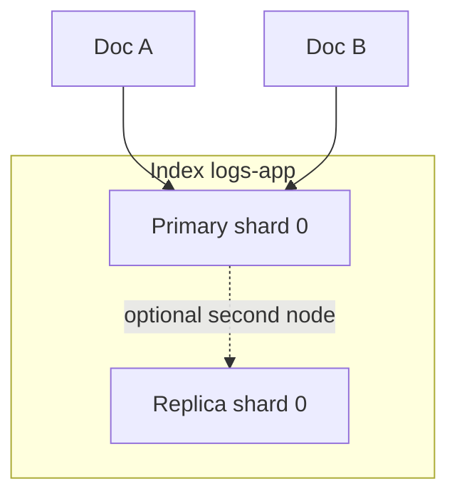

# 02. Architecture: cluster, index, shard, document

## Intro: “an index is not a table, but almost”

A beginner creates one **huge** `logs` index for the whole cluster. A week later — **yellow** cluster, slow search, shards at 200 GB. SRE explains: data is split into **shards**, replicas give fault tolerance, and **`_id`** is not a primary key like in SQL. This chapter is the OpenSearch data model on a single-node lab stand; in production the same concepts apply, but with more nodes.

## What you'll learn

- Hierarchy: **cluster → node → index → shard → document**.
- **Primary** and **replica** shard roles (on single-node, replicas = 0).
- API response fields: **`_index`**, **`_id`**, **`_version`**, **`_source`**.
- Why **routing** and shard count set the scaling ceiling.

## Cluster and node

**Cluster** — a logical set of nodes with one name (`cluster_name` in the `GET /` response). **Node** — one OpenSearch process (JVM). On the stand [`deploy/opensearch`](../../deploy/opensearch/README.md):

- `discovery.type: single-node` — one node, no quorum needed.
- Health: **green** (all primaries assigned) or **yellow** (replicas cannot be placed on one node — normal for single-node with `number_of_replicas: 1`).

```bash
curl -s http://localhost:9200/_cluster/health?pretty
curl -s http://localhost:9200/_cat/nodes?v
```

## Index

**Index** — a named collection of documents (a logical “database” for a data type). Lowercase name, no spaces: `logs-app-20260518`, `products-v1`.

| Operation | HTTP | Example |
|----------|------|--------|
| Create | `PUT /my-index` | with optional `mappings`, `settings` |
| Check | `HEAD /my-index` | 200 / 404 |
| Delete | `DELETE /my-index` | careful in production |
| List | `GET /_cat/indices?v` | size, health |

An index = **mapping** (field schema) + **settings** (shard count, replicas, analyzers).

## Document

**Document** — a JSON object with fields. On indexing the cluster:

1. Chooses a **shard** (by `_id` or `routing`).
2. Stores **`_source`** (original JSON).
3. Builds an **inverted index** for searchable fields.

Example log document:

```json
{
  "@timestamp": "2026-05-18T10:00:02Z",
  "level": "error",
  "service": "api",
  "message": "GET /orders 500",
  "status": 500
}
```

`GET /index/_doc/ID` response:

```json
{
  "_index": "logs-app-20260518",
  "_id": "xYz123",
  "_version": 1,
  "_source": { ... }
}
```

**`_id`**: if omitted — generated automatically; you can set it with `PUT /index/_doc/my-id`.

## Shard and replica

Index data is split into **primary shards** (often 1 by default on small indexes). Each document lands in exactly **one** primary shard.

| | Primary | Replica |
|---|---------|---------|
| Write | yes | no (copy from primary) |
| Read | yes | yes (read scaling) |
| On single-node | 1 | usually 0 in labs |



**Rule:** primary shard count **does not change** without reindex. Plan it at index creation (intermediate: rollover, ISM).

On the stand for labs:

```json
PUT /lab-demo
{
  "settings": { "number_of_shards": 1, "number_of_replicas": 0 }
}
```

## Segments and refresh

Inside a shard, data lives in **segments** (immutable). **Refresh** (default ~1s) makes new documents **visible to search**, not necessarily fsynced to disk. After bulk in labs, call `POST /index/_refresh` for predictable search.

| | Index API | Search API |
|---|-----------|------------|
| Visibility | after refresh (near real-time) | only what is indexed |
| Transaction | no multi-doc ACID | — |

## Aliases and templates (preview)

In production, logs write to **`logs-app-2026.05.18`** and are read via **alias** `logs-app-read` — simplifies rollover. **Index templates** set mapping for `logs-*`. For basic it is enough to know that the **index name** is part of the ops model; details — intermediate.

## OpenSearch Dashboards

**Dashboards** — UI on top of the API (Discover, Visualize, Dev Tools). Connects via `OPENSEARCH_HOSTS` in compose. Dev Tools duplicates `curl` — handy for learning; in CI and labs we use **`curl`** for reproducibility.

## On the stand: API overview

```bash
curl -s http://localhost:9200/
curl -s http://localhost:9200/_cat/indices?v
curl -s http://localhost:9200/_cat/shards?v
```

After [lab 03](03-lab-first-index.md) you will see `lab-first-*` or your index name — check `_cat/indices`.

## Common mistakes

| Mistake | Symptom | Fix |
|--------|---------|-------------|
| Too many tiny indexes | thousands of shards, heap pressure | rollover, one shard target size |
| One shard per terabyte | slow recovery | more primaries at creation (cannot grow later) |
| Confusing `_id` with business id | duplicates | `op_type=create` or external id as `_id` |
| Expecting search right after bulk | 0 hits | `_refresh` or `refresh=wait_for` |
| `number_of_replicas: 1` on 1 node | yellow cluster | replicas: 0 on dev |

## In production

- **Dedicated master** roles on large clusters (3 master-eligible).
- **Cross-cluster search** / **CCR** — DR and federation (advanced).
- **Snapshots** to S3 — index backup.
- Monitoring: `_cluster/health`, JVM heap, **thread pool rejections**, disk watermark.

## Interview notes

- **Shard** — unit of storage and scaling; **document** — unit of search.
- **Replica** — copy of primary for HA and read scale.
- **Near real-time** — not “immediately after POST”.
- **Split-brain** — multi-node issue without quorum (not on single-node lab).

## Summary

OpenSearch stores **JSON documents** in **indexes**, physically split into **shards**. The API returns metadata **`_index`**, **`_id`**, **`_source`**. Understanding shards and refresh explains bulk and search behavior in later chapters.

## Checklist

- How does an index differ from a document?
- How many primary shards does a document belong to?
- Why call `_refresh` after a training bulk?
- What does `_cluster/health` show on single-node with replica=1?

Next lesson: [03. Lab: first index](03-lab-first-index.md).
