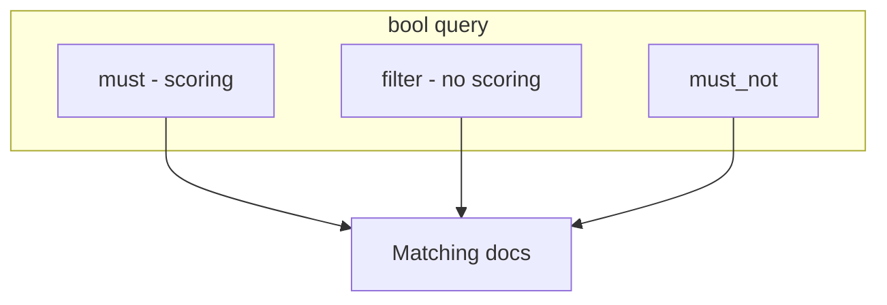

# 06. Query DSL: match, bool, filter

## Intro: “a query in JSON, not SQL”

On-call opens Dev Tools and writes “SQL” against OpenSearch — it fails. The right path is **Query DSL**: a JSON tree with `query`, optionally `sort`, `size`, `aggs`. During an incident you build a **bool**: text in `must`, status and time in **filter** (no effect on score). This chapter is the query language for logs on the `localhost:9200` stand.

## What you'll learn

- Query wrapper: **`GET index/_search`** + body.
- **Match** vs **term** vs **range** (link to mapping).
- **bool**: `must`, `should`, `must_not`, **filter**.
- Difference between **query** (scoring) and **filter** (yes/no, cache).

## Search request structure

```json
GET /lab-mapping/_search
{
  "query": { ... },
  "size": 10,
  "from": 0,
  "sort": [{ "@timestamp": "desc" }],
  "_source": ["@timestamp", "level", "message"]
}
```

| Field | Purpose |
|------|------------|
| `query` | which documents match |
| `size` | how many hits to return (default 10) |
| `from` | pagination (careful with large from) |
| `sort` | sort; with `query` — by `_score` + fields |
| `_source` | which fields in the response |

Response: `hits.total`, `hits.hits[]` with `_score`, `_source`.

## Match query

**match** — full text on a `text` field (analyzer on the query):

```json
{ "match": { "message": "payment timeout" } }
```

Variants: `operator: "and"` (all terms), `minimum_should_match` for softness.

**match_phrase** — whole phrase (word order).

## Term-level queries

| Query | Field | Example |
|-------|------|--------|
| **term** | keyword | `{ "term": { "service": "api" } }` |
| **terms** | keyword, list | `{ "terms": { "level.keyword": ["error", "warn"] } }` |
| **range** | date, number | `{ "range": { "status": { "gte": 500 } } }` |
| **exists** | any | `{ "exists": { "field": "trace_id" } }` |

**term** does not analyze the query string — the value must match the indexed keyword.

## bool query

```json
{
  "query": {
    "bool": {
      "must": [
        { "match": { "message": "orders" } }
      ],
      "filter": [
        { "term": { "level.keyword": "error" } },
        { "range": { "@timestamp": { "gte": "now-1h" } } }
      ],
      "must_not": [
        { "term": { "service": "healthcheck" } }
      ],
      "should": [],
      "minimum_should_match": 0
    }
  }
}
```



| Clause | Scoring | Typical use |
|--------|---------|--------------|
| **must** | yes | text, relevance |
| **filter** | no | level, time, status |
| **must_not** | no | exclude noise |
| **should** | yes (OR) | “at least one of” |

**Filter context** — faster, cached; for logs **90% of filters** go in `filter`, not `must`.

## Query string (brief)

**query_string** / **simple_query_string** — syntax `level:error AND service:api` in a string. Handy in UI, risky without escaping special characters. In labs we prefer explicit bool.

## Pagination and scroll (preview)

`from` + `size` for the first pages. Exporting millions of lines — **scroll** or **search_after** (intermediate). On basic — `size` ≤ 1000 for labs.

## Examples on the stand

File [`examples/search-queries.json`](examples/search-queries.json) — bodies for:

```bash
curl -s -X GET "http://localhost:9200/lab-mapping/_search" \
  -H 'Content-Type: application/json' \
  -d @courses/opensearch-basic/examples/search-queries.json
```

(substitute one object from the file or paste a fragment into `-d '...'`).

Practice — [07. Lab: search](07-lab-search.md).

## Common mistakes

| Mistake | Symptom | Fix |
|--------|---------|-------------|
| `term` in `must` for text | odd scores / 0 hits | `match` or `.keyword` |
| Everything in `must` | extra scoring, slower | statuses in `filter` |
| Forgot `.keyword` | 0 hits on level | `level.keyword` |
| `now-1h` without date mapping | error | `@timestamp` type date |
| Huge `size` | OOM on client | aggregations instead of 100k hits |

## In production

- **Search templates** — parameterized queries for Dashboards and API.
- **Slow query log** — threshold > 5s.
- **Index pattern** in Dashboards = alias `logs-*`, not one hard-coded index.
- **max_result_window** limit (10000) — no deep pagination via from/size.

## Interview notes

- **Query context** computes relevance; **filter context** is binary.
- **bool filter** does not affect `_score`.
- **match** applies analyzer to the query; **term** does not.
- Loki **LogQL** line filter `|=` is similar in spirit to `match` on message, but the data model differs — [03-loki](../observability-intermediate/03-loki-logql.md).

## Summary

Query DSL is the main language for investigating logs in OpenSearch: **match** for text, **term/range** in **filter** inside **bool**. Correct mapping makes queries predictable. The next lab drills the “API errors in the last hour” scenario.

## Checklist

- How does `filter` differ from `must` in bool?
- When `term`, when `match`?
- How do you sort logs by `@timestamp` desc?
- Where are the JSON examples for curl?

Next lesson: [07. Lab: search](07-lab-search.md).
