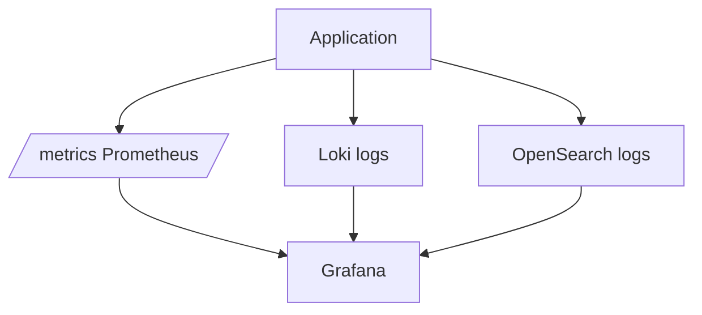

# 12. OpenSearch vs Loki vs Elasticsearch

## Intro: “we already have Grafana with Loki — why OpenSearch?”

The platform team rolled out **Loki** for k8s logs. A quarter later, security asks for **search on message** and **aggregations on arbitrary fields** without rigid labels. The data team already knows the **Elasticsearch** API. Leadership asks: is **OpenSearch** a fork, is it compatible? This chapter is a decision map and typical **interview questions**, not “one winner”.

## What you'll learn

- Positioning **OpenSearch** in the CNCF/AWS ecosystem.
- **Loki** vs OpenSearch for logs (with a pointer to [03-loki](../observability-intermediate/03-loki-logql.md)).
- **Elasticsearch** vs **OpenSearch**: license, compatibility.
- Hybrid architectures with **Prometheus** and Grafana.

## Comparison table (logs)

| Criterion | Loki | OpenSearch | Elasticsearch |
|----------|------|------------|---------------|
| Project | Grafana Labs | Linux Foundation / AWS | Elastic NV |
| Index | labels + chunks | inverted index + mapping | same (pre-fork) |
| Queries | LogQL | Query DSL | Query DSL |
| UI | Grafana | Dashboards | Kibana |
| Strength | cheap volume, k8s labels | complex search, aggs, security | mature Elastic Cloud SaaS |
| Weakness | weak ad-hoc full-text | ops, RAM, shard planning | SSPL license (Elastic product) |

Lab stand OpenSearch: [`deploy/opensearch`](../../deploy/opensearch/README.md). Loki: [`deploy/observability`](../../deploy/observability/README.md) + logs overlay.

## OpenSearch and Elasticsearch

**History:** Elasticsearch 7.10 → **OpenSearch** fork (AWS and community) after Elastic’s license change.

| | OpenSearch | Elasticsearch (Elastic) |
|---|------------|---------------------------|
| License | Apache 2.0 | SSPL / Elastic License (products) |
| Clients | check compatibility by **major version** | official clients for Elastic Cloud |
| Features | Security, ISM, ML — own plugins | Elastic Stack, APM, Enterprise |

**API:** bulk, search, mapping are **conceptually the same**; in interviews say “Elasticsearch experience transfers to OpenSearch with version testing”.

## Loki: when it’s enough

**Choose Loki** if:

- Logs are already in **Kubernetes** with good labels (`namespace`, `app`, `pod`).
- Main UI is **Grafana**, correlation with **Prometheus**.
- Queries are “stream + line filter”, not complex analytics over 50 fields.

**LogQL** (intermediate):

```logql
{container="mock-demo-app"} |= "error"
sum by (level) (count_over_time({app="api"}[1h]))
```

Details: [observability-intermediate/03-loki-logql.md](../observability-intermediate/03-loki-logql.md).

## OpenSearch: when you need it

**Choose OpenSearch** if:

- You need **full text**, **fuzzy**, **highlight**, security analytics.
- Many **unstructured** fields (JSON log without strict labels).
- You already have **ingest pipelines**, **ISM**, **cross-cluster search**.
- The org standardized on **ELK/OpenSearch** for SIEM.

**Query DSL** (basic course):

```json
{
  "query": {
    "bool": {
      "filter": [
        { "term": { "level.keyword": "error" } },
        { "range": { "@timestamp": { "gte": "now-1h" } } }
      ]
    }
  }
}
```

## Prometheus + logs: three paths



| Signal | Tool | Alert |
|--------|------------|-------|
| RPS, 5xx rate | Prometheus | Alertmanager |
| Stack trace line | Loki or OpenSearch | log-based metric / external |
| Top N routes with 5xx | OpenSearch aggs | dashboard + threshold |

Metrics are **not replaced** by logs — [observability-basic/11](../observability-basic/11-logs-preview.md).

## Cost and ops

| | Loki | OpenSearch |
|---|------|------------|
| RAM | moderate on ingester | heap + OS cache, sensitive |
| Disk | object storage friendly | SSD, shard sizing |
| Team | Grafana stack | search admins, ILM/ISM |
| SaaS | Grafana Cloud Logs | Amazon OpenSearch Service |

**FinOps:** cardinality in Loki labels; **shard count** and retention in OpenSearch.

## Data model — interview

| Question | Loki | OpenSearch |
|--------|------|------------|
| How is message text indexed? | scan chunk after selector | inverted index (analyzer) |
| Filter `service=api` | label in `{}` | `term` on keyword |
| Aggregation by hour | `count_over_time` + range | `date_histogram` |
| Risk | too many labels | too many shards / fields |

## Common mistakes

| Mistake | Consequence |
|--------|-------------|
| Two full log stacks with no owner | double cost, drift |
| Loki for SIEM full-text | slow, awkward |
| OpenSearch for all metrics | not a TSDB |
| “Elastic = OpenSearch 1:1” | breaking changes across versions |
| Security disabled as in the lab | leak in production |

## In production

- **Hybrid:** Loki for k8s stdout, OpenSearch for audit/application with rich mapping.
- **OTel Collector** — fan-out to multiple backends (advanced).
- **Single Grafana** with Prometheus + Loki + OpenSearch datasources.
- **Retention:** ISM on `logs-*`, Loki compactor + object storage.

## Interview notes

- **Inverted index** vs **label index** — key OS vs Loki difference.
- **OpenSearch** — open-source fork; check plugin compatibility.
- **Bulk** — standard OS ingest; Loki — push API (Promtail).
- **DISABLE_SECURITY_PLUGIN** — dev only ([deploy README](../../deploy/opensearch/README.md)).

## Summary

**Loki** — streams and LogQL in the Grafana ecosystem; **OpenSearch** — document search and analytics; **Elasticsearch** — commercial relative with a different license. Choose by queries, team, and budget; metrics stay in **Prometheus**. The basic course covered API and DSL; intermediate — pipelines and ISM.

## Checklist

- Name two scenarios where “Loki alone is enough”.
- Name two scenarios where “you need OpenSearch”.
- How does OpenSearch differ from Elasticsearch legally?
- Where in the repo is the LogQL course?

Next lesson: [13. Final project](13-final-project.md).
