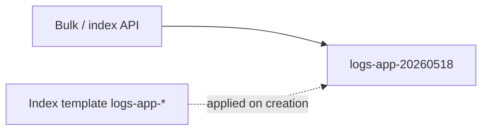

# 01. Index templates and mappings

## Why a template if the index gets created anyway

The first write to index `logs-app-20260518` makes OpenSearch **create the index on the fly** with dynamic mapping: strings become `text` + `keyword`, numbers become `long` or `double`. That is convenient for a lab; in production it is a source of surprises:

- the `status` field arrives as the string `"200"` from one service and as the number `200` from another;
- a high-cardinality field gets into the mapping and bloats the index;
- the default analyzer is not suitable for logs (you need `keyword` for filters).

An **index template** (in OpenSearch 2.x — the composable template API) sets **settings** and **mappings** **before** the first document appears in an index whose name matched `index_patterns`.



## Composable index template

The modern API is `_index_template` (not the legacy `_template` without composable, if you are reading old Elasticsearch 6 articles).

Key fields:

| Field | Meaning |
|------|--------|
| `index_patterns` | Name mask: `logs-app-*`, `metrics-*` |
| `priority` | On multiple matches the **higher** priority wins |
| `template.settings` | `number_of_shards`, `refresh_interval`, codec, … |
| `template.mappings` | Field types, `dynamic`, multi-fields |
| `template.aliases` | Optional: a single alias `logs-app-write` over rolling indices |

The example for this course — [examples/index-template-logs.json](examples/index-template-logs.json): indices `logs-app-*`, one shard, zero replicas (single-node lab), explicit types for `@timestamp`, `level`, `service`, `message`, `status`.

## Mapping: the types you need for logs

| Field | Type | Why |
|------|-----|--------|
| `@timestamp` | `date` | Sorting, range filters, the time picker in Dashboards |
| `level`, `service`, `method` | `keyword` | Exact filters, terms aggregations |
| `message` | `text` | Full-text search (use with care for volume) |
| `status`, `bytes` | `integer` / `long` | Numeric ranges, avg/sum in visualizations |
| `parsed` | `boolean` | Marker of a successful ingest pipeline |

**Dynamic mapping** can be restricted:

```json
"dynamic": "strict"
```

Then an unknown field in a document raises an indexing error — useful at the "schema contract" boundary (close to a Schema Registry in Kafka).

## Data stream vs "classic" daily index

In Elastic Stack 7+, **data streams** (`logs-*-*` as a stream + backing indices) are popular. On the training stack we use **named daily indices** `logs-app-YYYYMMDD` — simpler for ISM and for understanding "one index = one day". In AWS OpenSearch Service both approaches are available; ISM attaches to the index template either way.

## Relationship to bulk on the stack

The script [`deploy/opensearch/scripts/bulk-sample.sh`](../../deploy/opensearch/scripts/bulk-sample.sh) writes to `logs-app-$(date +%Y%m%d)`. Without a template OpenSearch guesses the mapping; with a template you get a stable schema for Dashboards and for the pipeline that adds `method`, `path`, `parsed`.

## Metrics vs logs (observability context)

**Prometheus** stores time series with low-cardinality labels. **OpenSearch** indexes **events** with full text and a rich mapping — more expensive, but stronger for investigations like "find all 500s with path `/orders` from yesterday". Separation of the pillars — [observability-intermediate](../observability-intermediate/README.md); a logs-only alternative focused on labels is Loki ([03-loki-logql](../observability-intermediate/03-loki-logql.md)).

## Common mistakes

1. **Two templates with the same priority** — unpredictable merging of settings.
2. **Changing a field type** after data appears — you need a reindex; the template does not "rework" an old index by itself.
3. **`text` instead of `keyword`** for `level` — aggregation on the `.keyword` subfield or unnecessary load.
4. **Too many shards** for a small volume — see [07-shards-replicas.md](07-shards-replicas.md).

## Checklist

- [ ] You understand when a template is applied (at index **creation**).
- [ ] You can explain `priority` and `index_patterns`.
- [ ] You choose `keyword` vs `text` for log fields.

**Next:** [02. Lab: index templates](02-lab-templates.md).
