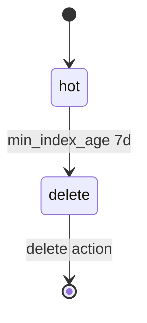

# 05. Index State Management (ISM)

## Problem: logs grow endlessly

The daily index `logs-app-20260518` is convenient for writing and deleting "a whole day" at a time, but without a policy the disk fills up. A manual cron `curl -X DELETE logs-app-*` is fragile: you forget retention, delete the wrong index, and there is no audit trail.

**Index State Management (ISM)** in OpenSearch is a built-in **state** engine for an index: hot → warm → cold → delete (the set of states is configurable). It is the analog of ILM in Elasticsearch.



## Policy: policy, states, transitions

The policy document (see [`deploy/opensearch/examples/ism-logs-policy.json`](../../deploy/opensearch/examples/ism-logs-policy.json)):

| Part | Meaning |
|-------|--------|
| `policy.default_state` | The starting state of a new index |
| `states[].actions` | What to run **on entering** the state (allocate, replica, snapshot, delete, …) |
| `states[].transitions` | Conditions for transitioning to another state |
| `policy.ism_template` | Which `index_patterns` to attach the policy to automatically |

The training policy is minimal:

- **hot** — no actions, we wait for the index to age;
- **delete** — the `delete` {} action removes the index.

Transition condition: `min_index_age: "7d"` (the index is 7 days old since creation).

## Rollover vs delete-by-age

In production, **rollover** by alias is often used:

- we write to the alias `logs-app-write` pointing at `logs-app-000001`;
- when `max_size` / `max_age` / `max_docs` is reached, **rollover** creates `logs-app-000002`;
- old indices move to warm/cold with fewer replicas or to a different tier.

On a single-node lab, **rollover** is limited (there is no point in a warm tier); the lab [06-lab-ism-rollover.md](06-lab-ism-rollover.md) shrinks `min_index_age` for a **fast** check of delete. Capture the rollover concept theoretically:

| Approach | Upside |
|--------|------|
| Daily index `logs-app-YYYYMMDD` | Simple mental model, ISM by age |
| Rollover + alias | One "current" write index, fewer names |

## ISM template and priority

An `ism_template` with `index_patterns: ["logs-app-*"]` and `priority: 100` attaches the policy to new indices. If several policies match — again the **priority** matters (as with the index template).

A shortened fragment to copy into reports — [examples/ism-policy-snippet.json](examples/ism-policy-snippet.json).

## Monitoring ISM

```bash
curl -s "http://localhost:9200/_plugins/_ism/policies?pretty"
curl -s "http://localhost:9200/_plugins/_ism/explain/logs-app-20260518?pretty"
```

In Dashboards: **Index Management → State management policies** (the menu name may differ slightly by version).

## Relationship to Kafka and observability

- **Kafka:** topic retention (`log.retention.hours`) ≠ retention in OpenSearch; a consumer can lag — indices pile up faster than ISM deletes them if ingest cannot keep up ([kafka-intermediate/17-monitoring](../kafka-intermediate/17-monitoring.md)).
- **Loki:** retention in `loki.yml` ([observability-intermediate/03](../observability-intermediate/03-loki-logql.md)) is at the chunk/store level; ISM is at the **Lucene index** level.

## Errors

| Symptom | Action |
|---------|----------|
| Policy did not apply | The index was created before the policy was registered; `explain` will show `null` |
| Index not deleted | The ISM job runs once per interval (~5–30 min); age is counted from index **creation** |
| `cluster_block_exception` read-only | Disk is full — see [08-lab-cluster-health.md](08-lab-cluster-health.md) |

## Checklist

- [ ] You distinguish **state**, **transition**, and **action**.
- [ ] You read `ism-logs-policy.json` and explain hot → delete.
- [ ] You know why a snapshot before delete is needed in prod.

**Next:** [06. Lab: ISM](06-lab-ism-rollover.md).
