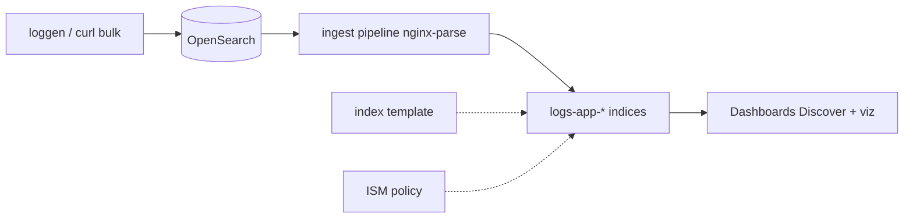

# 11. Final project: ELK-style pipeline

## Goal

Build an **end-to-end pipeline** in the spirit of ELK (Elasticsearch, Logstash, Kibana — for you, OpenSearch + ingest + Dashboards):



Optionally describe how the same flow would go through **Kafka** ([kafka-basic/12-patterns](../kafka-basic/12-patterns.md)) and where the Prometheus **metrics** would remain ([observability-intermediate](../observability-intermediate/README.md)).

## Requirements

| # | Component | Success criteria |
|---|-----------|------------------|
| 1 | **Index template** | `logs-app-*`, mapping from [examples/index-template-logs.json](examples/index-template-logs.json) |
| 2 | **Ingest pipeline** | [ingest-pipeline-nginx.json](../../deploy/opensearch/examples/ingest-pipeline-nginx.json), fields `method`, `path`, `status`, `parsed` |
| 3 | **Data** | ≥ 100 documents over 2 "days" (two `logs-app-YYYYMMDD` indices or a rollover tabletop) |
| 4 | **ISM** | [ism-logs-policy.json](../../deploy/opensearch/examples/ism-logs-policy.json) attached to `logs-app-*`; screenshot of `explain` |
| 5 | **Dashboards** | Index pattern, Discover saved search, ≥ 1 visualization (errors over time or top `path`) |
| 6 | **Documentation** | A 1–2 page README: architecture, commands, links to kafka/observability |

## Stack setup

```bash
cd deploy/opensearch
docker compose down -v   # clean start if desired
docker compose up -d
bash scripts/smoke.sh
```

## Step 1. Template and ISM

```bash
curl -s -X PUT "http://localhost:9200/_index_template/logs-app" \
  -H 'Content-Type: application/json' \
  -d @courses/opensearch-intermediate/examples/index-template-logs.json

curl -s -X PUT "http://localhost:9200/_plugins/_ism/policies/lab-logs-delete" \
  -H 'Content-Type: application/json' \
  -d @deploy/opensearch/examples/ism-logs-policy.json
```

## Step 2. Pipeline and log generation

```bash
curl -s -X PUT "http://localhost:9200/_ingest/pipeline/nginx-parse" \
  -H 'Content-Type: application/json' \
  -d @deploy/opensearch/examples/ingest-pipeline-nginx.json
```

Generation script (save as `courses/opensearch-intermediate/scripts/gen-logs.sh` or run it in a shell):

```bash
#!/usr/bin/env bash
set -euo pipefail
OS="${OS:-http://localhost:9200}"
PIPE="${PIPE:-nginx-parse}"
for day in 17 18; do
  IDX="logs-app-202605${day}"
  for i in $(seq 1 60); do
    METHODS=("GET" "POST" "PUT")
    PATHS=("/health" "/orders" "/users" "/pay")
    M=${METHODS[$((i % 3))]}
    P=${PATHS[$((i % 4))]}
    ST=$((200 + (i % 5) * 10)); [ $((i % 7)) -eq 0 ] && ST=500
    TS="2026-05-${day}T$(printf '%02d' $((10 + i % 10))):$(printf '%02d' $((i % 60))):01Z"
    echo "{\"index\":{\"_index\":\"$IDX\"}}"
    echo "{\"@timestamp\":\"$TS\",\"level\":\"$([ $ST -ge 500 ] && echo error || echo info)\",\"service\":\"api\",\"message\":\"$M $P $ST\"}"
  done
done | curl -sf -X POST "$OS/_bulk?pipeline=$PIPE" -H 'Content-Type: application/x-ndjson' --data-binary @-
curl -sf -X POST "$OS/logs-app-*/_refresh"
echo "done"
```

Verification:

```bash
curl -s "http://localhost:9200/logs-app-*/_count"
curl -s "http://localhost:9200/logs-app-*/_search" -H 'Content-Type: application/json' -d '{
  "size": 0,
  "aggs": { "by_status": { "terms": { "field": "status" } } }
}' | head -c 1500
```

## Step 3. Dashboards

1. Index pattern `logs-app-*`, time field `@timestamp`.
2. **Discover:** saved search `errors` — `level:error` OR `status >= 500`.
3. **Visualize:** Vertical bar — Count, X-axis Date Histogram on `@timestamp`, split series `terms` on `level`.
4. **Dashboard:** combine the visualization and a top-5 `path.keyword` table (or `path` if there is a keyword subfield).

## Step 4. Relationship to Kafka (written)

In the report, add a diagram:

```text
app → logs.raw (Kafka) → Connect OpenSearch Sink → your template/ISM
                      ↘ consumer metrics → Prometheus
```

Specify:

- where **Grok** runs (only OpenSearch ingest, don't duplicate in a Connect SMT);
- how to monitor **lag** ([kafka-intermediate/17-monitoring](../kafka-intermediate/17-monitoring.md));
- what happens if ISM deletes an index while a consumer still holds an offset (re-indexing / idempotent write).

## Step 5. Relationship to observability (written)

A 4-row table:

| Signal | Tool | Example |
|--------|------------|--------|
| Error rate 5xx | Prometheus | `rate(http_requests_total{status=~"5.."}[5m])` |
| Error stack text | OpenSearch Discover | `service:api AND level:error` |
| Correlation | Shared `trace_id` in the JSON log | (if present in the application) |
| Retention 7d | ISM delete | `ism-logs-policy.json` |

Link: [observability-intermediate/03-loki-logql](../observability-intermediate/03-loki-logql.md) — when you would choose Loki over OpenSearch.

## Grading criteria (self-check)

- [ ] The template applied before bulk (the mapping is stable).
- [ ] ≥ 80% of documents have `parsed: true` (the rest explained).
- [ ] ISM `explain` shows the policy on both daily indices.
- [ ] The dashboard opens without typing a query manually each time.
- [ ] The report connects three courses: opensearch-intermediate, kafka-intermediate, observability-intermediate.

## Cleanup

```bash
cd deploy/opensearch && docker compose down -v
```

## What's next

- Enable security on a test two-node cluster and go through [09-security-overview.md](09-security-overview.md) hands-on rather than as a tabletop.
- Bring up an **Amazon OpenSearch Service** sandbox domain following [10-managed-opensearch.md](10-managed-opensearch.md).
- In parallel, go through [observability-intermediate/16-final-project](../observability-intermediate/16-final-project.md) and compare the two approaches to logs on the same application.

Congratulations: you've gone from a template to a managed index lifecycle and visualization — the core of operating a log search cluster.
