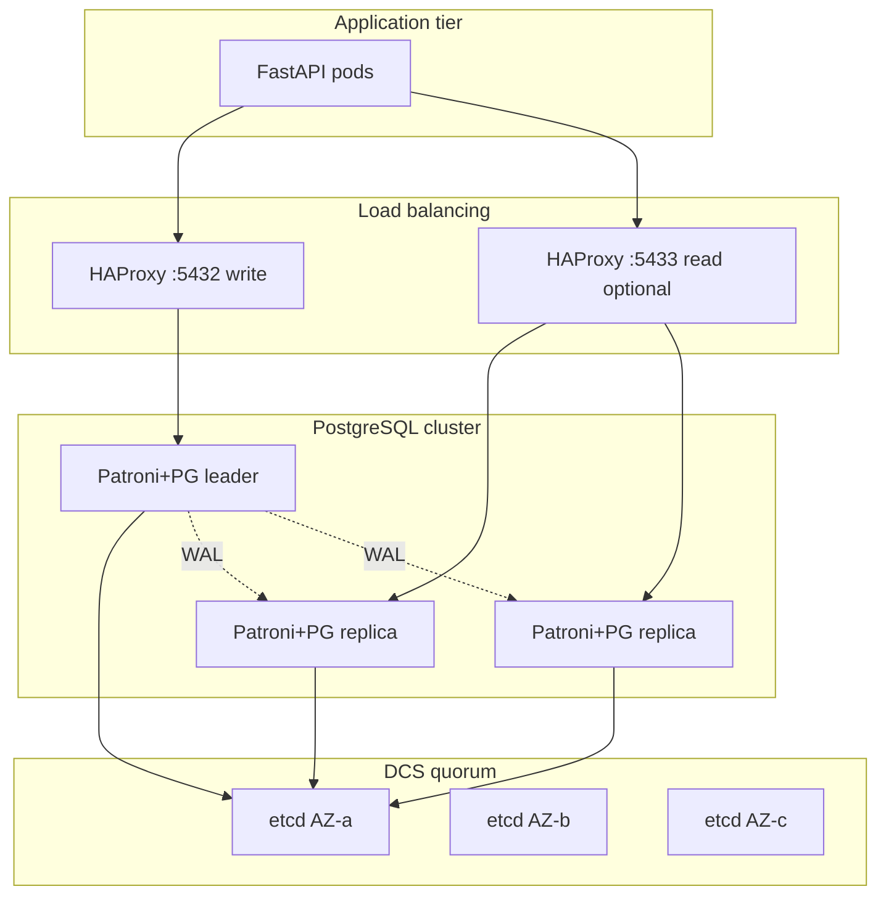

# 02. Lab: Patroni (architecture)

## Why this lab

Bringing up a full Patroni+etcd stack locally means 8+ GB RAM and hours of debugging. For the advanced level it's enough to **design** production HA: a diagram, a failover tabletop, RPO/RTO. Optionally — the [official Patroni docker](https://github.com/patroni/patroni).

## Prerequisites

- [01-patroni-ha](01-patroni-ha.md)
- [intermediate/05-streaming-replication](../postgresql-intermediate/05-streaming-replication.md)

## Task 1. Mermaid diagram

Create `docs/patroni-architecture.md` with a diagram:



Label: AZ, who accepts writes, where PgBouncer sits ([intermediate/15](../postgresql-intermediate/15-pgbouncer.md)).

## Task 2. Failover tabletop

Scenario: **the primary in AZ-a is unreachable** (network partition, not disk).

Document it step by step (at least 10):

| Step | What happens |
|-----|----------------|
| T+0s | The Patroni health check on node1 fails |
| T+? | The TTL lock in etcd expires |
| T+? | Patroni on node2 acquires the lock, `pg_promote()` |
| T+? | HAProxy removes node1 from the backend |
| T+? | The app reconnects (connection pool retry) |
| ... | The old node1: `pg_rewind` or rebuild the replica |

Answer:

1. **RPO** with async replication and a 5-second lag.
2. **RTO** given your Patroni timings.
3. What to do with the **old primary** after the network recovers (demote, rebuild).

## Task 3. Sync vs async — a decision

A table for your mock-exams "shop":

| Mode | RPO | RTO | Latency p99 write | Choice |
|-------|-----|-----|-------------------|-------|
| Async | | | | |
| Sync 1 standby | | | | |

Justify it in one paragraph for the product owner.

## Task 4. etcd quorum

Explain in 5 sentences:

- Why **2 etcd nodes** is an anti-pattern.
- What happens when quorum is lost (2 of 3 etcd down).
- The connection to "the Postgres cluster is read-only".

## Task 5. Optional — Patroni local

If you have 8+ GB RAM:

```bash
git clone https://github.com/patroni/patroni.git
# follow the docker-compose from the Patroni repository
```

Record: `patronictl list`, kill the primary, observe the failover.

## Success criteria

- [ ] A Mermaid diagram with 3 AZs, etcd, HAProxy, app
- [ ] Failover steps ≥ 10, RPO/RTO specified
- [ ] etcd quorum mentioned (not 2 nodes)
- [ ] A plan for the old primary after split recovery

## Next

Partitioning: [03-partitioning.md](03-partitioning.md).
