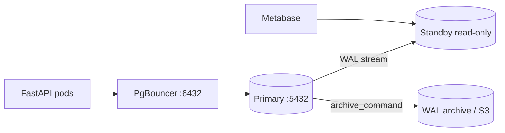

# 17. Final project: HA-ready environment

## Real-world scenario

The lead asks: "Describe what our Postgres looks like in production — not the table schema, but the **operations**: backups, replica, pool, monitoring, what the on-call engineer does at 3 a.m." This project pulls intermediate together into a `docs/postgres-prod/` package you can put in GitLab next to [fastapi](../../deploy/fastapi/README.md) or [django](../../deploy/django/README.md).

Some components can be **documented** without a full implementation (PITR drill, a second AZ) — but the artifacts must be verifiable, not "everything's in AWS, don't worry about it."

## Goal

Design and partially implement a **production-like** Postgres: an HA diagram, a justified config, replication, a PITR runbook, monitoring, a backup strategy, and an on-call cheat sheet.

## Prerequisites

- Completed lessons 01–16.
- [basic/15-final-project](../postgresql-basic/15-final-project.md) is desirable (the application schema).
- Labs: [06-streaming-replication](06-lab-streaming-replication.md), [10-lab-pitr](10-lab-pitr.md), [14-lab-monitoring](14-lab-monitoring.md).

## Submission structure

```text
docs/postgres-prod/
├── README.md              — overview, links
├── architecture.md        — diagram + explanations
├── postgresql.conf.snippet
├── replication.md         — streaming or runbook
├── pitr-runbook.md        — from lab 10, refined
├── monitoring.md          — Grafana panels + alerts
├── backup-strategy.md     — pg_dump + WAL archive
└── oncall-cheatsheet.md   — 10 commands
```

## Required deliverables

### 1. Diagram app → PgBouncer → primary + standby



Explain: who writes, who reads, what happens on failover.

### 2. A postgresql.conf fragment with justification

At least 8 parameters from [01-configuration](01-configuration.md):

| Parameter | Your value | Why |
|----------|---------------|--------|
| `shared_buffers` | | |
| `effective_cache_size` | | |
| `work_mem` | | |
| `wal_level` | | |
| `max_wal_size` | | |
| `log_min_duration_statement` | | |
| `autovacuum` | | |
| `idle_in_transaction_session_timeout` | | optional |

The `postgresql.conf.snippet` file + a table in `architecture.md`.

### 3. Streaming replica or runbook

- **Implemented:** a screenshot/SQL of `pg_stat_replication`, `pg_is_in_recovery()` on 5433.
- **Tabletop:** `replication.md` ≥ 12 steps from [06-lab-streaming-replication](06-lab-streaming-replication.md) for your infrastructure.

### 4. PITR runbook

From [10-lab-pitr](10-lab-pitr.md): the DROP scenario at 14:00, recovery to 13:55, RPO/RTO, quarterly test.

### 5. Grafana dashboard mockup

The `monitoring.md` file — a list of panels (a live Grafana isn't required):

| Panel | Metric / query |
|--------|------------------|
| Connections | `pg_stat_activity` count vs max |
| Replication lag | bytes or seconds |
| Dead tuples | top tables `n_dead_tup` |
| Top query | pg_stat_statements total_ms |
| Disk PGDATA | node filesystem |
| Archiver failures | `pg_stat_archiver.failed_count` |
| Long transactions | idle in transaction > N min |
| Database size | `pg_database_size` |

5+ alerts with thresholds.

### 6. Backup strategy

`backup-strategy.md`:

- Nightly `pg_dump -Fc` (scope: schema app)
- Continuous WAL archive (tool: pgBackRest / WAL-G / S3)
- Retention (7/30/90 days)
- Restore test calendar

### 7. On-call cheat sheet

`oncall-cheatsheet.md` — **10 commands** with a one-liner "when to use it":

Example:

```sql
-- Who is blocking
SELECT ... FROM pg_locks JOIN pg_stat_activity ...;

-- Top queries
SELECT ... FROM pg_stat_statements ORDER BY total_exec_time DESC LIMIT 5;

-- Replication lag
SELECT ... FROM pg_stat_replication;

-- Dead tuples
SELECT ... FROM pg_stat_user_tables ORDER BY n_dead_tup DESC;

-- Terminate idle in transaction (be careful)
SELECT pg_terminate_backend(pid) FROM pg_stat_activity WHERE ...;
```

## Bonus

- Logical replication of one table into a warehouse ([08-lab-logical-replication](08-lab-logical-replication.md))
- A `pg_repack` playbook for bloat
- Patroni overview — a link to [advanced](../postgresql-advanced/README.md)

## Grading criteria

| Level | Criteria |
|---------|----------|
| **Pass** | All 7 deliverables, a coherent README |
| **Strong** | A live replica or drill log; parameters tied to the VM RAM |
| **Gap** | Only a diagram without a runbook and backup |

## Self-check before submitting

- [ ] An on-call engineer can find the PITR runbook without you
- [ ] It's clear where the app connects (6432 vs 5432)
- [ ] RPO/RTO are consistent with the backup strategy
- [ ] There's a plan for `too many clients`
- [ ] The on-call sheet is in one place

## Next

[`postgresql-advanced`](../postgresql-advanced/README.md) — Patroni, partitioning, major upgrade, CloudNativePG.

Specializations:

- [postgresql-performance](../postgresql-performance/README.md)
- [postgresql-ops](../postgresql-ops/README.md)
- [postgresql-security](../postgresql-security/README.md)

---

**postgresql-intermediate complete.**
