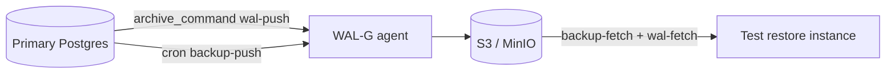

# 05. Lab: WAL-G

## Why this lab

A tabletop of the WAL-G → S3/MinIO architecture plus a restore drill checklist is the minimum for ops without a full WAL-G install. Optionally — MinIO from the ops compose.

## Prerequisites

- [04-wal-g](04-wal-g.md)
- The Postgres environment

## Task 1. MinIO (optional)

```bash
cd deploy/postgres
docker compose -f docker-compose.yml -f docker-compose.ops.yml up -d
```

Console: http://localhost:9001 — create a bucket `pg-wal`.

Capture the env vars for WAL-G:

```bash
WALG_S3_PREFIX=s3://pg-wal/course
AWS_ENDPOINT=http://localhost:9000
AWS_ACCESS_KEY_ID=minioadmin
AWS_SECRET_ACCESS_KEY=minioadmin
```

## Task 2. Diagram

`wal-g-architecture.md`:



Label: RPO (WAL), RTO (restore steps).

## Task 3. archive_command design

Describe in text:

1. `archive_mode = on` on the primary
2. `archive_command = 'wal-g wal-push %p'`
3. Monitor `pg_stat_archiver.failed_count`
4. Alert if archive fail > 0

## Task 4. Restore drill checklist

At least 5 steps:

```markdown
- [ ] 1. Isolate test host / new volume
- [ ] 2. wal-g backup-fetch PGDATA LATEST
- [ ] 3. Configure restore_command wal-fetch + recovery_target_time
- [ ] 4. Start Postgres, verify data
- [ ] 5. Record duration, update runbook
```

Schedule: **quarterly**, owner: DBA on-call rotation.

## Task 5. Locally — WAL on disk

```bash
docker exec mock-postgres psql -U course -c "SELECT pg_current_wal_lsn();"
docker exec mock-postgres du -sh /var/lib/postgresql/data/pg_wal
docker exec mock-postgres psql -U course -c "SELECT * FROM pg_stat_archiver;"
```

Connection to [intermediate/03-wal](../postgresql-intermediate/03-wal.md): what happens if the archive fails.

## Success criteria

- [ ] Diagram primary → WAL-G → object storage
- [ ] archive_command design described
- [ ] Restore drill checklist ≥ 5 items
- [ ] pg_stat_archiver reviewed

## Next

Blue/green: [06-blue-green.md](06-blue-green.md).
