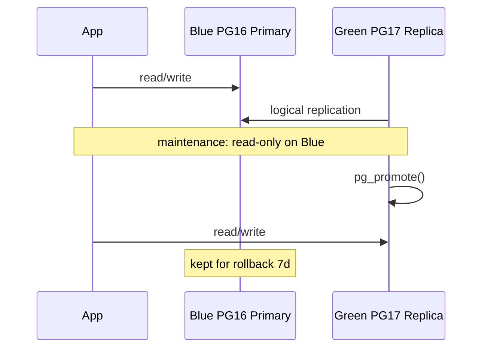

# 07. Lab: blue/green

## Why this lab

A cutover is a rare event; without a checklist a team gets lag, DNS, and rollback wrong. You'll build a sequence diagram, a checklist, and a tabletop of a 16→17 migration.

## Prerequisites

- [06-blue-green](06-blue-green.md)
- [advanced/09-major-upgrade](../postgresql-advanced/09-major-upgrade.md) — overview

## Task 1. Sequence diagram

`blue-green-cutover.md` with Mermaid:



## Task 2. Cutover checklist (fill it in)

- [ ] Green replication lag < 1 MB (or < 5 sec)
- [ ] Sequences synced on green
- [ ] App maintenance banner / read-only mode on blue
- [ ] Stop writes to blue (API deploy)
- [ ] Final sync wait — lag = 0
- [ ] `pg_promote()` on green or Patroni switchover
- [ ] Update DNS / K8s Service / Vault DATABASE_URL
- [ ] PgBouncer reload
- [ ] Smoke tests: login, checkout, migrations dry-run
- [ ] Monitor 24h on green
- [ ] Decommission blue after retention (7–14 days)

## Task 3. Tabletop PG 16 → 17

The 10 steps **before** cutover (preparation):

```text
1. Provision green PG17 cluster
2. wal_level=logical on blue (restart)
3. Schema on green matches blue
4. CREATE PUBLICATION on blue
5. CREATE SUBSCRIPTION on green (copy_data=true)
6. Wait sync, monitor pg_stat_subscription
7. Test read-only workload on green replica
8. Document rollback: re-point app to blue
9. Schedule cutover window
10. Notify stakeholders RTO/RPO
```

## Task 4. RPO/RTO table

| Replication | RPO at cutover | RTO estimate |
|-------------|----------------|--------------|
| Async physical | | |
| Sync physical | | |
| Logical (caught up) | | |

## Task 5. Rollback scenario

If a smoke test fails on green — the 5 steps to return traffic to blue.

## Success criteria

- [ ] Mermaid sequence diagram
- [ ] Checklist ≥ 10 items
- [ ] Tabletop 16→17 ≥ 10 steps
- [ ] Rollback plan

## Next

Zero-downtime: [08-zero-downtime.md](08-zero-downtime.md).
