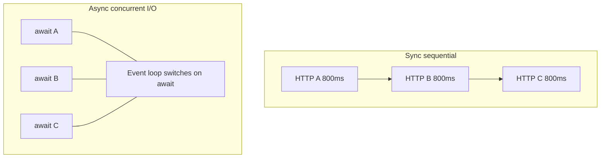
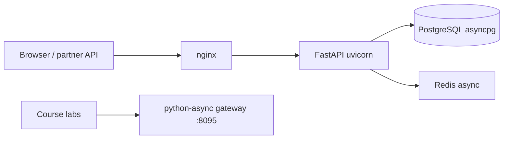

# 01. Sync vs async: when and why

## Intro: "the report takes 40 seconds to build while the user waits"

An aggregation service pulls data from **five internal HTTP APIs**. Each responds in **~800 ms**. Sync code in a loop `for url in urls: requests.get(url)` gives **4+ seconds** of wall-clock time — the user sees a spinner, the SLO is burning. The team suggests "add threads" or "rewrite on asyncio". The CTO asks: **what will actually give a win**, and what will only add complexity?

The answer starts not with the trendy `async def`, but with the **waiting model**: CPU-bound vs I/O-bound, one process vs many, and where the **event loop** lives. This chapter is a map of the terrain before the code. A deeper look at coroutines is in [02-coroutines-await](02-coroutines-await.md); applied patterns in FastAPI are in [27-async-patterns](../fastapi/27-async-patterns.md) (more superficial).

## What you'll learn

- The difference between **concurrency** and **parallelism** with Python examples.
- When **asyncio**, **threading**, **multiprocessing** are the right tool.
- Why async speeds up **I/O-bound**, but not **CPU-bound**.
- How asyncio fits into the mock-exams stack (FastAPI, httpx, Postgres, Redis).

---

## Concurrency vs parallelism

| | Concurrency | Parallelism |
|---|-------------|-------------|
| Idea | many tasks **progress** over a period of time | tasks run **simultaneously** on different cores |
| Model | switching while **waiting** on I/O | true parallel execution |
| Python GIL | doesn't get in the way of I/O wait | CPU on one process — one thread "computes" |
| Typical tool | **asyncio**, threads | **multiprocessing**, C extensions |



**Wall-clock** for three independent HTTP requests: sync sequential ≈ **2.4 s**; async concurrent ≈ **~800 ms** (plus overhead).

---

## Three ways to "do several things at once"

| Approach | Strengths | Weaknesses | Example |
|--------|-----------------|-----------------|--------|
| **Sync + threads** | simple sync code, blocking I/O | GIL, race conditions, thread overhead | legacy `requests` |
| **asyncio** | thousands of I/O waits in one thread | needs an async stack; blocking the loop = disaster | httpx, asyncpg |
| **multiprocessing** | CPU on all cores | heavy IPC, memory | pandas batch, ML inference |

```python
# I/O-bound: three sync requests in a row — slow
import time
import urllib.request

def fetch_sync(url: str) -> bytes:
    with urllib.request.urlopen(url, timeout=10) as r:
        return r.read()

t0 = time.perf_counter()
for _ in range(3):
    fetch_sync("http://localhost:8095/slow?extra_ms=100")
print(f"sync sequential: {time.perf_counter() - t0:.2f}s")
# expect ~0.45s+ (3 × ~150ms on the deploy/python-async stand)
```

You'll write the async version in [03-lab-first-async](03-lab-first-async.md).

---

## I/O-bound vs CPU-bound

| Load | Nature | Does async help? | Alternative |
|----------|----------|-----------------|--------------|
| HTTP, DB, Redis, disk read | waiting on network/disk | **yes** | threads (worse scaling) |
| JSON parse 1 KB | micro-CPU | no point | sync is enough |
| resize 5000 images | heavy CPU | **no** (blocks the loop) | ProcessPool, Celery |
| crypto hash 1 GB | CPU | **no** | separate worker |

**Rule:** asyncio is **one thread** that **doesn't block** on I/O. Any **long sync** call (`time.sleep`, `requests.get`, heavy pandas) **stops all** coroutines in the process.

See [27-async-patterns](../fastapi/27-async-patterns.md): `asyncio.to_thread` is a bridge for legacy sync, not an architecture replacement.

---

## Where asyncio fits in the mock-exams architecture



- **FastAPI** — ASGI, `async def` endpoints ([`deploy/fastapi`](../../deploy/fastapi/README.md), port **8090**).
- **asyncio labs** — mock gateway ([`deploy/python-async`](../../deploy/python-async/README.md), port **8095**).
- **Postgres** — asyncpg via SQLAlchemy ([`deploy/postgres`](../../deploy/postgres/README.md)).
- **Redis** — cache/rate limit ([`deploy/redis`](../../deploy/redis/README.md), [`redis-basic`](../redis-basic/README.md)).

This course teaches the **mechanism underneath FastAPI**, and does not replace the FastAPI course.

---

## When NOT asyncio

| Situation | Better |
|----------|-------|
| CLI script of 50 lines, 2 HTTP calls | sync + `httpx` or `requests` |
| Team not ready for the async ecosystem | sync Flask/Django + workers |
| 90% CPU in the request handler | sync workers / process pool |
| Library is sync-only (old SDK) | thread pool or a separate microservice |
| "Async for the sake of async" without I/O | needless complexity with no win |

---

## Interview myths

| Myth | Reality |
|-----|------------|
| "Async is always faster" | faster only when **waiting** on I/O and running **concurrently** |
| "Async = multithreading" | one thread + cooperative multitasking |
| "GIL gets in the way of async" | the GIL is released on I/O; it gets in the way of **CPU** in the same thread |
| "We'll rewrite everything on async in one sprint" | you need async drivers, tests, observability |

---

## On the stand: comparing aggregate

Bring up the stand (if not up yet):

```bash
cd deploy/python-async
docker compose up -d --build
curl -s -w "\nTIME:%{time_total}s\n" http://localhost:8095/aggregate
curl -s -w "\nTIME:%{time_total}s\n" http://localhost:8095/aggregate-parallel
```

**Sequential** `/aggregate` — ~**1 s**; **parallel** `/aggregate-parallel` — ~**500 ms**. The gateway implements what you'll build by hand in [18-lab-parallel-fetch](18-lab-parallel-fetch.md).

---

## Common mistakes

| Mistake | Why it's bad | The right way |
|--------|--------------|---------------|
| Async for a CPU-bound hot path | blocks the event loop, p99 spikes | ProcessPool / a separate worker |
| Threads for 50k websockets | RAM and context switches | asyncio + one loop |
| `requests` inside `async def` | freezes all clients | `httpx.AsyncClient` ([17](17-async-http-httpx.md)) |
| Comparing only RPS without latency | "fast" with 1 user, bad with 100 | profile under concurrent load |
| Ignoring the sync baseline | you don't know whether there's a win | measure sequential vs concurrent |

---

## In production

- **Metrics:** p50/p95/p99 latency, not just the average.
- **Graceful shutdown:** cancelling tasks on SIGTERM ([08-lab-graceful-shutdown](08-lab-graceful-shutdown.md)).
- **Limits:** connection pool, a semaphore on outbound HTTP ([13-primitives-locks](13-primitives-locks.md)).
- **FastAPI:** several uvicorn workers = several processes × event loop ([30-uvloop-production](30-uvloop-production.md)).

---

## Summary

**Asyncio** is a tool for **concurrent I/O** in a **single thread** via an **event loop** and **await**. It doesn't replace **multiprocessing** for CPU and doesn't make sync code faster by itself. The choice starts with the load profile: **how much time the process waits** vs **computes**.

## Checklist

- How does concurrency differ from parallelism?
- Why are three sequential HTTP requests slower than three concurrent awaits?
- Name two cases where asyncio is a bad choice.
- How is `/aggregate-parallel` on port 8095 related to the course topic?

Next lesson: [02. Coroutines and await](02-coroutines-await.md).
